# 18.Jenkins集成SonarQube并集成项目自动检测

登录Jenkins

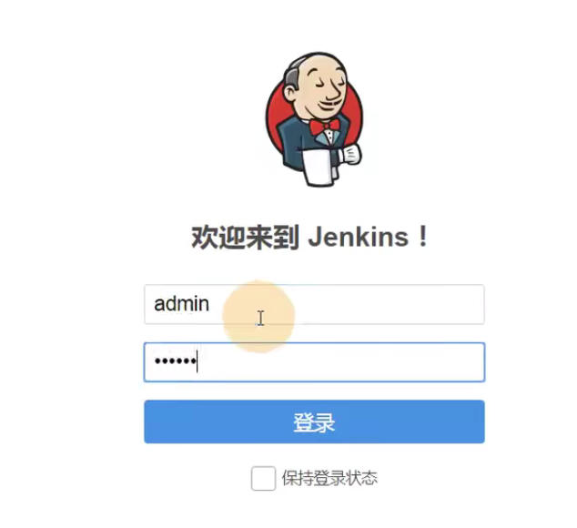

## 1、Jenkins需要安装插件

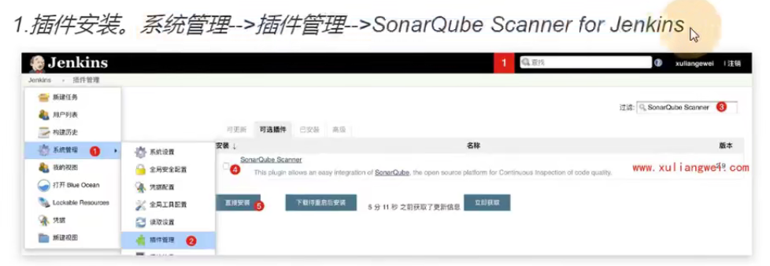

需要安装SonarQube_Scanner_for_jenkins

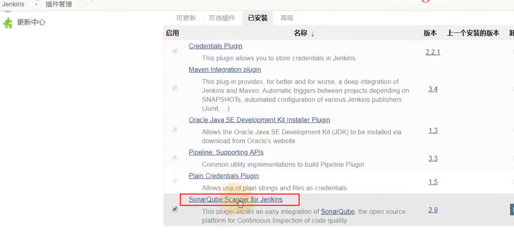

## 2.在Jenkins中配置SonarQube

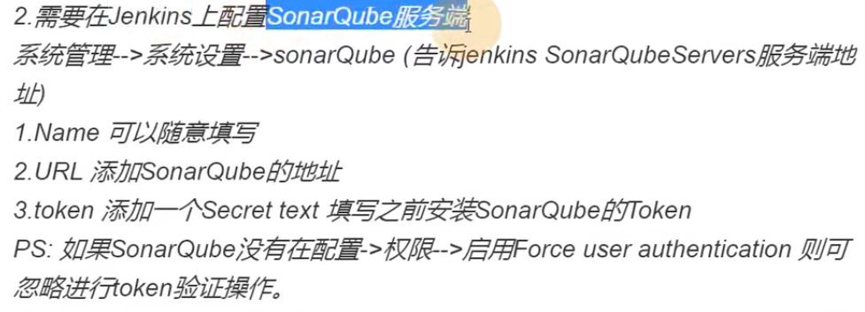

​	

系统管理--系统设置

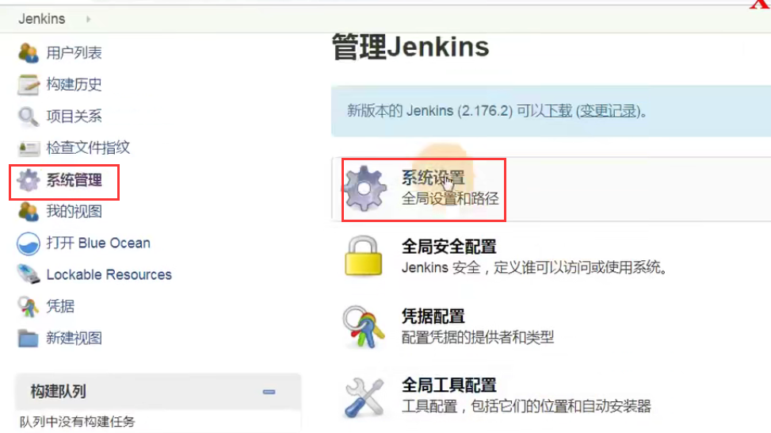

​	点击添加SonarQube开始设置

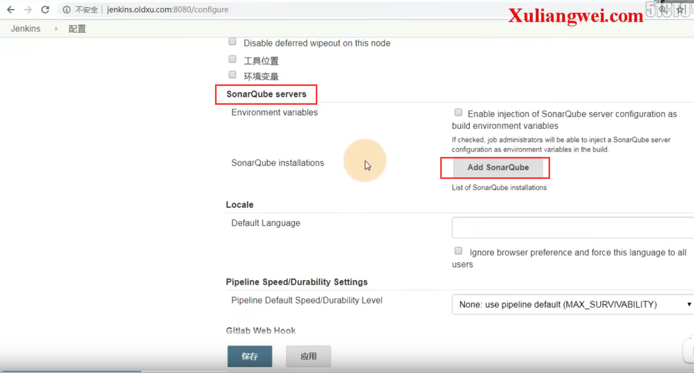

配置名称--配置sonar的服务端地址--设置token凭据（用于请求sonar使用）

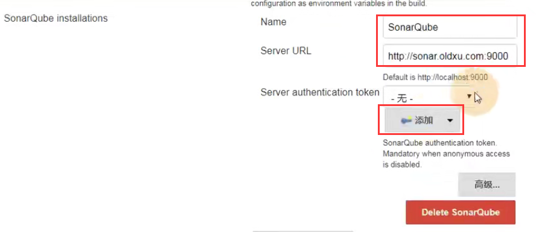

添加token凭据

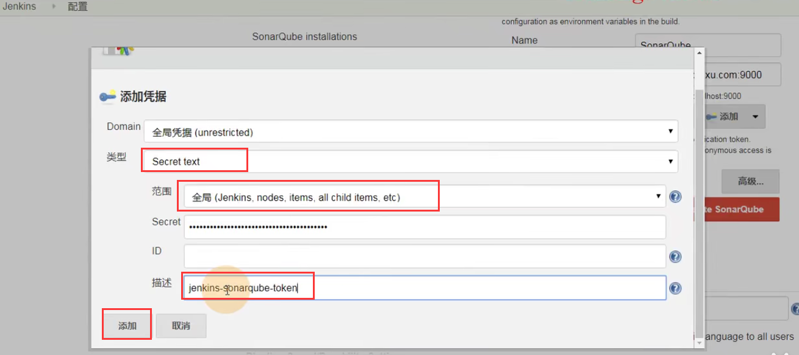

选择好凭据-然后保存

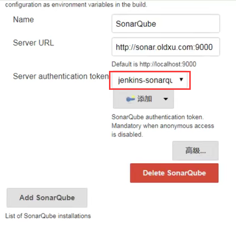

现在Jenkins已经配置完成了和sonar的连接关系了

#### 然后我们需要--配置客户端插件scanner与sonar的关系

​	进入全局 安全配置中--截图错误--应该是全局工具配置

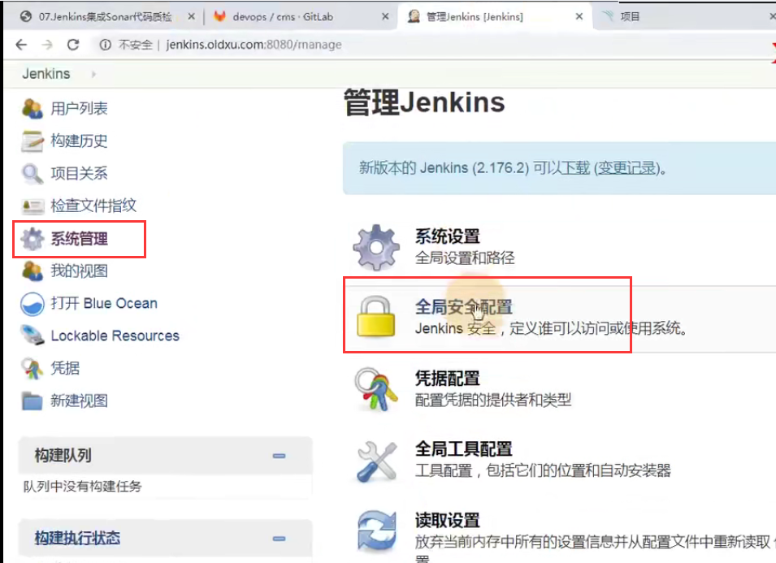

新增sonarQube Scanner

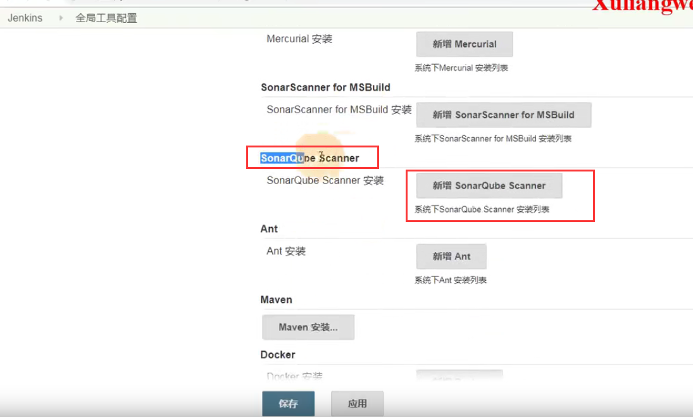

配置scanner的名称和安装全路径--勾选取消自动安装

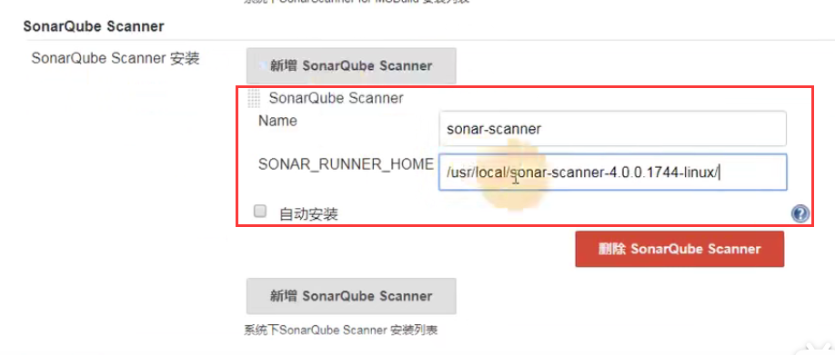

#### 到此我们的Jenkins就知道了sonar的客户端是谁，服务端是谁都配置好了

## 3、Jenkins构建项目自动sonar扫描

进入项目构建中--增加构建步骤选择执行SonarQube的扫描

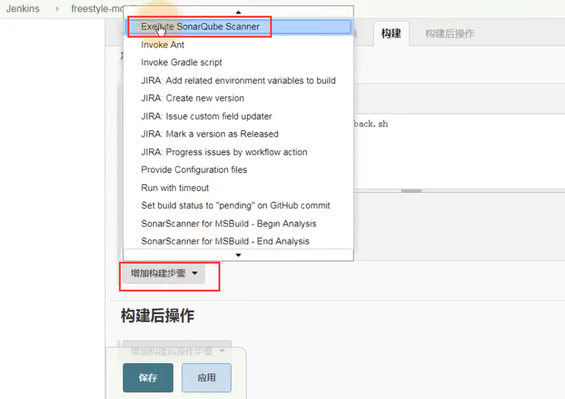

名称和JDK都不需要指定和配置--就把执行脚本的参数放入就可以了

​	JOB_Name就是构建的项目名称

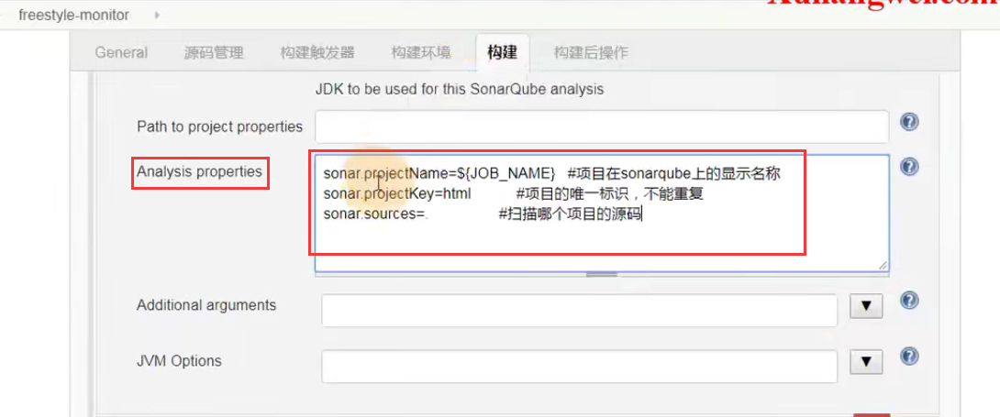

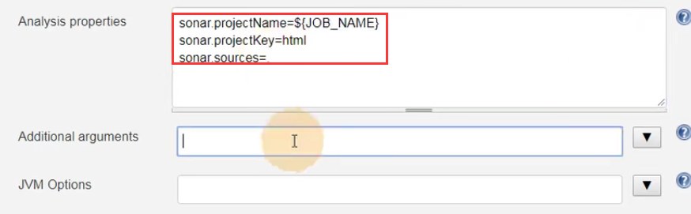

然后应用保存

然后在项目下--可以发现有SonarQube了

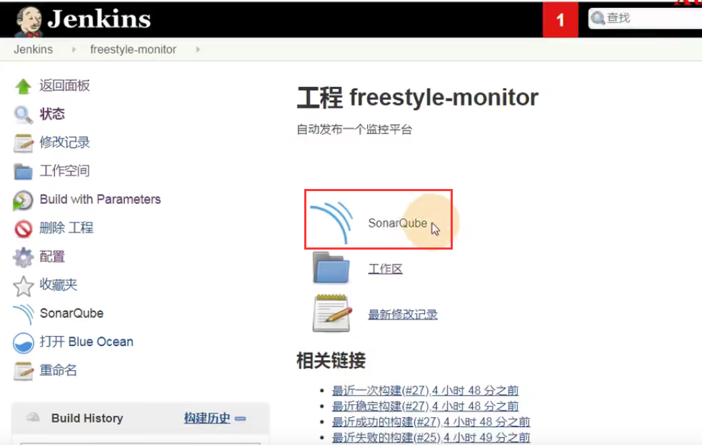

构建一下项目：

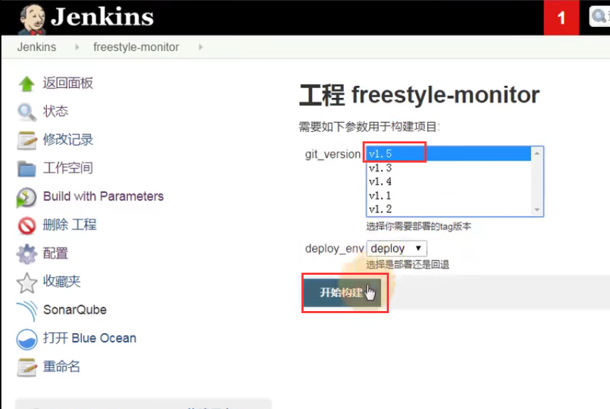

我们查看控制台--看到先是去GitLab去拉取的代码，然后调用了sonar客户端Scanner执行了配置的脚本--进行扫描 

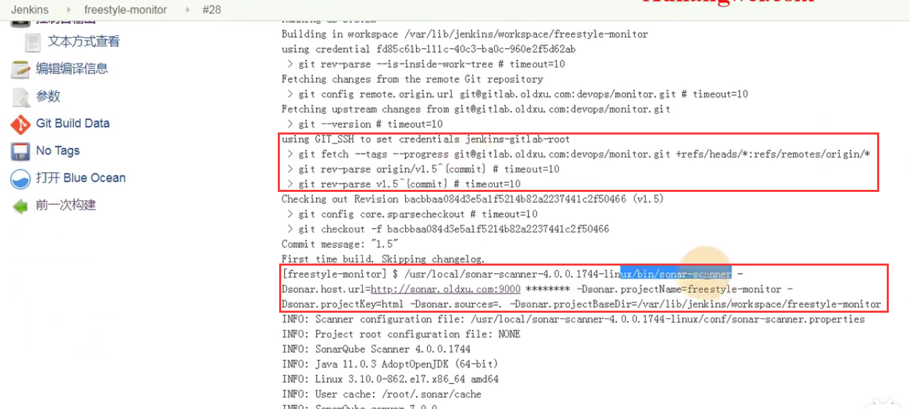

代码扫描完成后才会执行我们的项目部署的脚本

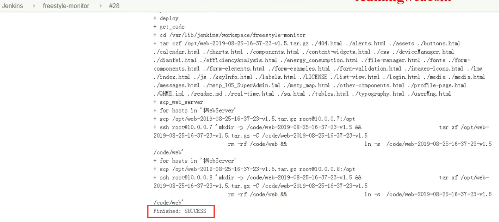

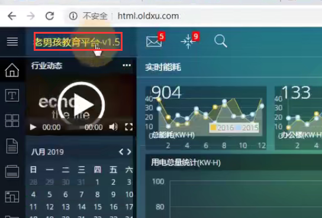

到此--我们的项目就集成了sonarQube的自动检测--每次构建都会先检测

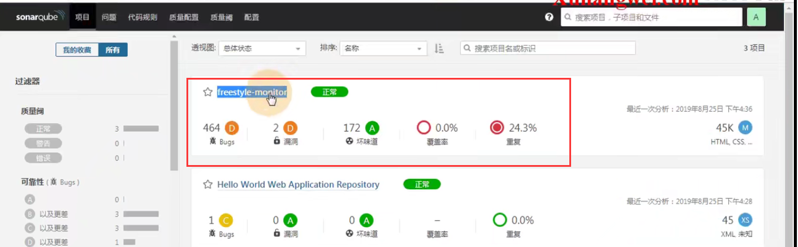

