# 19.Jenkins-maven项目实现代码自动检测

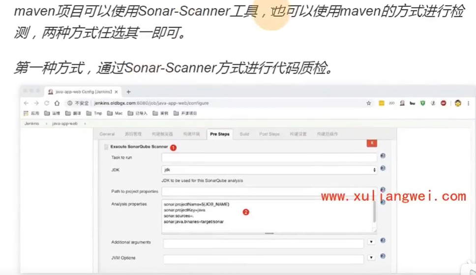

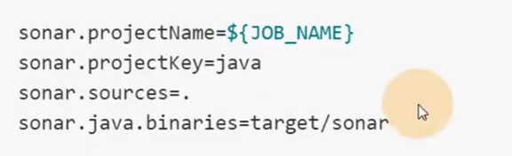

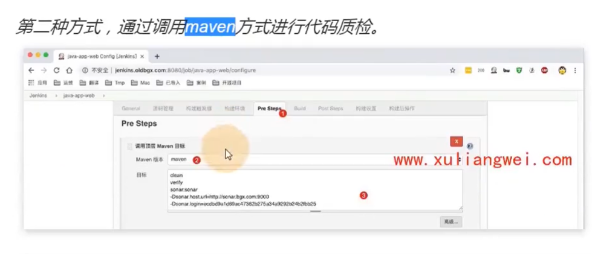

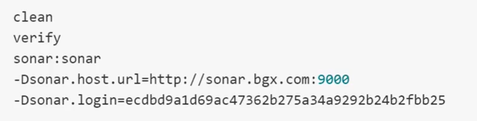

#### maven项目的扫描方式建议使用SonarScanner

​	因为扫描的内容多一些

进入Jenkins是maven项目中--编辑构建

​	在构建的中有Pre Steps--就是构建编译前的操作

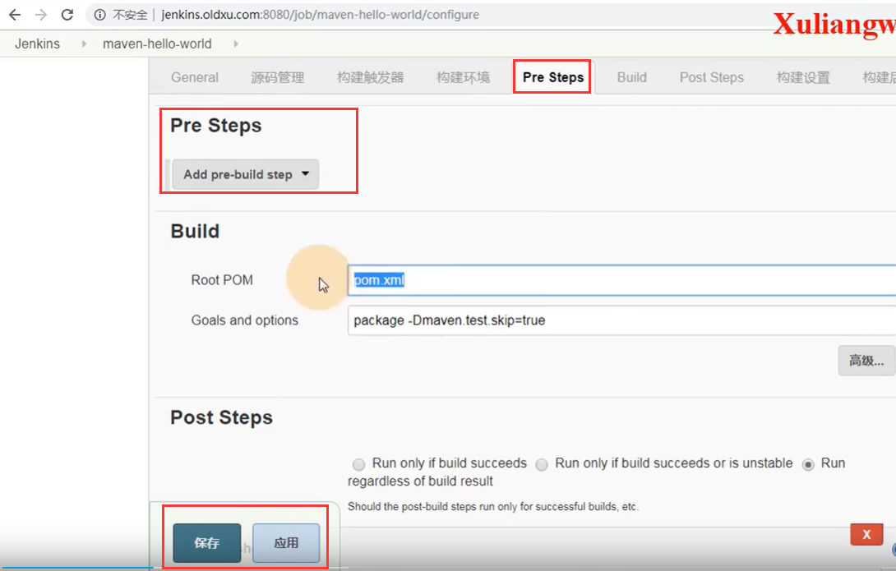

然后点击Add。。。选择执行sonar扫描

​	配置执行参数

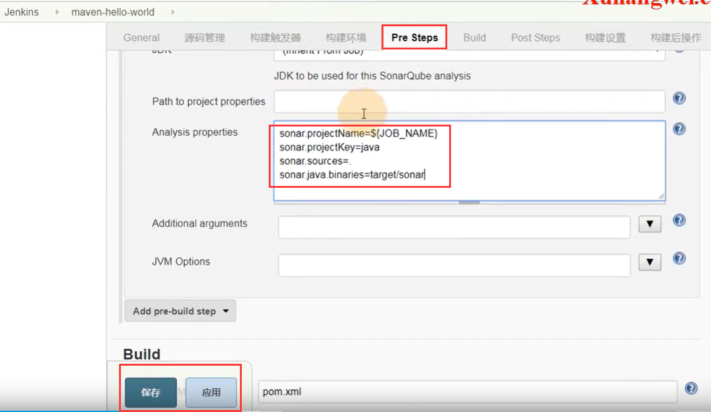

然后开始构建：

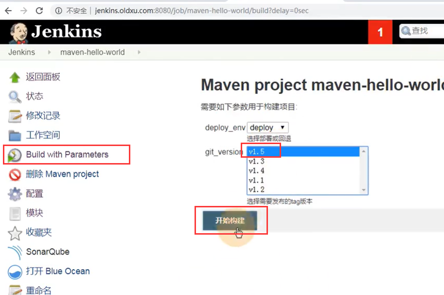

构建完成可以看到--提示构建成功ok

​	在构建的编号右侧还有一个sonar按钮--可以点击进入到sonar界面查看详情

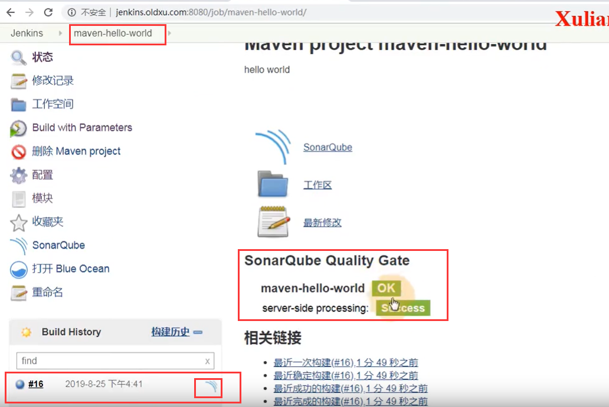

我们点击进入到sonar中查看项目扫描

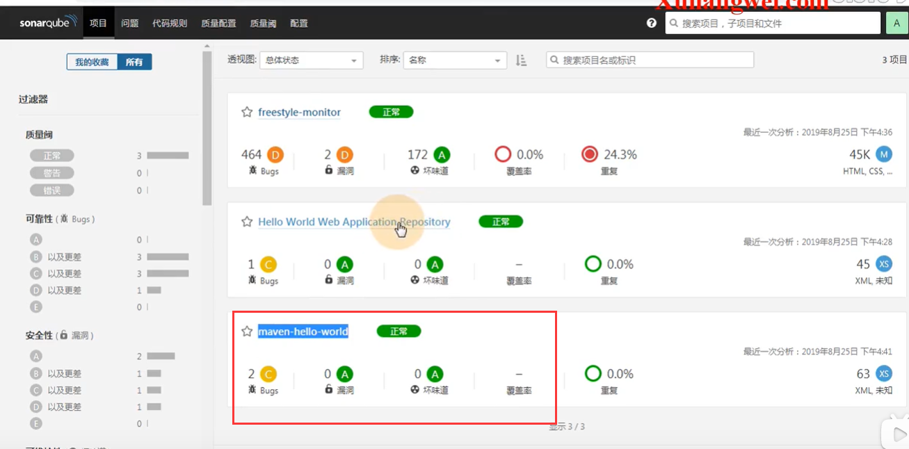

也可以删除掉扫描的项目--进入项目--点击配置

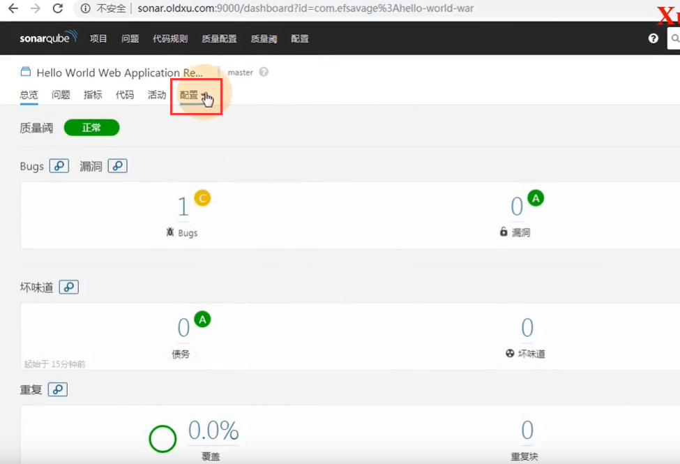

点击删除

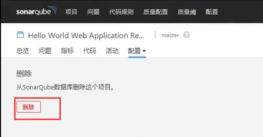

https://www.bilibili.com/video/BV11J411674t?p=40&spm_id_from=pageDriver

