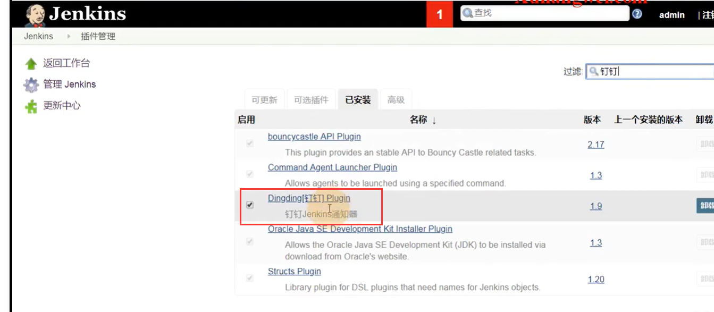
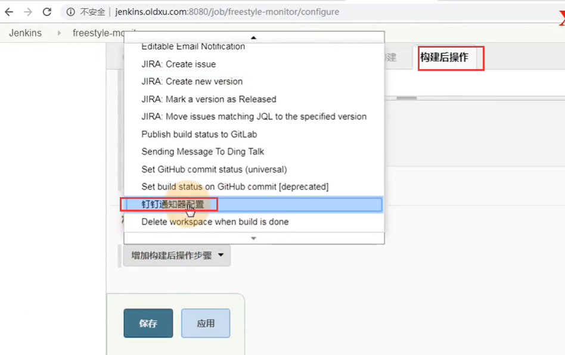
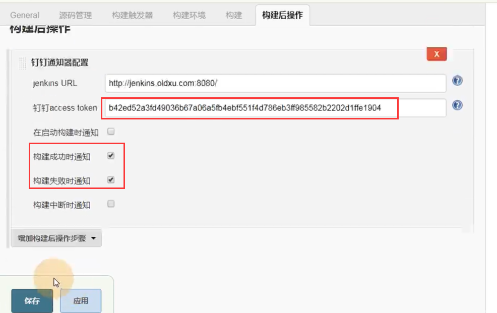
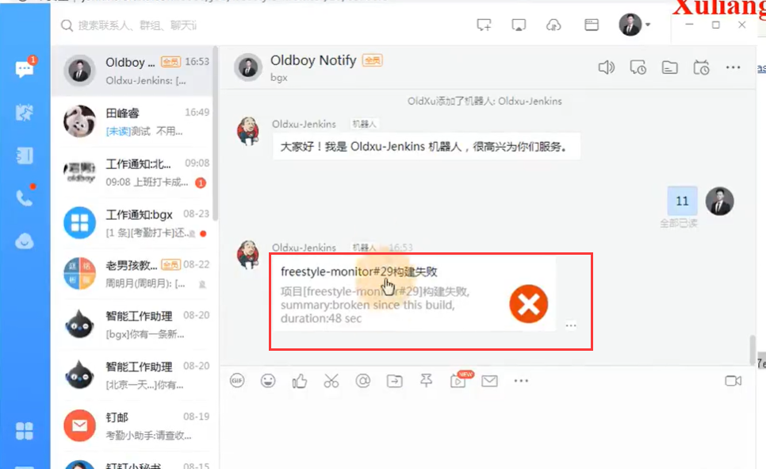
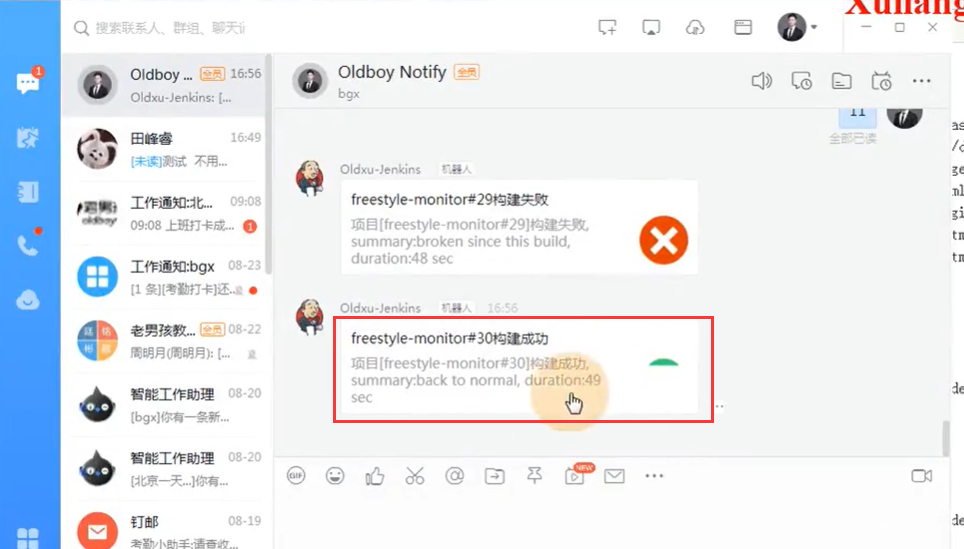
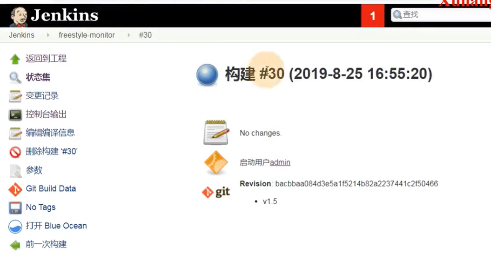

# 21.Jenkins集成钉钉-实现项目部署通知钉钉

Jenkins如果想要实现给钉钉发通知-就需要安装钉钉的插件

我们在Jenkins进入项目的构建--选择构建后的操作

​	增加构建后的操作步骤--选择钉钉通知

然后就是配置钉钉的token--设置构建成功通知，构建失败通知

然后我们构建项目--构建失败了，发送了通知---构建失败是因为之前构建过了

我们删除掉之前的成功构建--重新构建一下

​	构建成功发送了成功通知

点击就进入了Jenkins项目中

