# 22.Jenkins-pipeine流水线实践

​	流水线：就是整个过程都是可见的，像我们之前的free-style项目，maven的项目整个过程都是不可见的

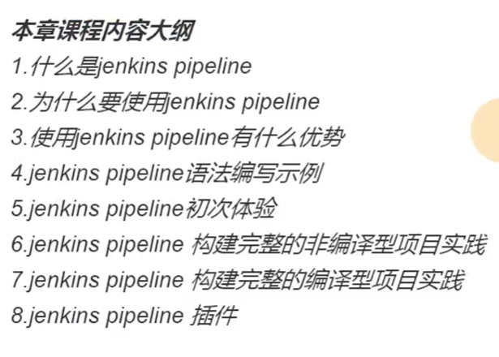

## 1、Jenkins pipeine基本概述

​	注意：pipeine是一门语言--使用他是需要写他的代码的

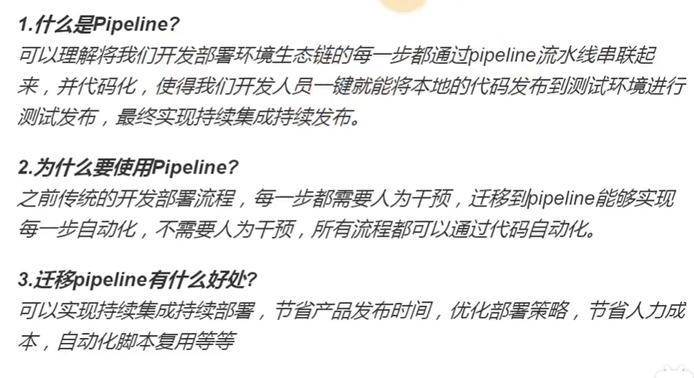

语法：

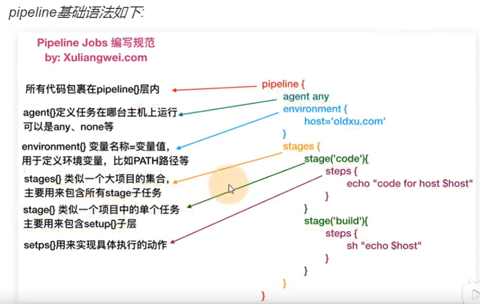

我们在Jenkins中新建一个流水线项目：

​	选择流水线

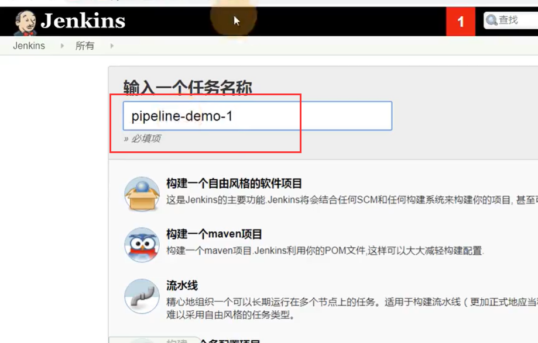

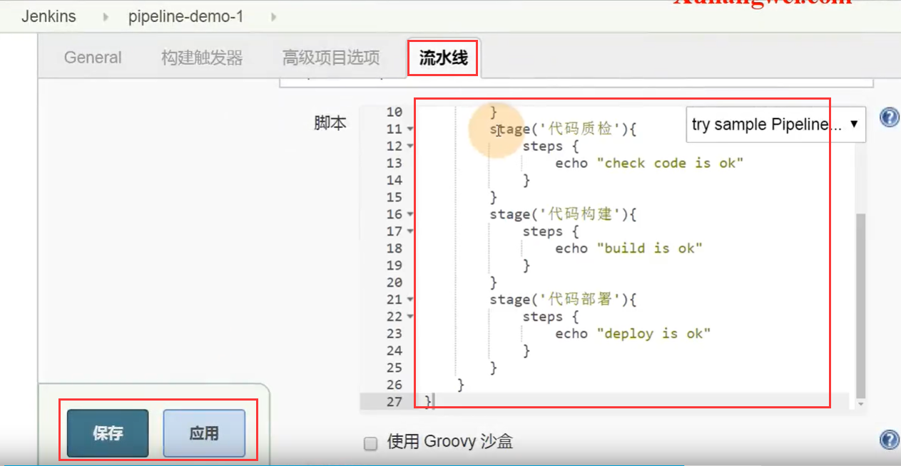

在编辑器中写一下流水线的代码

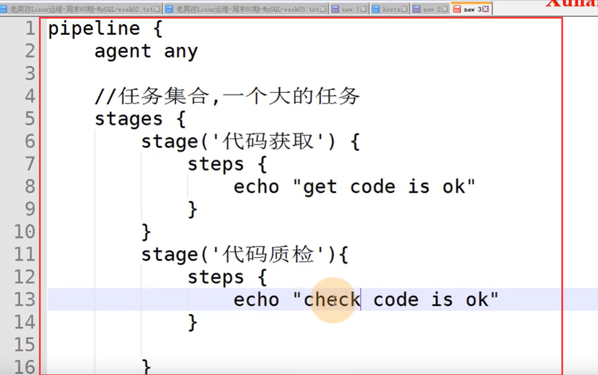

现在就完成了整个任务的阶段：

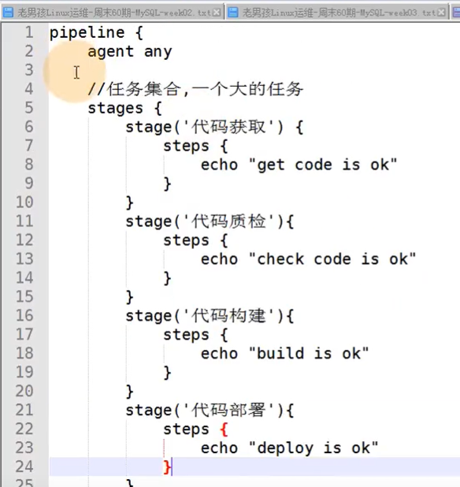

还需要post--比如任务都执行完后需要进行通知--我们暂时先不写post

点击构建--这次的构建就和我们之前的构建是完全不一样的--有阶段视图--每个阶段都会展示出来的

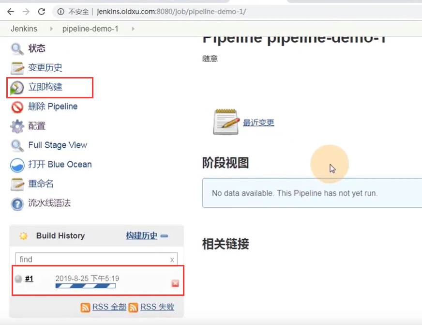

每个阶段都看的清清楚楚

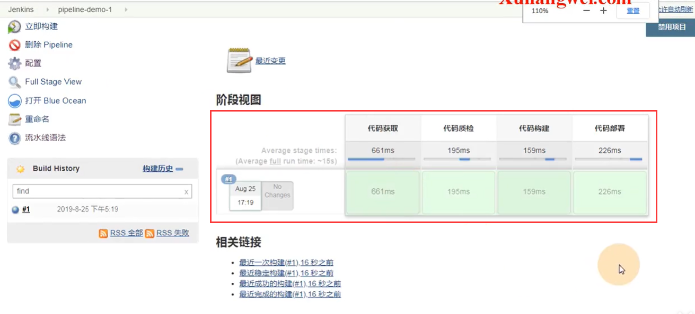

我们现在打开Build Ocean

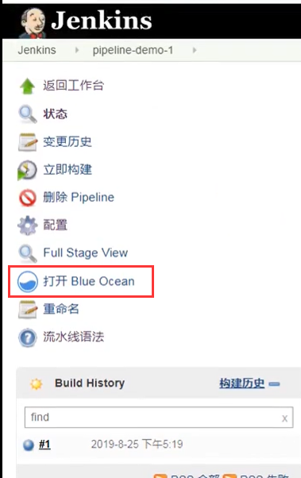

然后进入的pipeine界面--点击运行

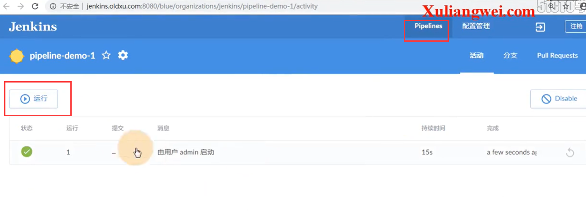

​		可以通过点击消息键入

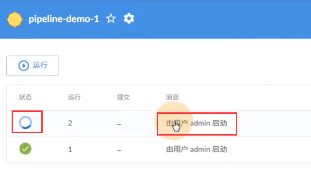

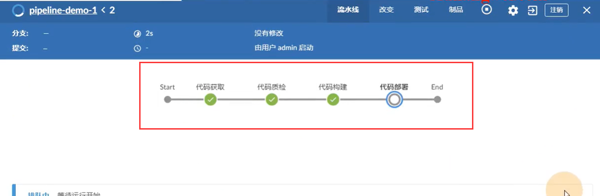

等执行完最后颜色也改变了

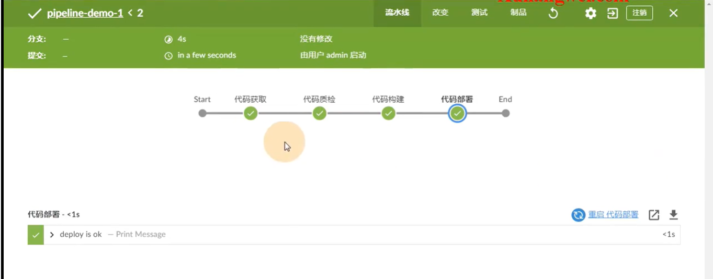

我们的pipeine有俩种写法--第一种是直接写在了Jenkins配置中--Pipeine script

​	第二种是--Pipeine script from SCM

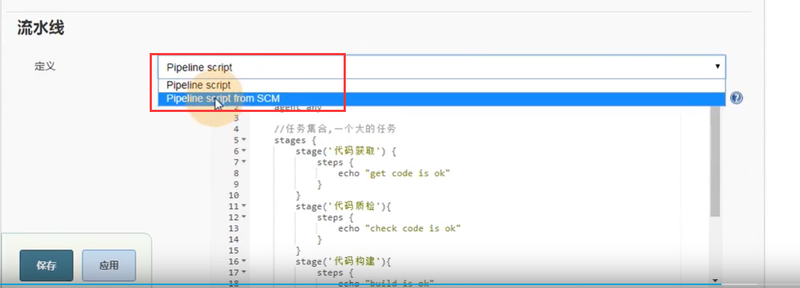

在这里面--就是配置从git获取 到执行的pipeine代码

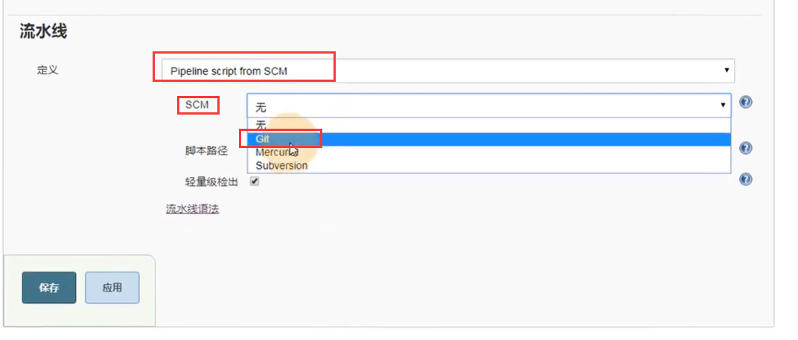

设置git地址和token

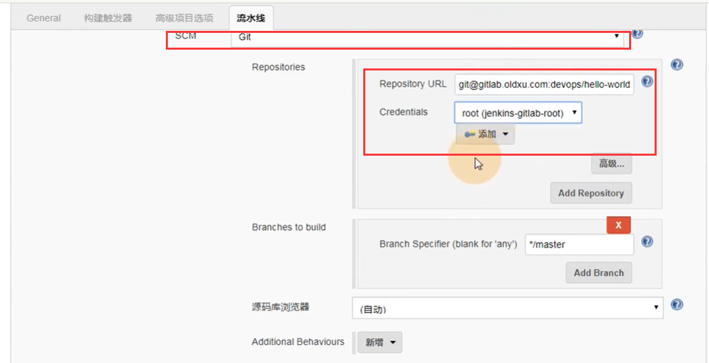

此git项目中必须得有一个Jenkinsfile的文件--然后配置这个Jenkinsfile的路径

​		这个文件中放的就是pipeine的执行代码

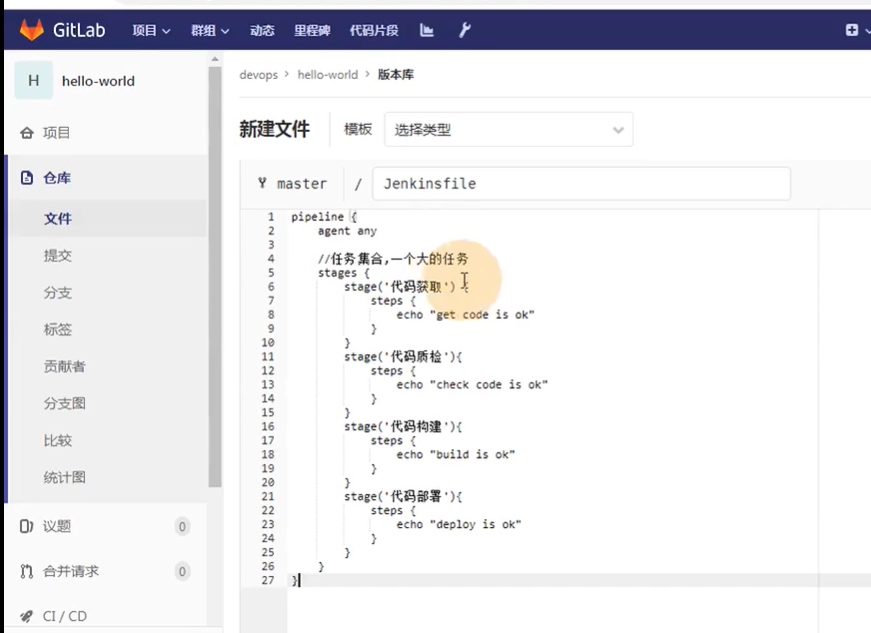

应用保存

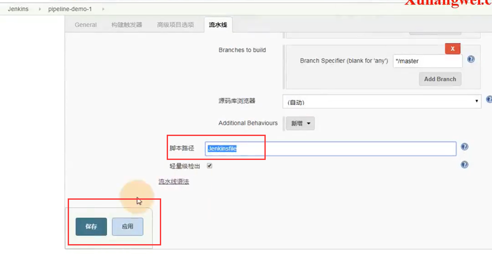

然后立即构建项目

​	先是checkout SCM---获取到git上的**流水线**代码

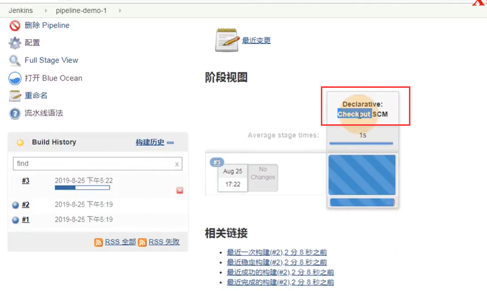

这个Jenkinsfile的文件会获取到Jenkins的工作项目目录下

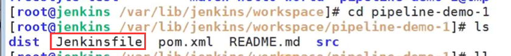

https://www.bilibili.com/video/BV11J411674t?p=43&spm_id_from=pageDriver

