# 24.Jenkins-pipeine-Bule可视化插件

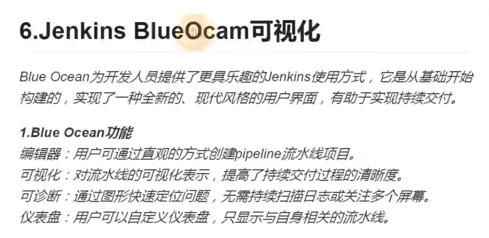

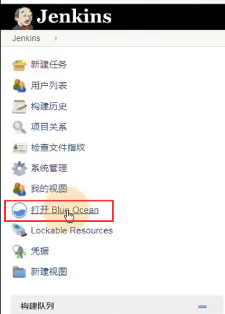

效果就是这样：

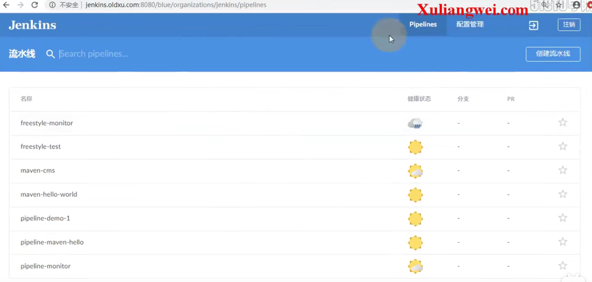

​	可以创建流水线

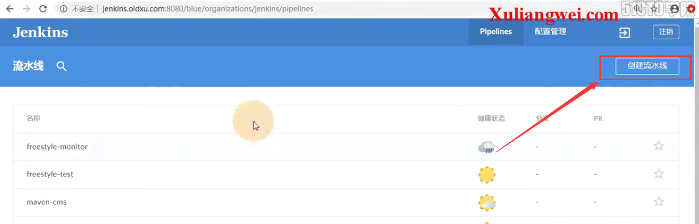

还可以点击想要查看的项目--进入后可以点击运行进行代码检测

​	然后可以点击消息键入查看日志

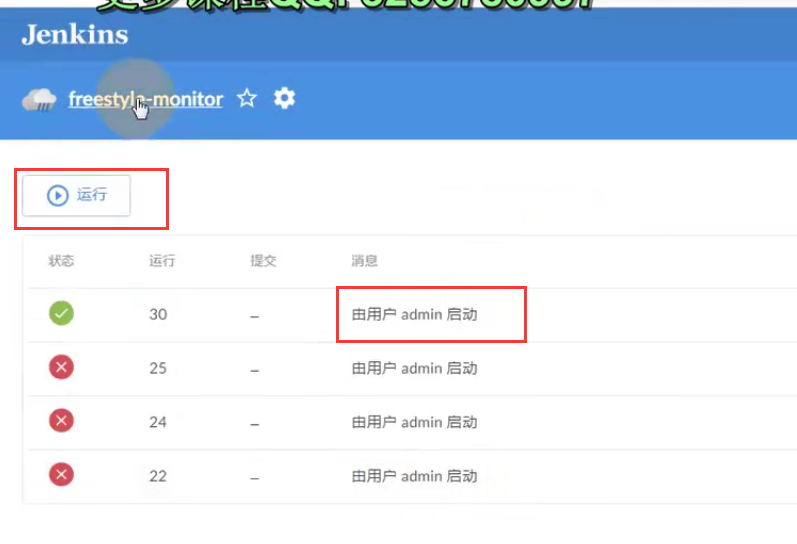

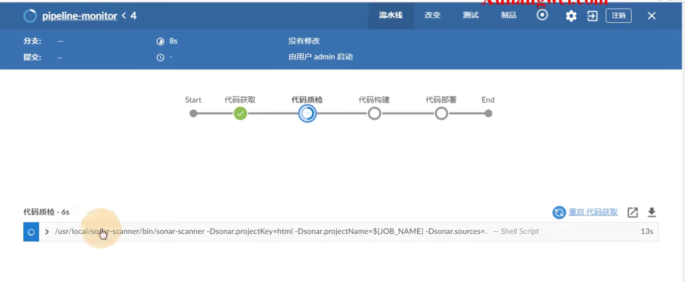

#### 2、将Jenkins项目参数化构建设置为文本

​		如果参数化构建选择为文本的--那么就可以在sonar单独执行了

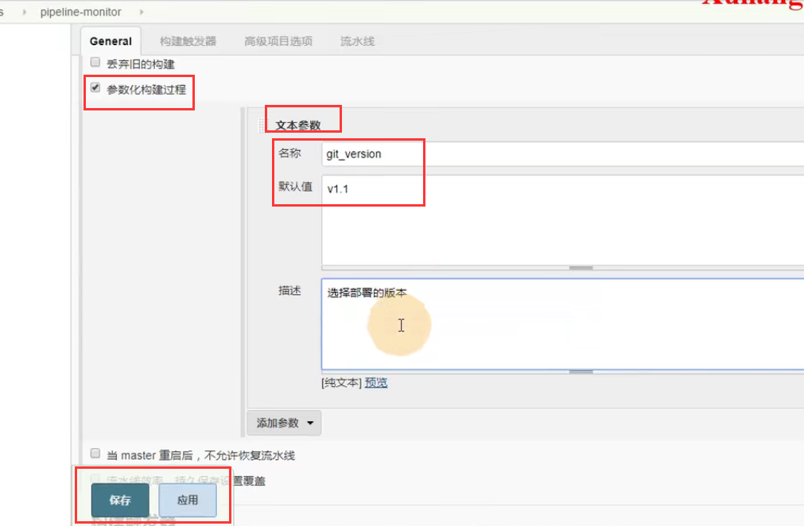

点击运行--如果构建参数是文本的就可以在这里直接点击运行了

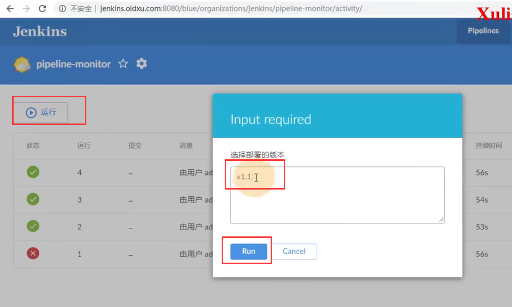

​	这个插件的作用就是让流水线看的更为清晰一些

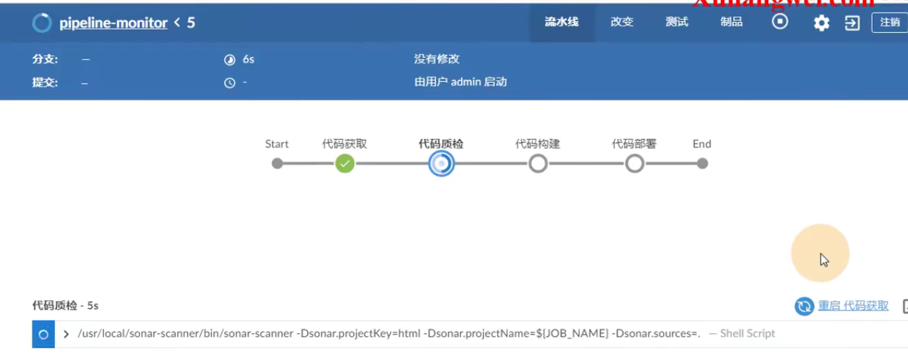

​		执行完成变为绿色

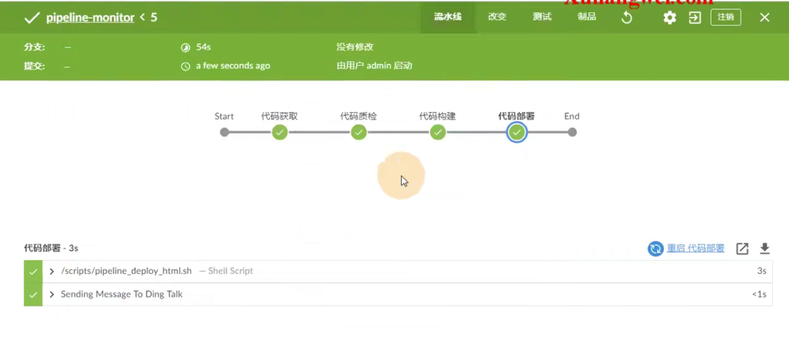

代码执行完毕--通知也没有问题

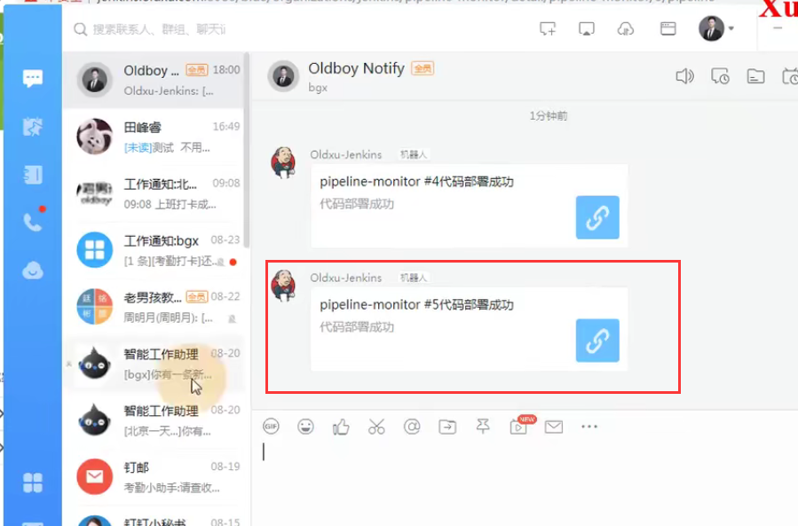

https://www.bilibili.com/video/BV11J411674t?p=45&spm_id_from=pageDriver

