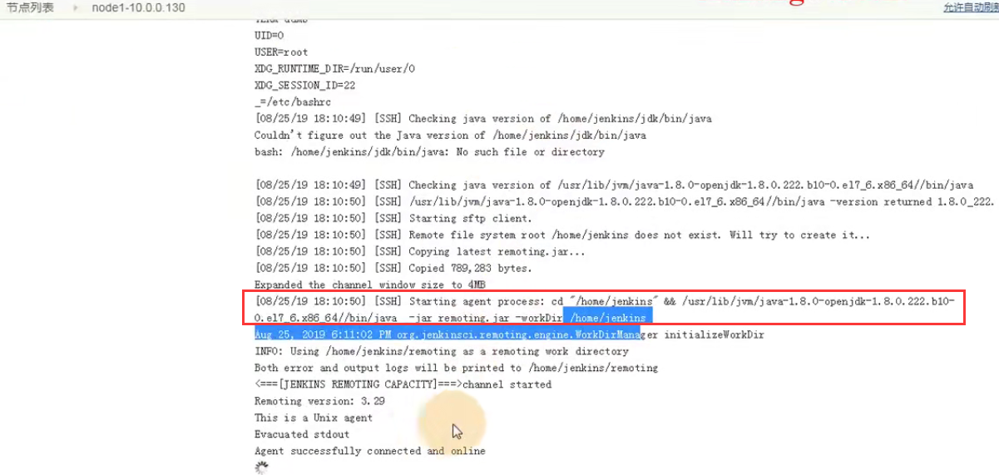

# 25.Jenkins分布式构建-并集成pipeline项目测试

## 1、Jenkins分布式构建思路

任务可以指定执行Jenkins是服务器，也可以不指定-交给Jenkins-master主服务

​	现在有10个任务，但是主服务master最多一次执行2个，那么就还有8个进入队列了

​	这8个队列的任务就顺延 进入Jenkins的从slave节点

​	从节点会将结果通知给主节点

​	（master上需要安装Jenkins，其他从服务器不需要安装Jenkins只安装jdk-git，maven，sonar等主服务安装的从也都需要安装）

## 2、启动一个Jenkins-slave节点

在系统管理下---节点管理

进入节点管理--然后新建节点

设置节点名称

并发构建数--一次最多支持构建几个项目

远程工作目录可以自己选一个要放入节点的地方--如果没有目录会自动创建的

将主节点的公钥推送到从节点服务器上--用于免秘钥通信

然后打开主节点的私钥 copy私钥

添加凭据：然后点击添加

需要配置一下工具的位置：工具就是主节点安装的所有需要的工具比如maven，jdk，git。。。。。

配置工具位置：

点击保存：

可以看到我们创建的节点：点击这个节点

进入日志查看一下：

可以看到会给你创建一个/home/Jenkins的文件夹

​	然后在文件夹下发送过来一个remoting远程的jar包，这个jar包自动启动起来后，就启动好了 Jenkins的从节点

启动成功后

可以看到有2个空闲的Jenkins节点

## 3、执行一个任务使用集群

​	先配置一下任务

我们让他的执行脚本的时候sleep 10秒

开始构建：然后再点再点，点击构建多次

可以看到主服务和从服务都在构建项目--这就是我们分布式构建

#### 如何指定服务进行构建呢

​	修改 之前的agent any 改为指定节点 node1--》这个node1是从服务节点的标签

开始构建项目：

是从节点执行的：

​	之前配置的git路径有点问题，，修改一下git配置的地址

测试再次修改sonar

修改设置域名映射

由于从节点找不到执行脚本而发生错误--将脚本远程推送到从节点上

构建的时候又报错了--原因是需要和web服务端无秘钥联通

构建成功：

https://www.bilibili.com/video/BV11J411674t?p=46

