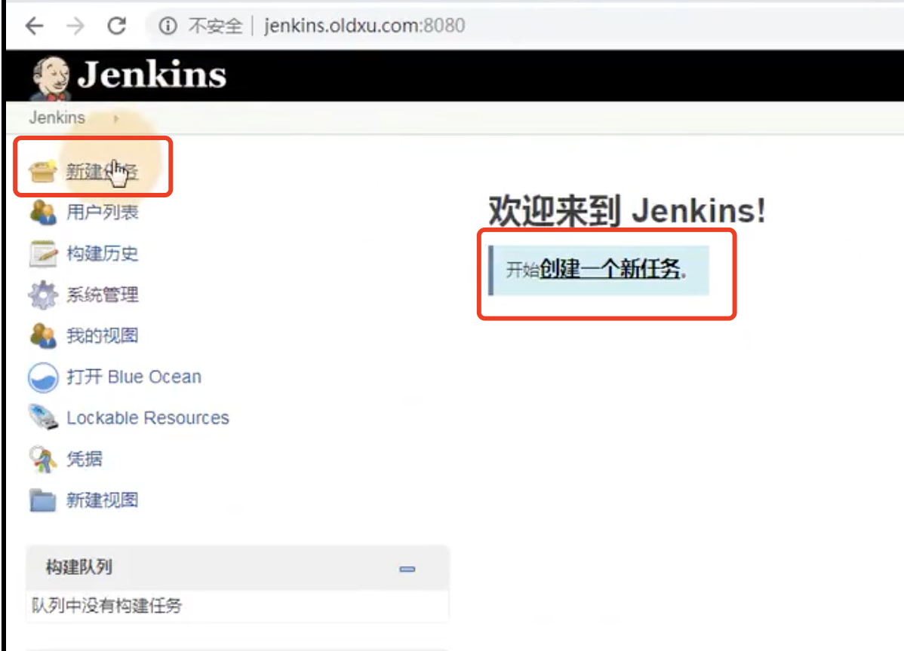
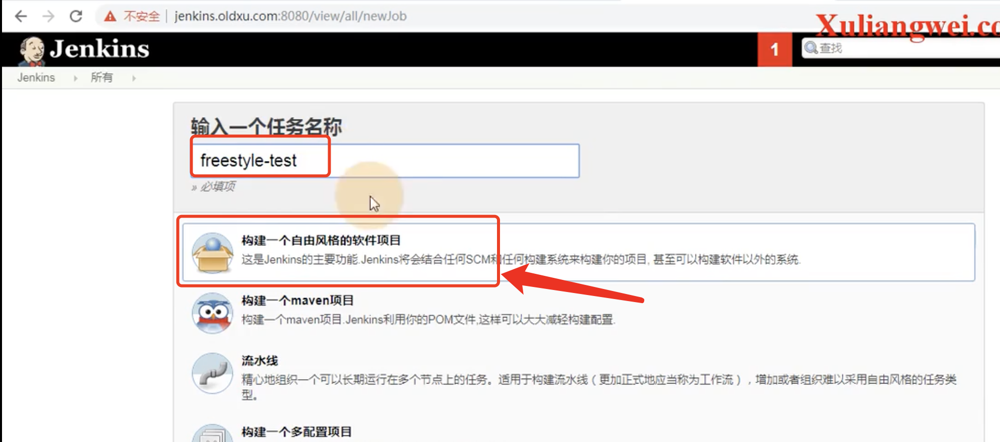
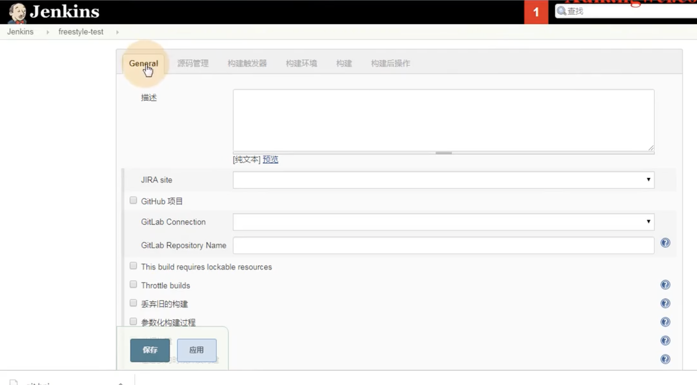
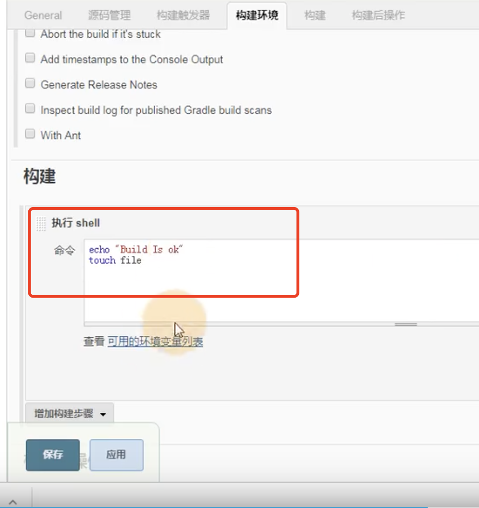
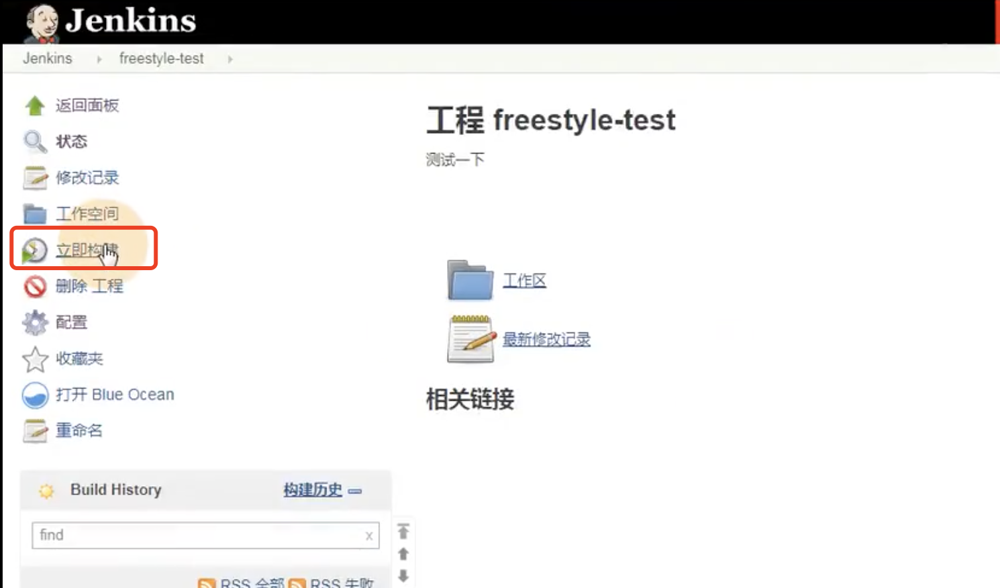
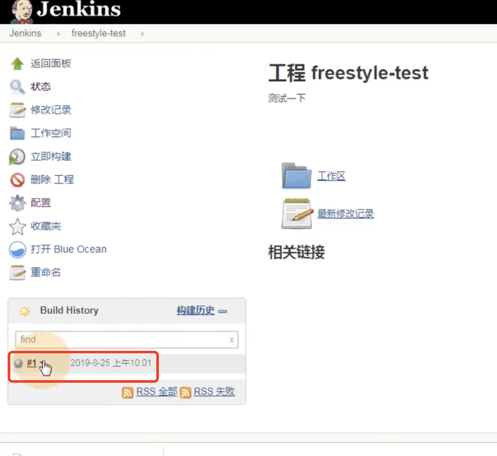
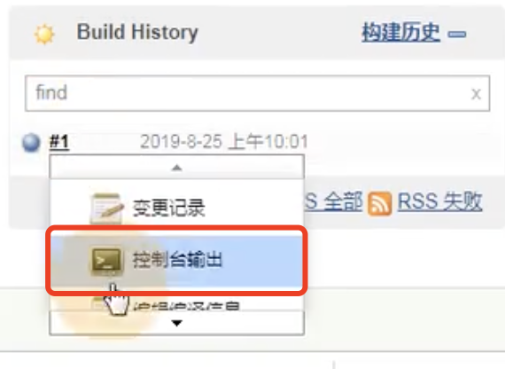
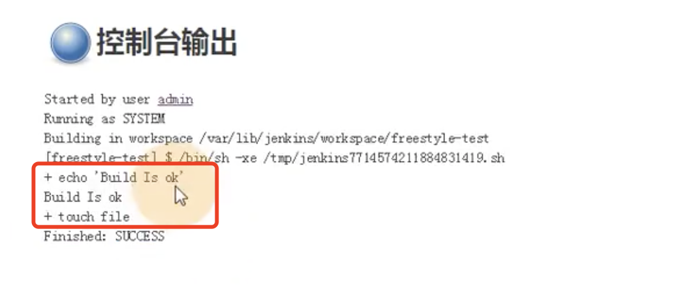
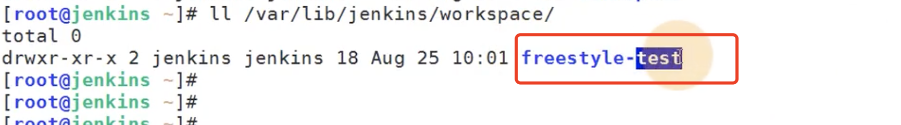
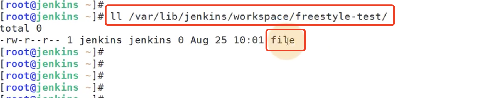

# 3.jenkins初体验-调用shell脚本


	## 1、使用jenkins创建一个自由风格的软件项目 freestyle

​		点击新建任务--创建一个新任务




然后选择构建一个自由风格的软件项目--输入项目名称




​	这里我们就输入个描述就可以了

​	丢弃旧的构建--很重要--每天可能构建成百上千次-我们可以保留近10次或者多少次的构建

​	参数化构建--很重要--是一种传参的形式




选择以什么方式构建--我们现在先选择shell

​		我们在shell创建一个文件--点击应用




​	我们点击立即构建




​	然后我们看到一个蓝色的小球# 1 构建成功了--如果是红色就是构建失败了




点击控制台输出




他执行了这个shell命令，构建成功创建了一个文件

​		疑问：我们要这个有什么用呢？我们直接执行shell不就可以了

```
		为什么要有这个web界面，对于开发而言，他们是不具备登录服务器权限的，只需要让项目能够上线就可以了，如果我们给一个这样的界面开发人员找到自己维护的项目，点击构建一下就上线完成了，这样的话，开发就不需要服务器权限了，还有这里可以做权限控制，能够看见想让看见的项目。
```





​	那么我们刚刚构建好的文件在哪里呢？

都在var/lib/jenkins/workspace

​		我们查看一下到这个目录发现刚刚创建的项目就在这里面




进入到这个项目目录--发现这里面有一个文件--就是我们刚刚构建的时候创建的文件




