# 5-手动实现集群架构代码上线

​	我们先看一下自动发布项目架构图：

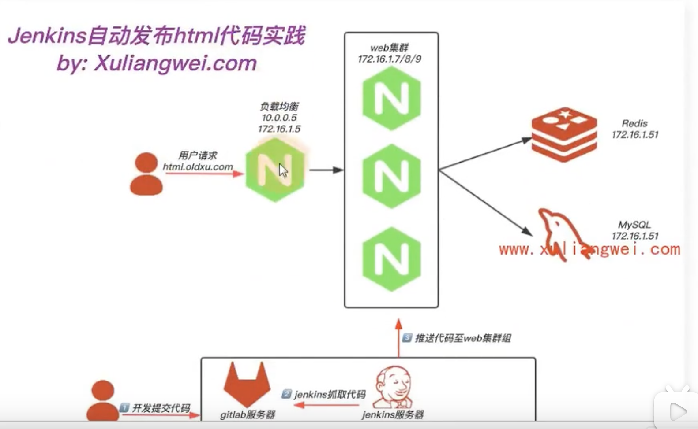

我们先搞3台机器-1台lb负载均衡，2台web

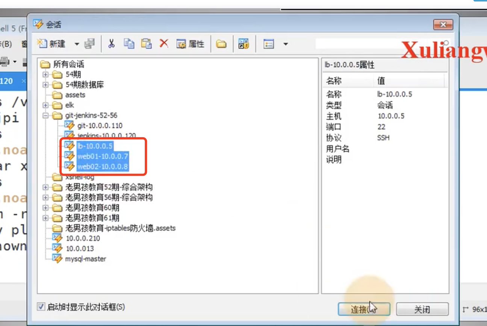

## 1、配置nginx

在5这台服务器上安装nginx

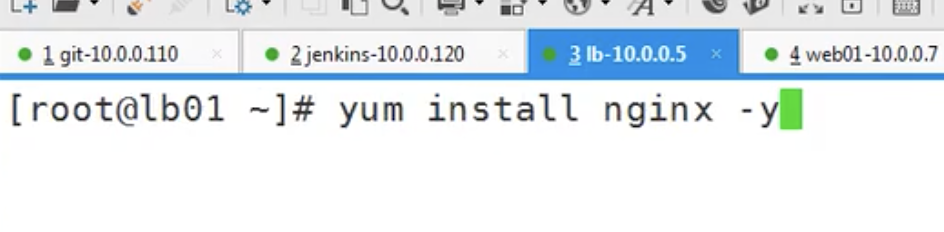

到nginx目录下，查看一下nginx的配置

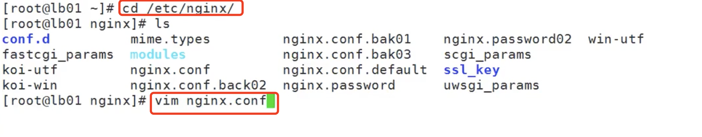

然后我们编辑一个负载均衡的配置：在conf.d下

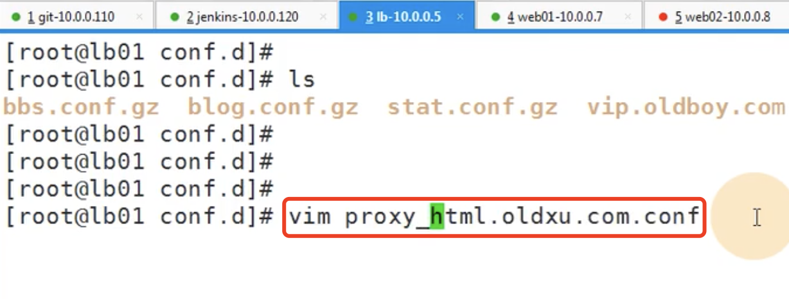

​	配置的意思是：有人访问server_name html.oldxu.com这个地址的话-监听的是80端口，我就代理到html这个资源池，而html的资源池配置的就是2台web服务器的地址

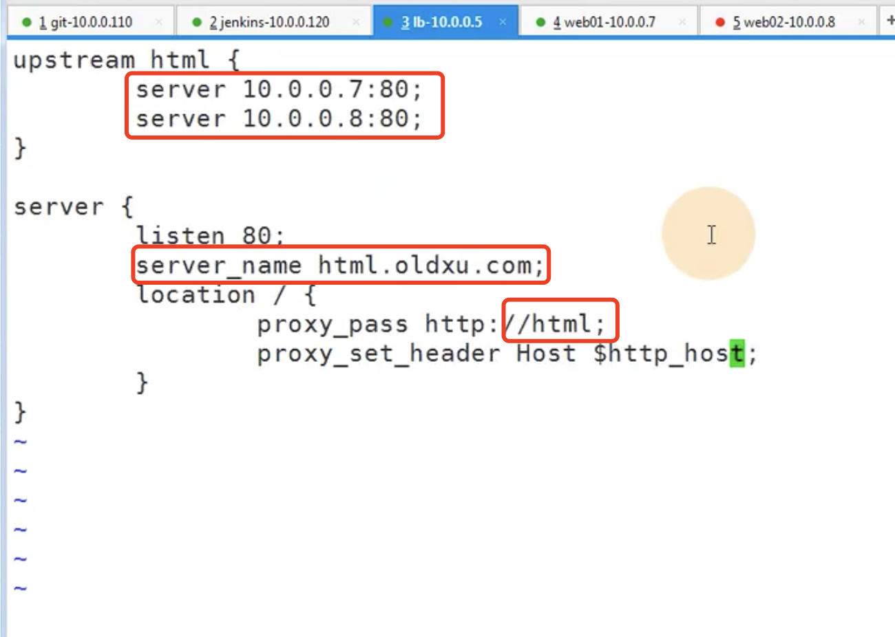

nginx -t 检查一下配置文件语法是否正确--没有问题

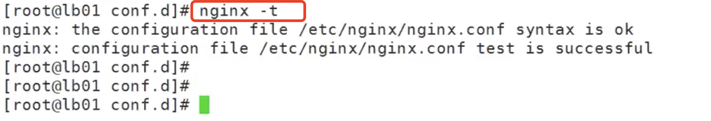

重启nginx

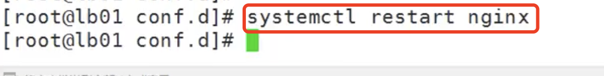

## 2、配置后端web服务

​	在7这台服务器上配置一下nginx

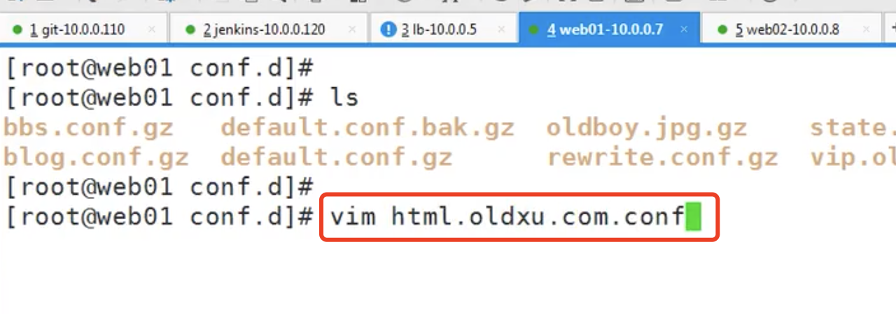

然后配置nginx 监听80端口，然后配置请求服务名称是 html.oldxu.com

​		配置项目路径是在/code/web下，然后请求的是index 或者 index.html

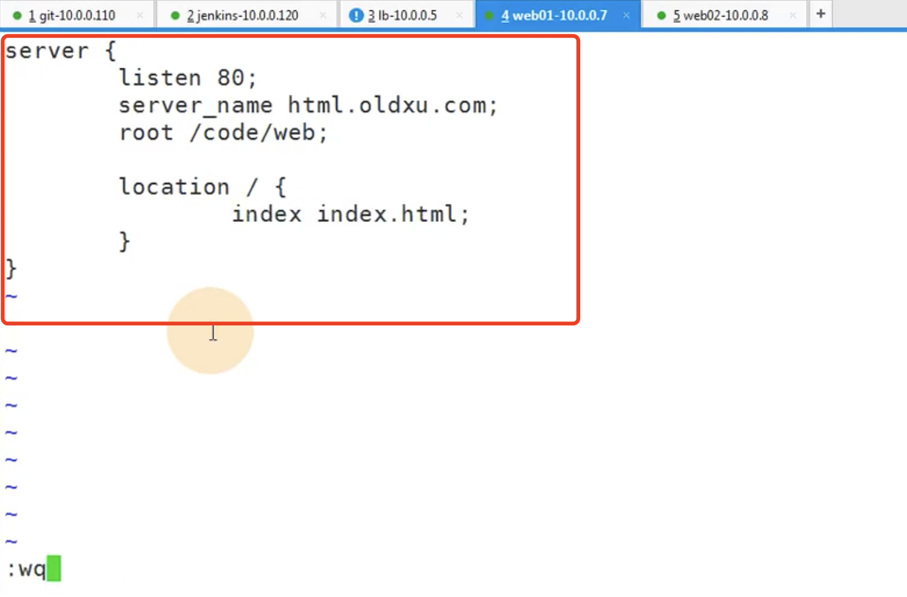

然后重启nginx

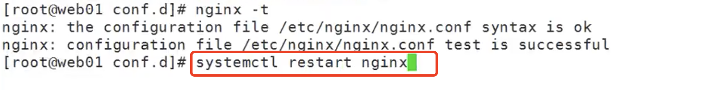

然后创建/code/web文件夹

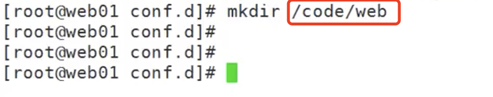

第二台web服务也是一样的配置

请求一下服务看看：403 因为我们的code/web下什么也没有

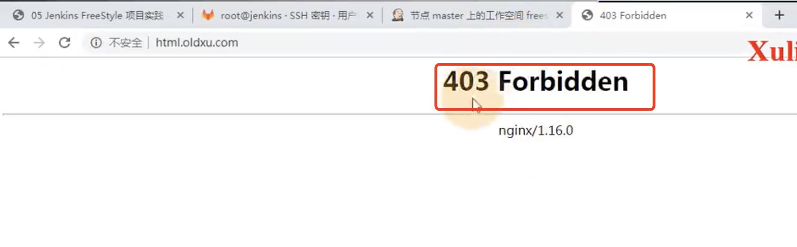

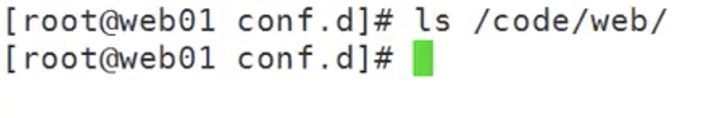

## 3、手动将Jenkins获取的代码推送到服务器上

​		进入到Jenkins的工作目录--然后进入到项目文件夹下

​		使用scp -r ./* 全部推送到 10.0.0.7服务器下的 /code/web目录下

​		需要输入yes建立连接和推送的服务器密码

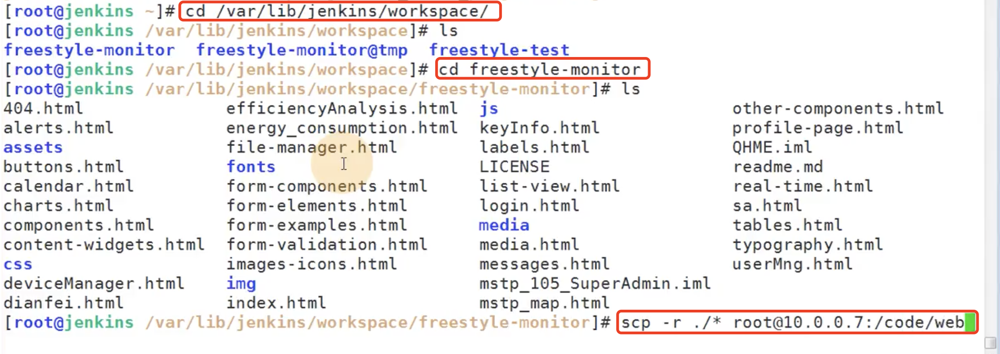

10.0.0.8也一样推送一下：

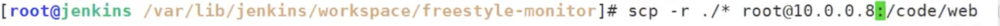

我们这回访问一下项目：发现没有问题请求成功了

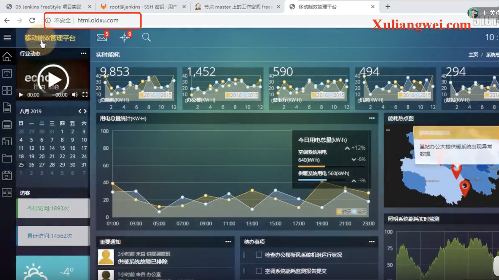

​	那么现在问题来了：如果项目名称改变了，我们是不是还得重复一下以上的步骤--比较麻烦的

如果改了一下名称，又发现不对还是得改回来是不是又得操作一遍。。。。我们后续就要解决这样的问题

