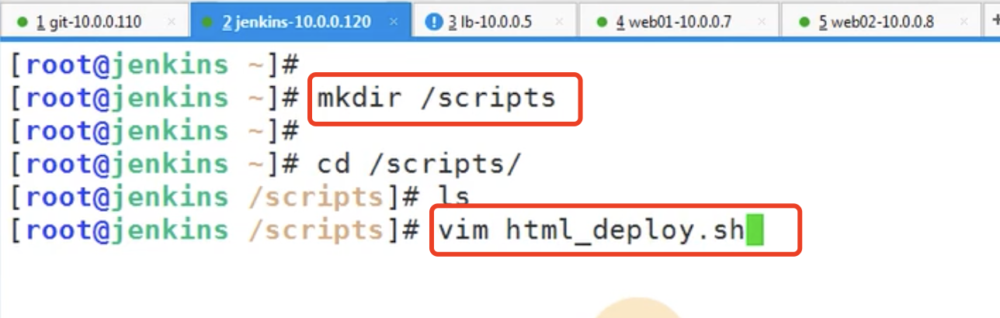

# 6.Jenkins实现集群架构自动上线功能

​		我们之前实现的手动过程还是比较繁琐的，我们现在期望是改为自动化的。

## 1、自动发布项目实现思路

​	1、手动搭建nginx集群架构

​	2、开发者提交代码至gitlab，手动拉取代码，并推送至web服务器组

​	3、将手动操作编写至shell脚本，由Jenkins调取，并推送至web服务器组

以上3步--前2步我们都实现了

## 2、编写shell脚本

​	我们在Jenkins服务器上先创建一个文件夹，然后创建一个脚本

写脚本--先把思路写下来

​	设置时间戳

​	进入Jenkins工作目录 并且&&   \  是换行的意思

​	打包 到/opt/web-时间戳.tar.gz ./* 全部 

​	设置web_server变量以空格分隔 ，然后循环

​	scp 将项目的压缩包发送到web服务器的opt目录下

​	然后ssh 连接目标web服务器 创建文件夹在/code/web+时间戳

​	并且解压缩web+时间戳的包-到/code/web-时间戳的这个文件夹下

​	删除/code/web下的全部文件 并且

​	建立软连接 ln -s 将 /code/web-时间戳的文件夹 连接到 /code/web上（为以后版本恢复修改软连接提供方便）

将这俩块内容都改为函数--因为函数如果我们不调用就不触发

然后我们再写一个deploy函数--有人说这样写很麻烦-其实一定要写函数脚本的，不要写裸脚本，复用的机会少，而且维护困难

​	编写deploy函数触发以上的第一步和第二步函数

​	然后默认触发deploy函数--编写完成--保存脚本

添加最高权限

查看一下脚本的路径--复制

## 3、Jenkins配置

​	在Jenkins中进入项目点击配置

然后我们在构建中选择执行shell

这样的话开发就看不到我们的脚本（如果直接写在这里就完全暴露脚本内容了）--点击保存

然后点击--立即构建

​	发现报错了--查看一下原因

原因是：因为Jenkins是由Jenkins用户启动的 他无法打开tar这个包的权限

我们查看一下运行Jenkins的用户确认一下--确实是Jenkins用户，要么升级权限，要么换为root用户

我们改为root用户运行

重启：Jenkins

现在我们再次构建：

进入控制台看一下：

​	报错：hostname解析不了--ssh的时候出错了

修改一下脚本不用host是不是关键词的问题，改为hosts

不是这个原因--原因是ssh需要免密要的连接

现在我们建立免秘钥的ssh连接

再建立10.0.0.8的免秘钥连接

测试ssh连接--没有问题

再次构建：发生报错--原因是使用变量没有加$符号

然后再次构建： 构建成功

查看控制台--成功

测试一下网站--能不能打开-没有问题

然后我们在web服务器上查看一下

​	在10.0.0.7下的code文件夹下web文件夹软连接到 了 /code/web+时间戳文件夹上

## 3、模拟修改发布

​	在gitlab上直接修改一下--提交修改

然后点击构建

然后我们等待构建完成--刷新页面

​	发现已经改变了

## 4、脚本的优化处理

​	我们可以使用Jenkins的变量进行脚本的优化

​	我们还可以将多次使用的文件夹设置为变量

点击构建--构建成功没有问题

现在的脚本有没有什么问题？1.回退怎么办？2.使用tag方式发布

​		如果我们以tag的方式进行发布那么回退的问题是不是也是可以解决的

