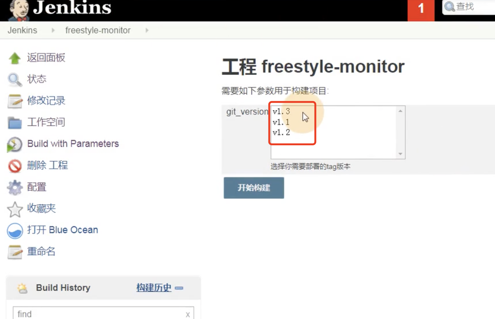

# 7.jenkins实现集群架构代码自动部署与回滚

	## 1、让项目实现支持tag版本的上线

​		由于之前上线方式是直接获取最新代码，那么会造成后期回退变得困难，那如果采用tag方式，比如第一次上线v1.1，第二次上线v1.2，如果上线v1.2出现问题，那么就可以快速回退至上一个版本v1.1

## 2、实现tag版本上线的方式思路

​		1、开发如果需要发布新版本，必须将当前的版本打上一个标签。

​		2、jenkins需要让其脚本支持传参，比如用户传递v1.1则拉取项目的v1.1标签

## 3、实战jenkins部署tag版本

​	1、首先安装Git Parameter插件，然后配置jenkins的参数化构建，让用户在构建的时候选择对应的版本

​	我们先选择几种参数方式查看一下效果：

选项参数：

我们试一下这俩个脚本：

立即构建--变为Build with Parameter

​	我们输入个参数--然后选择一个参数

然后点击开始构建--我们看一下输出的结果是什么--是v1.5就是输入的内容

​	选项参数就是输入的选项

## 4、安装插件

​	搜索插件--然后安装git Parameter

​	

​		安装过程：安装完成圆点是蓝色的不需要重启jenkins

​	我们把之前的参数构建删除掉，重新选择一下参数化构建过程

​		现在安装了插件-我们就可以选择git Parameter了

​	输入的name--就是变量

​	Description：描述信息

​	Parameter Type：选择tag标签

​	Default Value ：选择分支

​		注意这个源码管理中需要修改

​	改为${git_version}---与参数名称一致

 

## 5、修改脚本

​		因为我们需要传入参数--而且脚本中需要使用参数--所以我们需要修改脚本

copy一下旧脚本生成一个新的脚本--然后编辑脚本

​	加入tag版本参数

脚本还可以优化一下-把时间戳和tag版本参数合并一下

​	设置构建的执行脚本：

​	点击Build with Parameter 选择你需要构建的tag版本--现在是空的

​	因为在gitlab上就没有tag标签

我们加一下tag： v1.1

然后我们编辑一下代码-再次打个标签v1.2，提交

现在我们刷新一下jenkins：可以选择tag标签了

选择v1.3开始构建

刷新项目--构建v1.3成功

现在我们又想部署v1.2了

V1.2构建成功--现在就完全实现了版本tag控制的功能

现在有个问题：就是我们点击构建一次就会生成一个文件夹

## 6、版本回退

回退如何处理：

​		直接在web集群服务主机上，进行软连接删除和重新建立

​		我们希望是在构建的时候可以选择-选择是部署还是回退的选项进行构建

我们在参数构建--增加一个 **选项参数** 构建

编辑内容：

 脚本该如何接收呢？我们来修改一下脚本

​	copy一下发布tag的脚本为新的rollback脚本，然后编辑

我们在脚本中加入一个函数 back--这个函数用于回退的功能

​		然后我们对可选变量deploy_env进行判断 如果是 deploy字符串 就执行deploy函数

​		如果是rollback 就执行back函数

​		

先保存--试试-在构建中设置执行的脚本

先部署一下测试一下：

构建失败--原因是脚本elif 最后得有个then;		然后重新构建成功

我们先做个查询文件的测试--查询 /code文件夹下 的 深度1级 的类型文件夹，名称为web-*-v1.1的文件夹

​	基本可以精确定位到文件夹

编辑脚本： 将查询到的回退版本 赋值给变量back_file,

​					然后删除原先的web文件夹

​					建立软连接到回滚的文件夹上

选择回退--开始构建

查看控制台：

成功回退：这个回退是基于原先的文件夹进行的软连接切换，并没有重新copy代码进行构建

## 7、重复构建的问题--就是一直点击构建

比如v1.1构建多次--那么这个项目的代码相当于被获取了多次--导致很多重复的文件夹

​		我们肯定是不希望他能够重复执行

