# 8.jenkins集群架构代码自动发布重复构建的问题

​	

​	重复构建的问题，我们点击构建一次-然后就进行一次代码的获取-这样其实是不好的，造成硬盘的浪费，还有就是我们版本回退应该是需要保留一个唯一的文件的。

​	我们点击查看--可用的环境列表

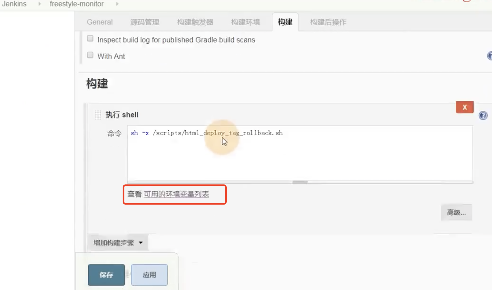

​	我们可以将这俩个变量做一个判断：

​		判断如果git_Commit === Git Previous Successfull commit就相当于部署过了

​		git_Commit是第一次检出提交的hash值，

​		Git Previous Successfull commit：是上一次提交检出的hash值

​		那么判断第一次的检出hash值和上一次检出的hash值如果一致，那么就属于重复构建了

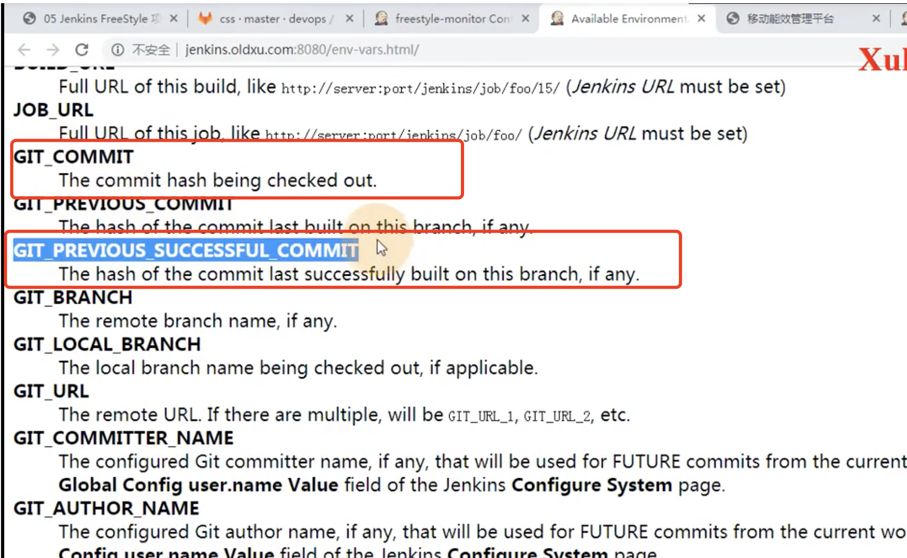

​	然后我们编辑脚本：

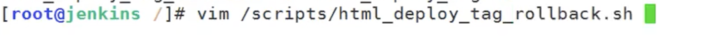

​	进行判断

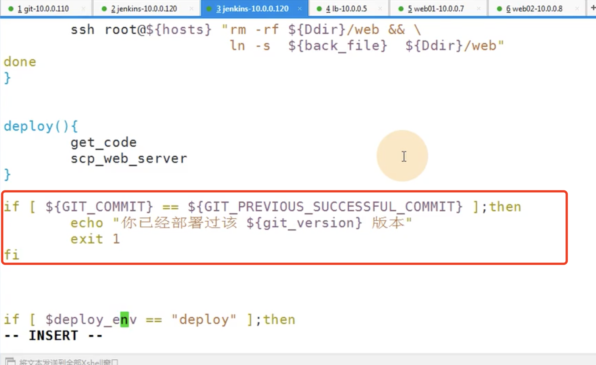

​	我们应该把这个放在部署的判断中，因为如果我们回退是不需要进行这个判断的

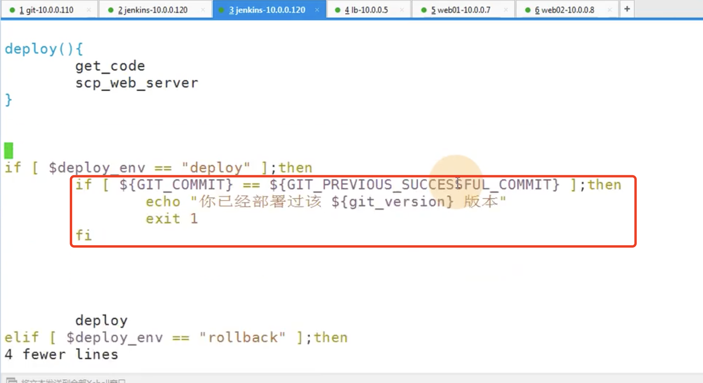

​	将deploy放在else中

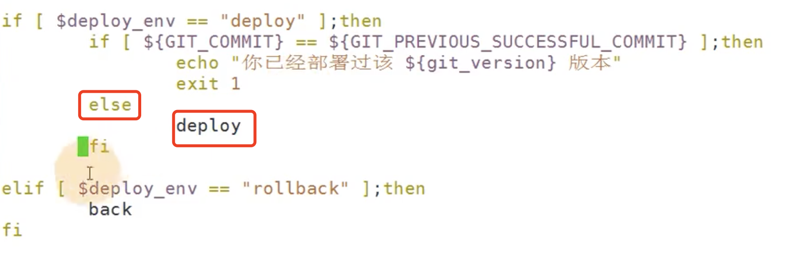

​	现在我们测试一下重复构建：

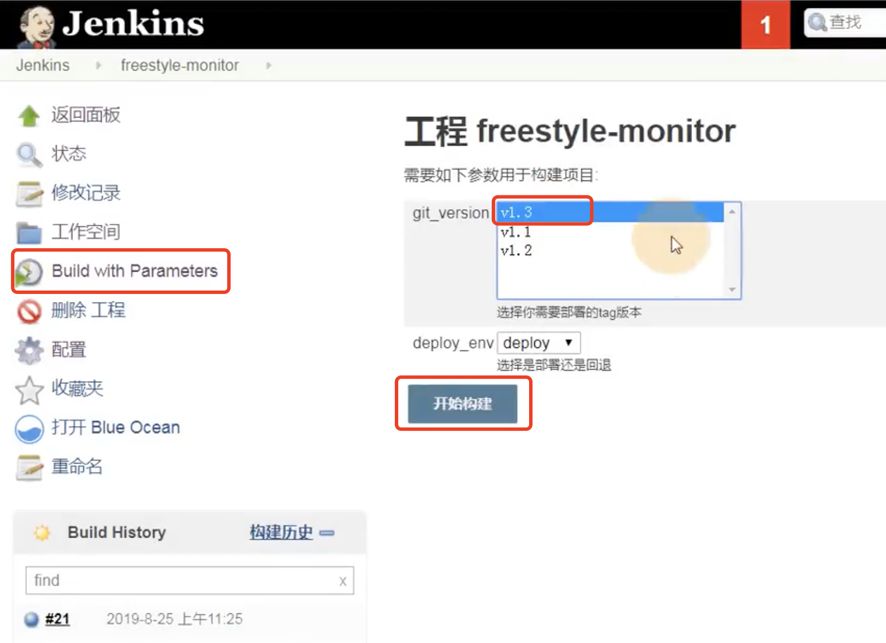

构建失败--已经构建过了

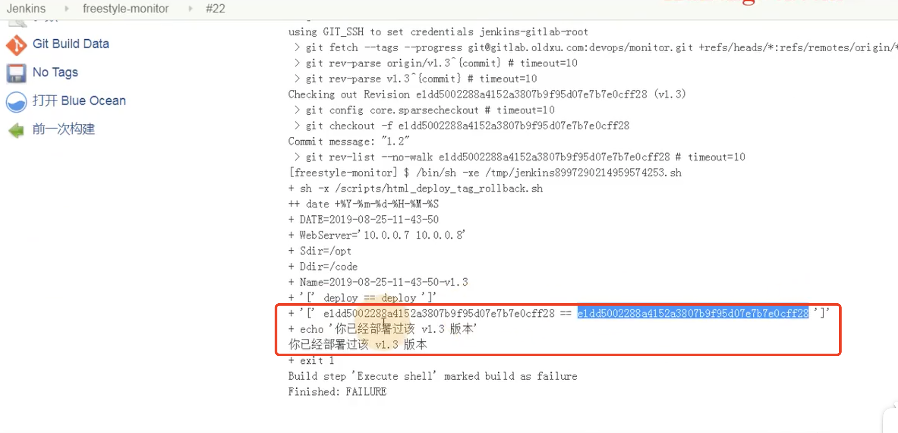

我们修改一下代码

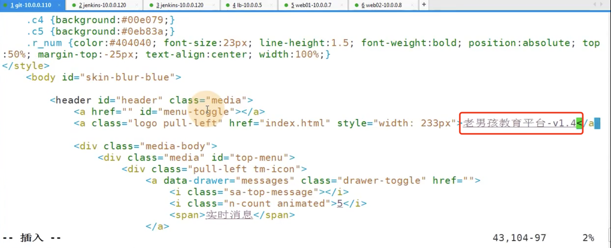

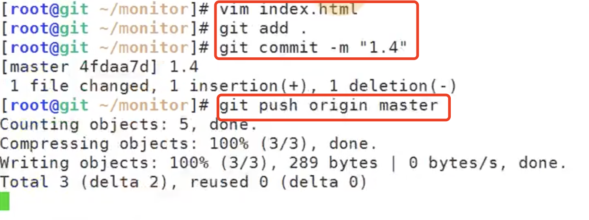

设置v1.4的tag

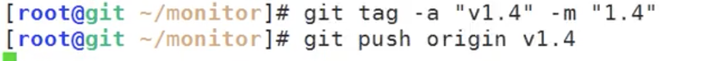

然后我们现在构建一下：

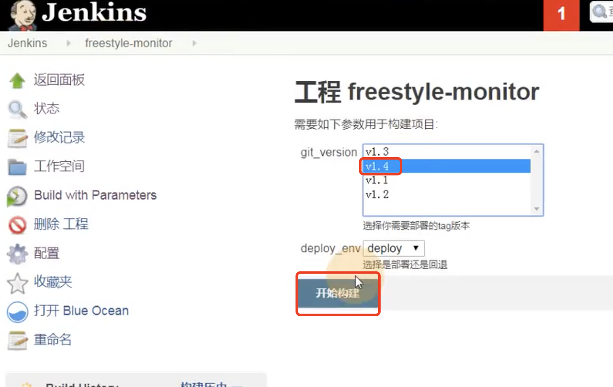

部署成功

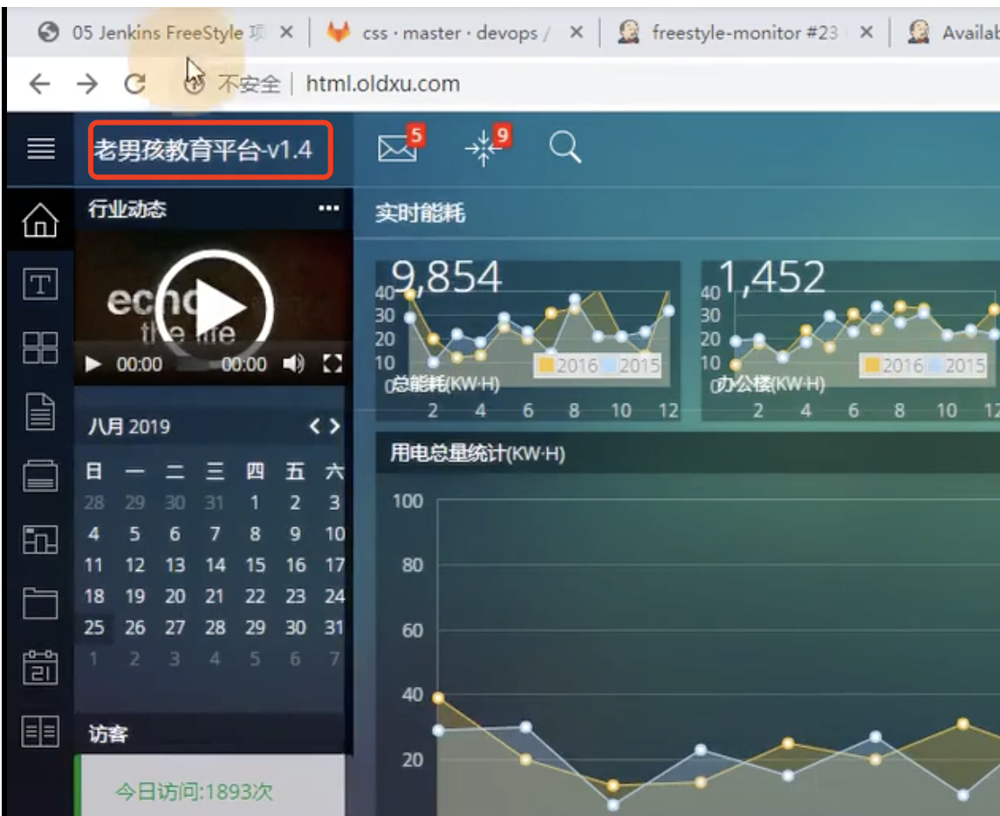

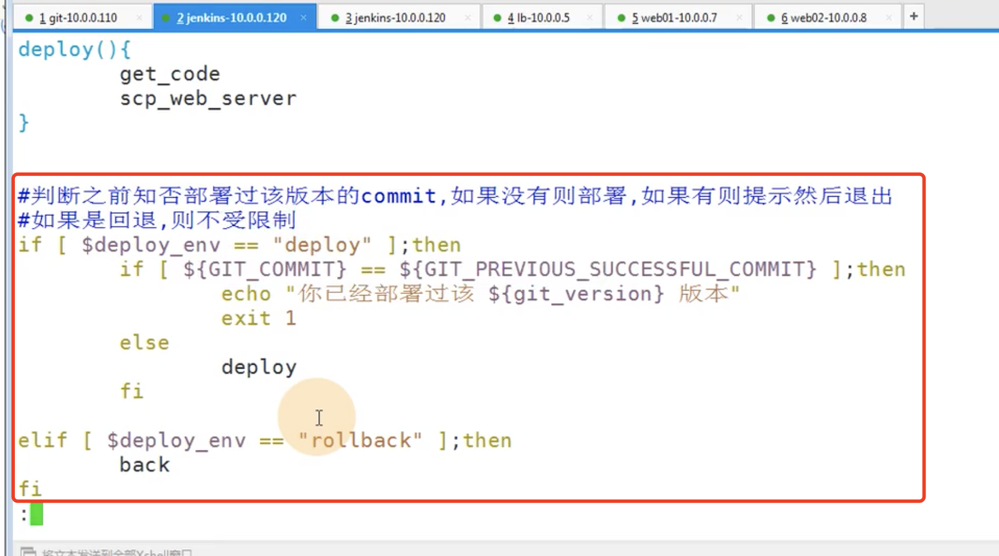

