# 11.git基本操作-分支原理


#### 1、什么是分支

​		其实就是我们在不同的空间进行工作或者开发--然后在某个时间点选择合并 然后就聚合功能了

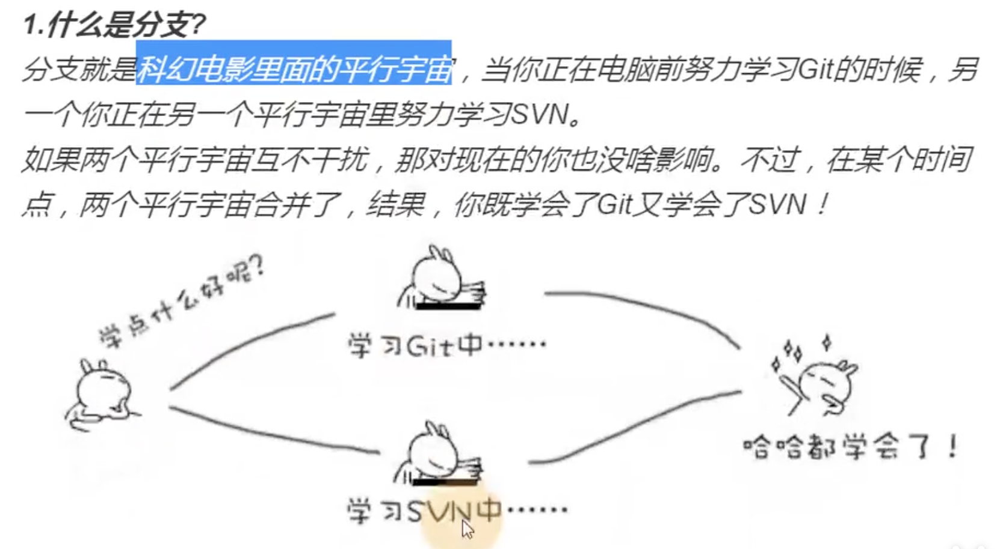


​	比如之前的svn 总是有人提交的错误代码，导致的报错问题得让他修复重新提交-比较烦人

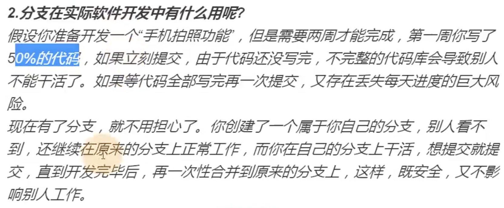


我们先看一下这个图：来解释一下这个图，理解一下分支和分支合并的思路

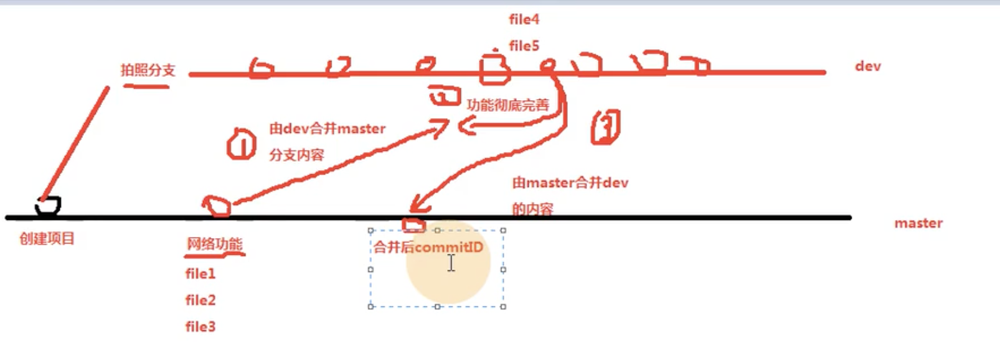

```
	比如 我们要开发的 拍照功能 和 网络功能是同步进行的，由我们开发的拍照功能独立一个分支进行开发
然后在我们开发完成后如何进行合并到master呢? 肯定是不能直接合的，因为如果你直接合出了问题bug别人拉取到你的代码就会报错，如果是持续部署也会报错
	
		那么首先是 你应该由拍照分支合并master分支，然后在拍照分支测试合并的代码没有问题之后，再由拍照dev分支合并到master分支，这样就OK了
		
		还有个问题就是--如果在俩个分支在合并的时候发生冲突了呢？这种没有办法手动解决
	
	
```


#### 2、分支操作

​	1.如何查看分支： 使用命令 git branch  默认是在master分支

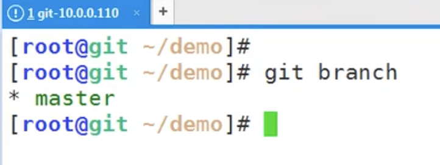


​	2.如何创建分支：使用 git branch 分支名称

​		可以看到我们现在有2个分支了，现在处于带*号绿色的分支上

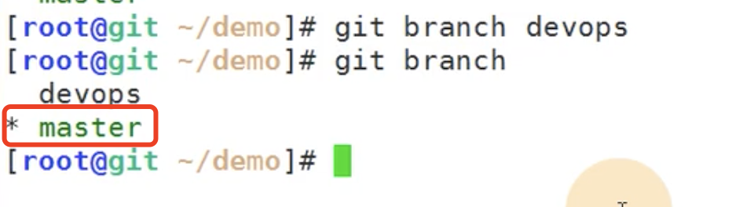 


​	3.如何切换分支 使用 git checkout 分支名称

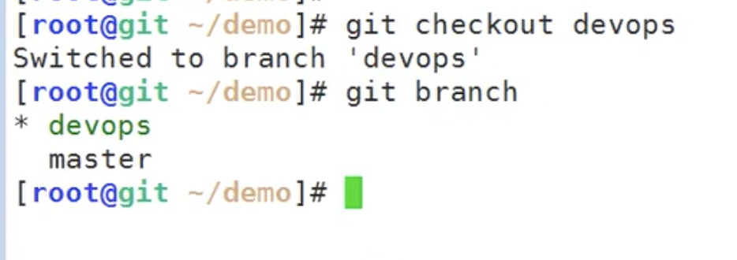

​	而且新的分支也会有之前分支的内容

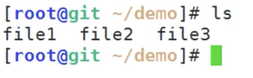


我们现在在新的分支上加入3个新的文件

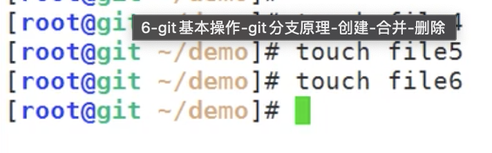‘


​	4.分支的合并 使用git merge

​		首先 我们需要考虑的是该谁合谁，肯定是我们先去合并master的，因为要保证master的代码稳定

我们目前是在dev的分支， merge master 就是将master的代码合并到dev上--可以理解为将master的代码拿过来

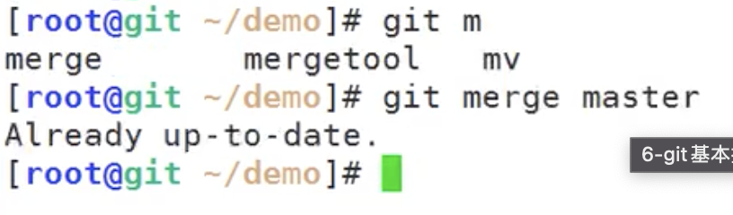

​	提示Already up-to-date 就是master没有更新


那我们切入到master 让master往前走几个节点再进行合并

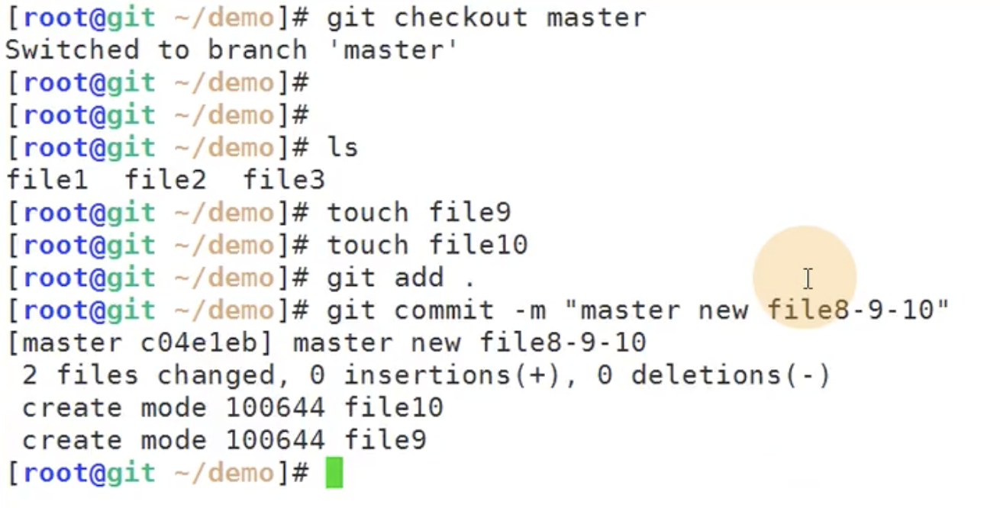


​	然后我们再切换到dev分支 对master进行合并  git merge master

​		提示：合并分支master 到 devops分支 

​		请输入一个提交信息 这样虽然成功了，但是建议还是加上提交信息


 

我们写一下合并信息

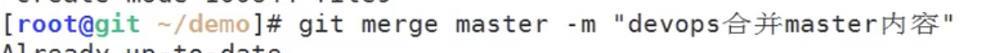


现在我们看一下合并的内容--file9 和file10都是合并过来的

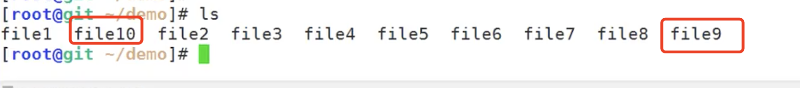


合并过来我们看一下状态-看下用不用提交

​		工作台干净不需要提交

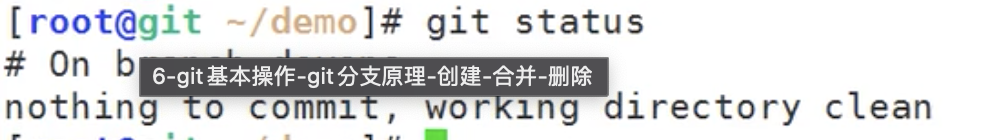


​	假设我们现在在合并完之后在dev的分支也测试完成了没有问题


现在我们就可以合并到master分支了

我们先切回master分支--然后查看文件是没有合并的内容

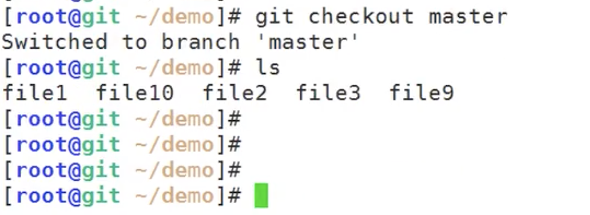


然后master分支合并dev分支

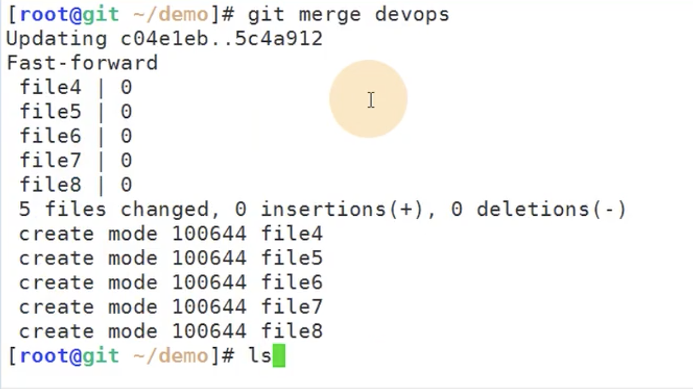


查看master文件内容--dev分支的内容都合并过来了


​	5.删除分支：git branch -d 分支名称

​		我们dev开发完成并且已经合并到master分支了，然后其实就可以删除dev分支了

​		然后查看已经没有dev分支了

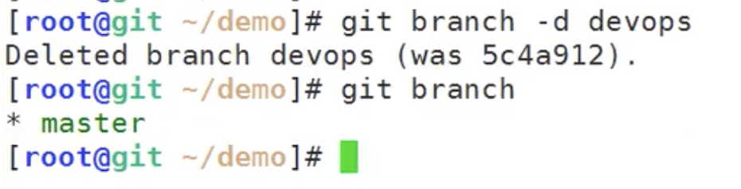


​		注意：每次merge 都会有新的版本id生成

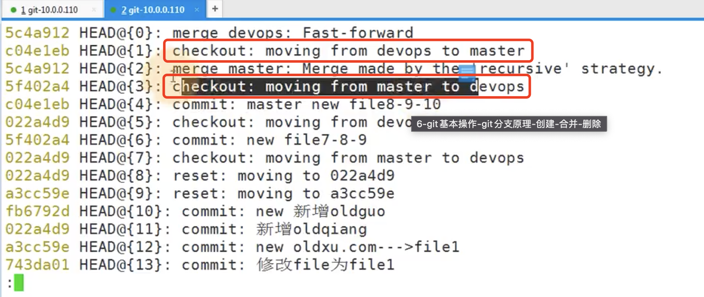


如图：

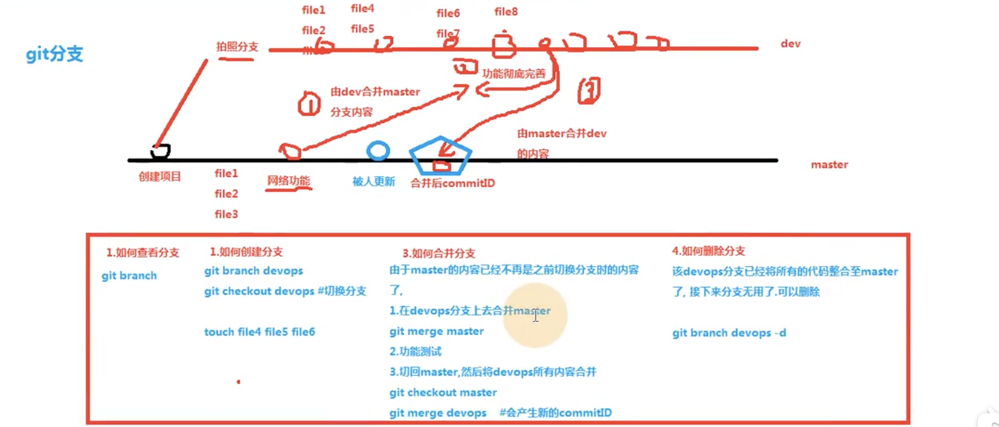


#### 3、合并冲突

​	什么是合并冲突： 指同一个文件同一行代码-在合并的时候有不同的内容就导致冲突了

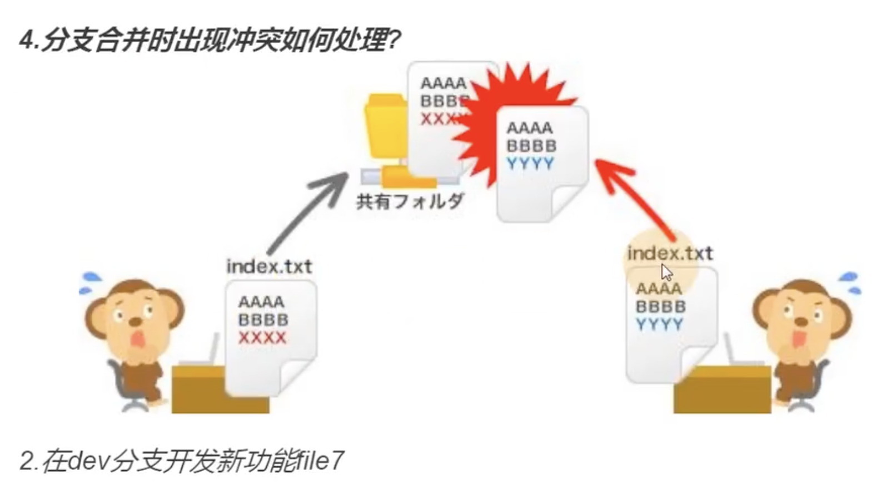


模拟一致冲突：

​	在file1插入一行内容	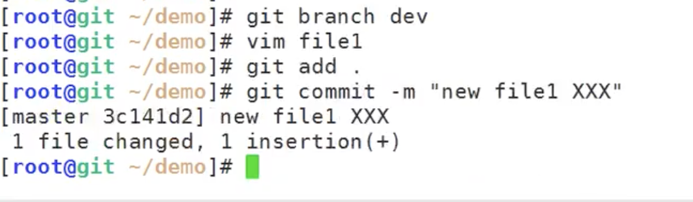


​	我们切换到dev分支，查看一下dev的file1--他是没有XXX内容的

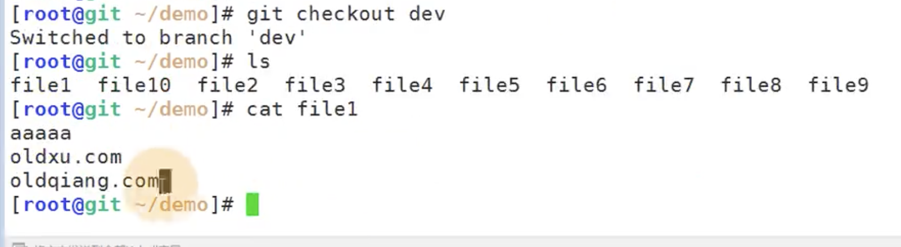


​	我们也编辑一下dev分支的file1文件

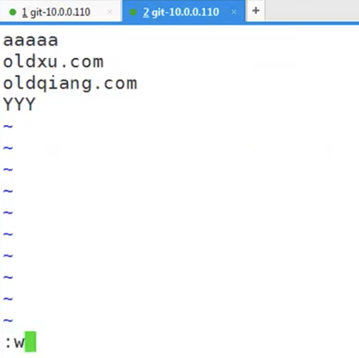

​	然后提交：

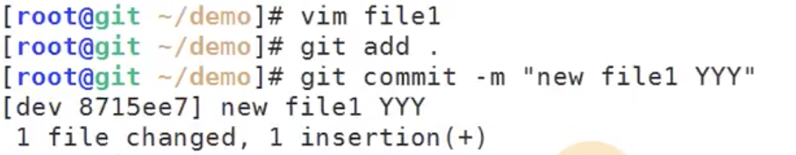


然后现在开始合并代码--dev合并master

​	发生错误--合并冲突了

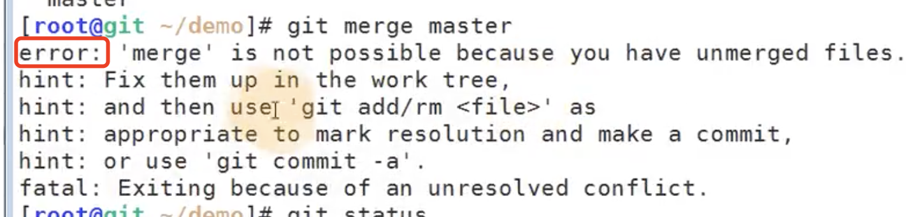


​	合并完我们看一下这个文件的变化

​		HEAD是当前的分支内容YYY ，XXX是master的内容

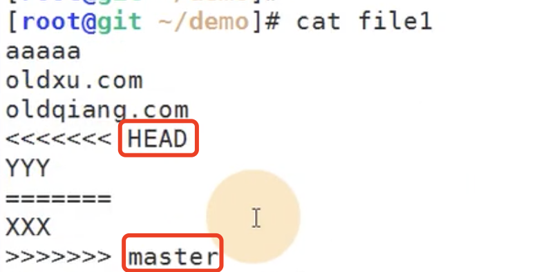


​	然后我们手动处理一下，删除掉这些====《《《《 》》》符号及Head 和master保存提交后

我们再次查看一下---文件正常了，这个就是**手动合并**


​	现在调整好了在dev分支上，那么master分支怎么办？

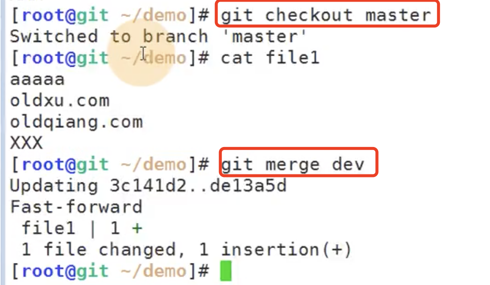

​	为什么在master合并dev的时候没有冲突呢？因为我们在dev合并master的时候已经将合并冲突处理了

然后再由master合并dev分支的时候也就不会冲突了--保证了master的稳定性


https://www.bilibili.com/video/BV11J411674t?p=11&spm_id_from=pageDriver


