# 13.git基本操作-远程仓库

​	

比如gitee 我们先创建一个仓库

​	也可以选择导入仓库--可以选择github仓库的项目直接就导入过来了

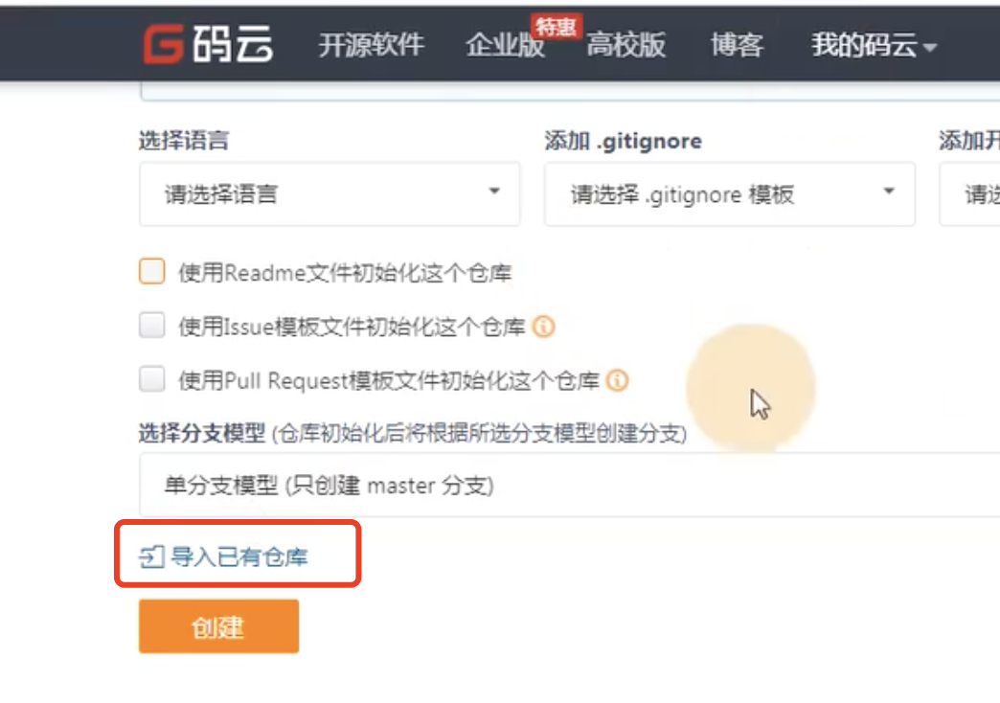

​	点击创建--然后跳转到另外一个页面

​		如果我们选择Https协议的话是需要输入用户名和密码才可以

​		如果选择SSH是免密码的

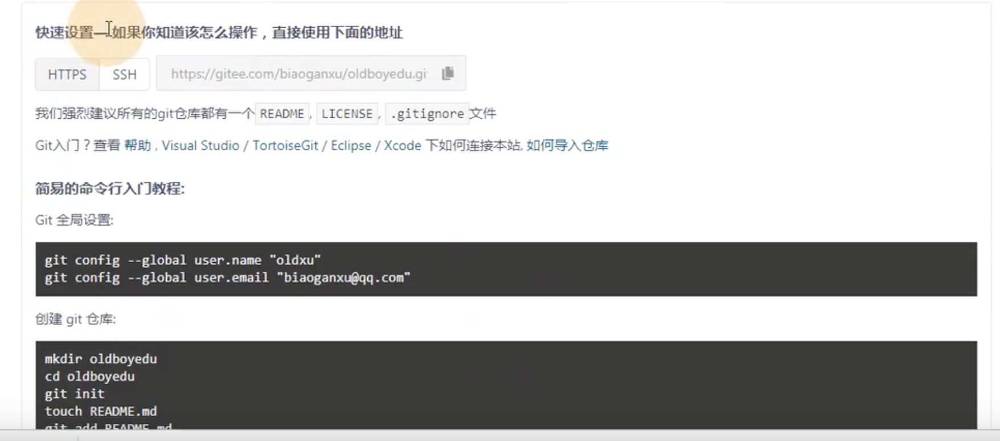

​	然后是全局设置，配置用户名和邮箱

​		然后在本地执行这些命令-创建文件夹oldboyedu，然后进入到这个目录，然后初始化git

​		然后创建README.md文件，然后提交

​		然后remote add origin（这个是个用户名） 到远程仓库地址

​		最后push -u 用户名 到 master 分支中，推送到远程分支

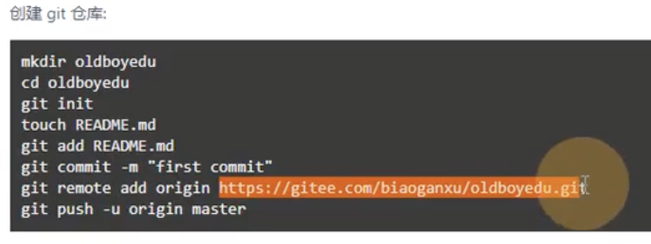

#### 2、如果已有仓库

​		cd 进入我们本地的仓库

​		然后git remote 添加 用户 到远程仓库地址

​		然后git push 推送 -u 用户名 到 master

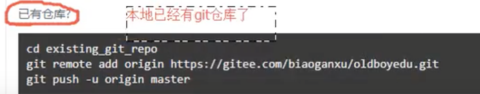

#### 3、本地实践

​	设置远程仓库地址

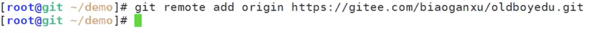

​	查看用户

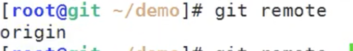

​	查看用户详细信息 git remote -v

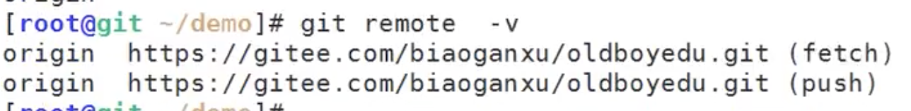

​		然后推送到远程仓库

​				发现需要用户名和密码--用微信登录的不知道用户名和密码

​			我们可以使用秘钥SSH来推送

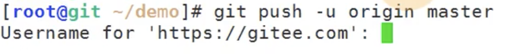

​	

#### 4、使用SSH协议进行推送

​		如果我们使用ssh就需要公钥和私钥了--远程仓库使用公钥进行加密，本地使用私钥进行解密

​	先在本地生成一个公钥

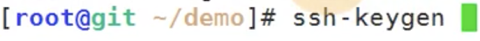

​	

​	然后一路回车就可以了

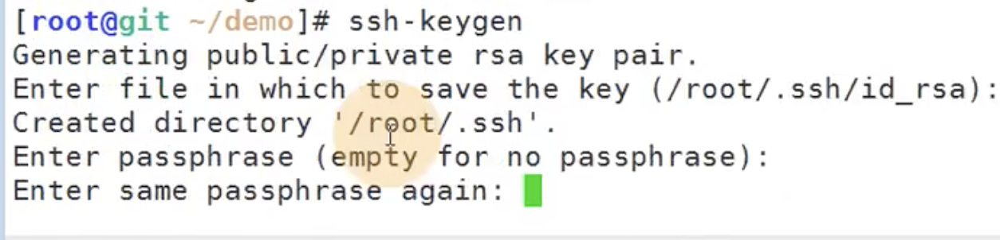

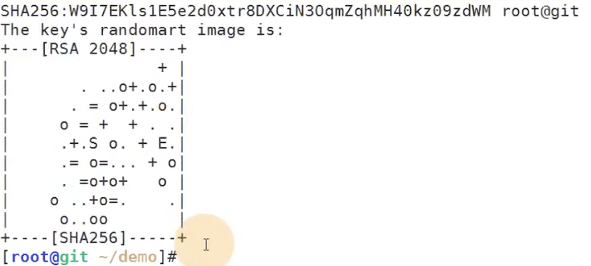

然后cat 一下：查看公钥

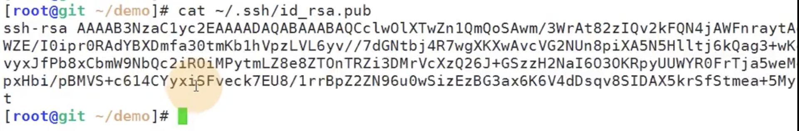

然后复制公钥--在远程仓库中设置，因为远程仓库需要使用公钥来加密

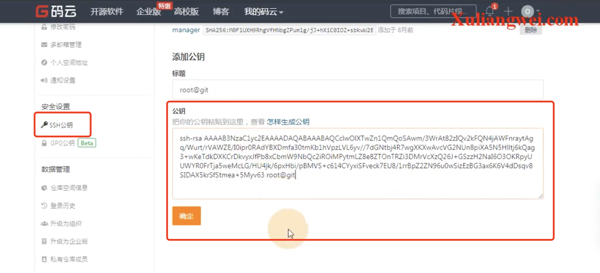

​	添加成功：

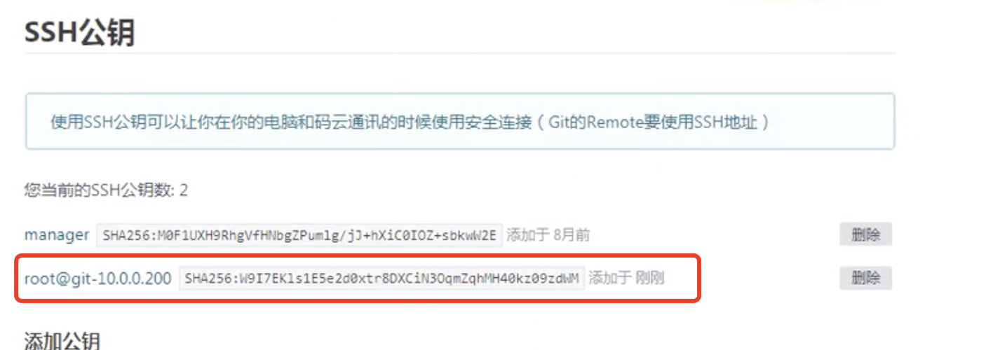

​	然后我们希望把刚刚添加的  **远程仓库** 给**删除**掉--因为我们要使用SSH

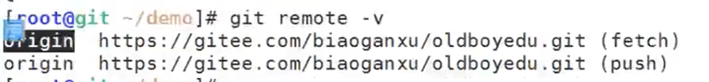

​	使用git remote remove 用户名

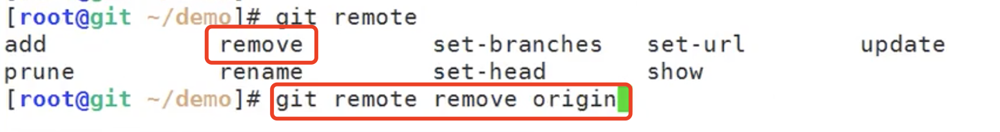

​	检查一下是否删除了：删除了

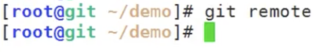

​	然后我们重新设置远程仓库的用户使用ssh协议的路径

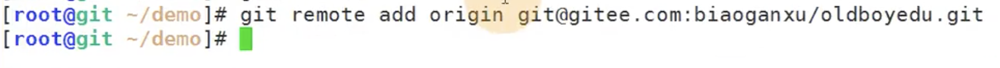

​	现在我们查看一下本地的git工作台是否干净，干净就进行推送到远程分支master

​		推送的过程需要确认是否推送，确定yes 回车

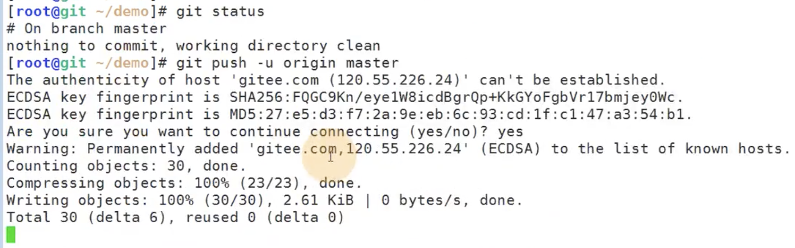

​	推送成功--并且没有输入密码--SSH推送是不需要密码的

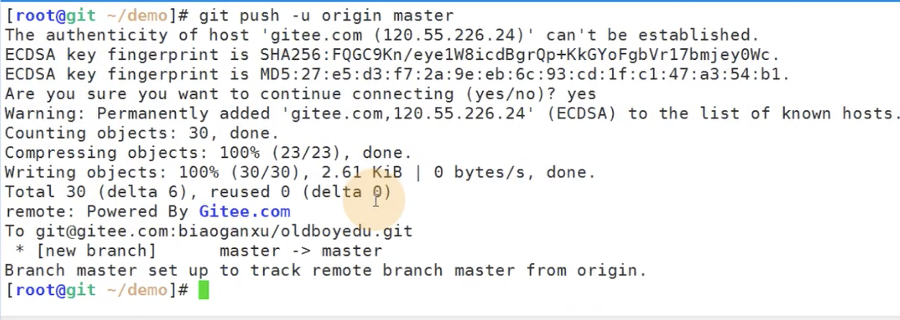

我们刷新一下远程仓库的页面--可以看到我们本地仓库的内容都推送上来了

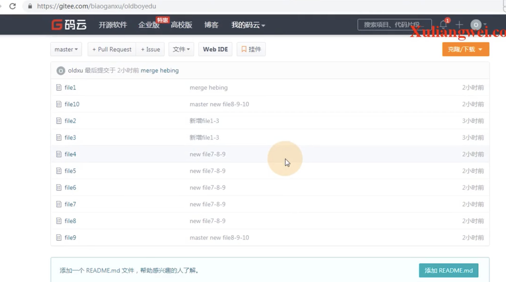

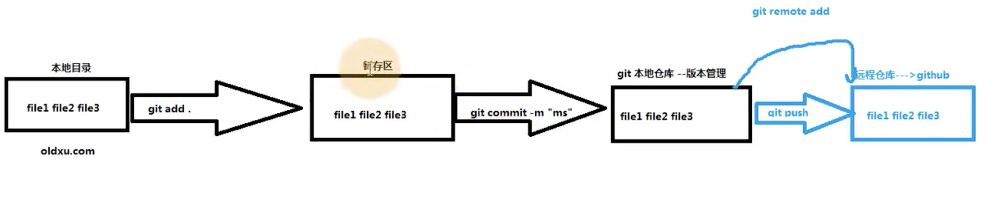

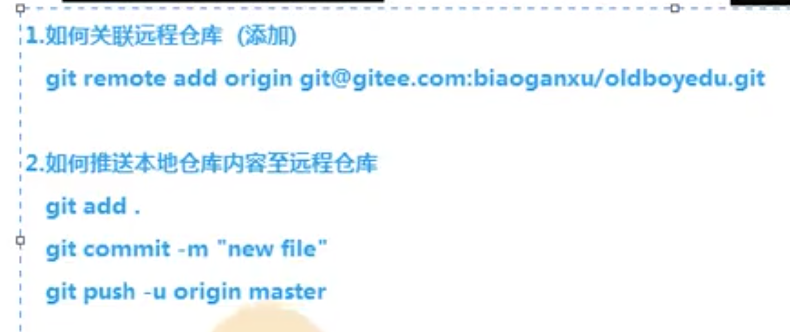

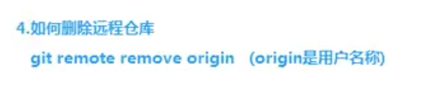

#### 5、如果一个新人加入进来该怎么办？

​		新人加入先克隆 clone 复制一份完整的仓库内容

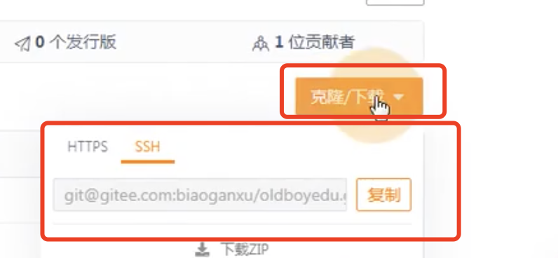

​	注意，新人加入先得加key，在远程仓库加入你的公钥--或者使用https协议是需要输入用户名和密码的

然后克隆代码：

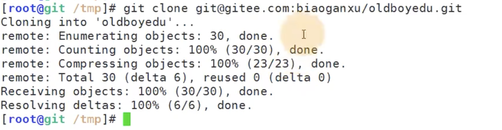

克隆完之后查看克隆的文件内容

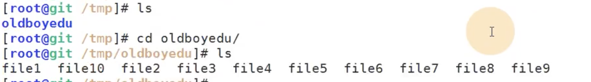

然后新人开发了新的文件代码

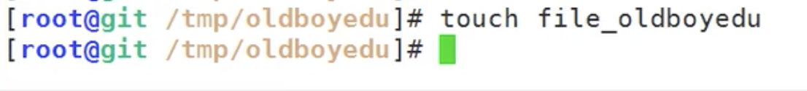

然后添加到暂存区--然后提交到本地仓库--然后查看远程地址（已有因为是clone的项目会自带远程地址）--然后提交到远程仓库

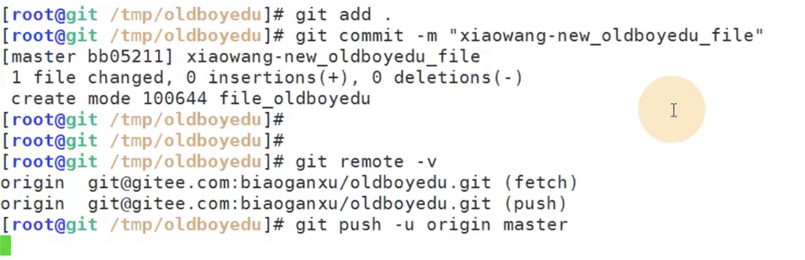

​	提交成功--提示：你的本地master已经与远程的master建立了关联

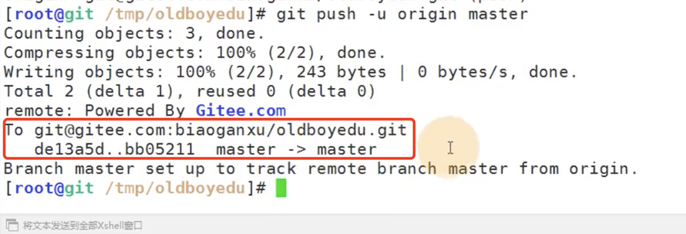

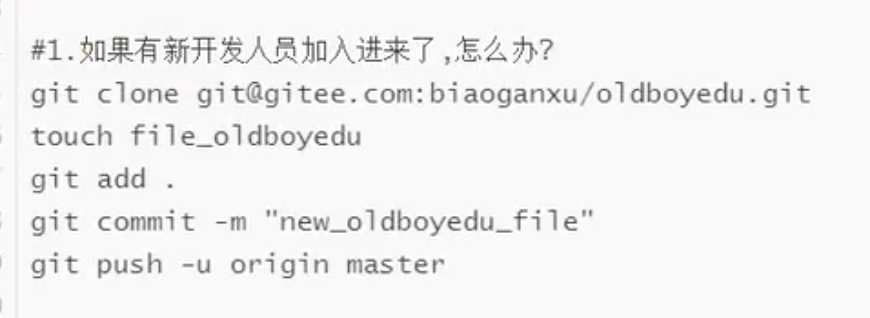

#### 6、我如何查看新人提交的内容呢？

​		我们需要更新代码，需要把仓库的代码拉取到我本地更新到最新的代码

​		可以看到有1个文件的变更 

​		创建 mode 10644版本的 file_oldboyedu 文件

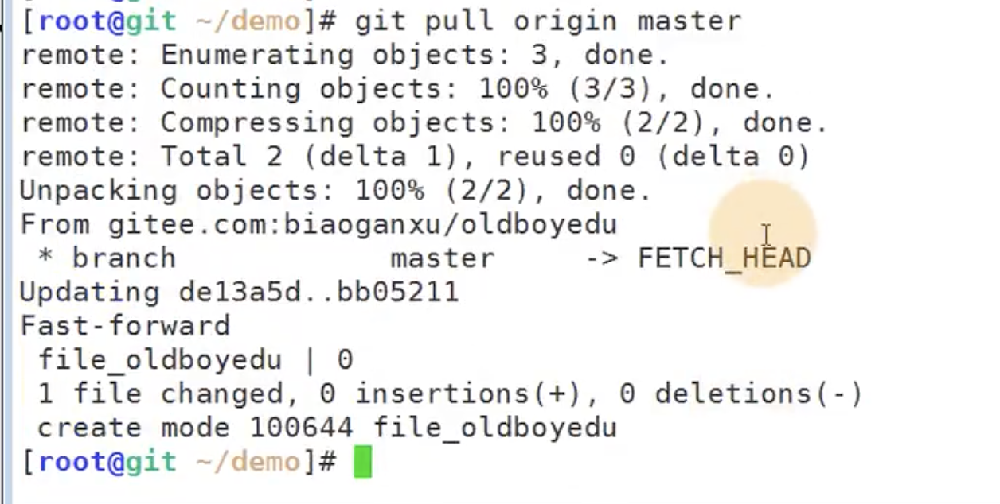

