# 16.gitLab汉化处理

​		目前全部是英文版的--如果我们设置为中文版的学习一下更方便一些

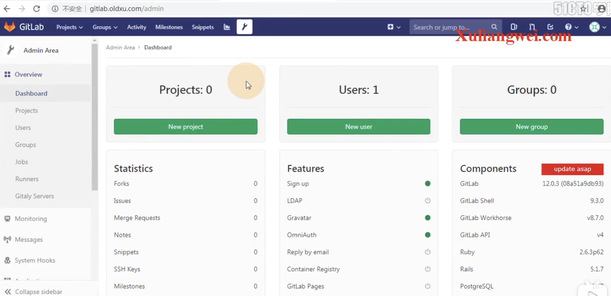

#### 1、汉化前期工作

​	我们到这个gitLab中文汉化社区中查看一下--然后在这里下载对应版本的汉化包

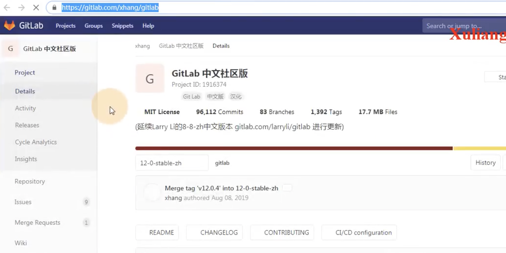

​	将下载的这个汉化包解压

​	解完包后，我们来看一下包内的版本是什么

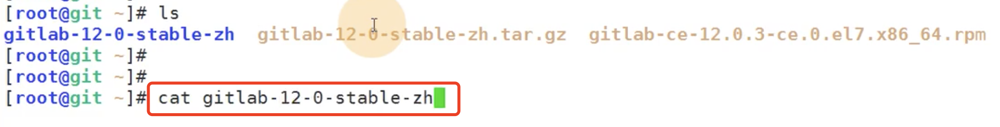

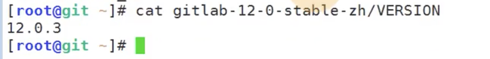

我们确认汉化的版本和gitLab的安装版本是同一版本前期工作就算完成了

#### 2、进行汉化

​	先停止gitLab服务 gitlab-ctl stop

​	然后我们使用中文的包去覆盖英文的包，加反斜杠是防止有重复的

​	执行命令copy过去--这个copy可能会出现错误，忽略就可以了

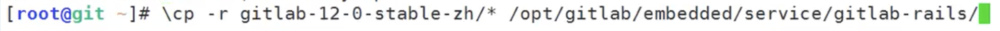

然后就汉化完成了--启动gitLab

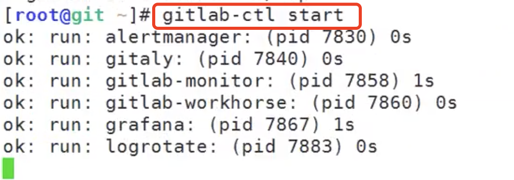

启动后如果你马上去访问gitLab的话会报一个502的错误

​	502的错误就是--gitLab有启动nginx服务，nginx去请求后端的代理服务-服务还没启动起来

​	这个就需要稍微等待一下了--大约1分钟

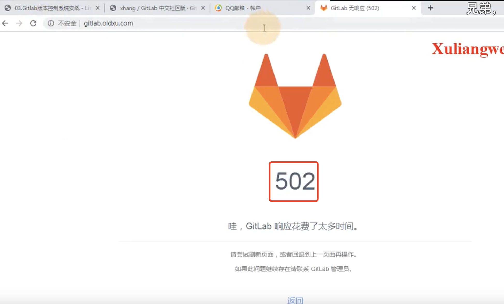

​	现在我们发现顶部菜单栏并没有被汉化

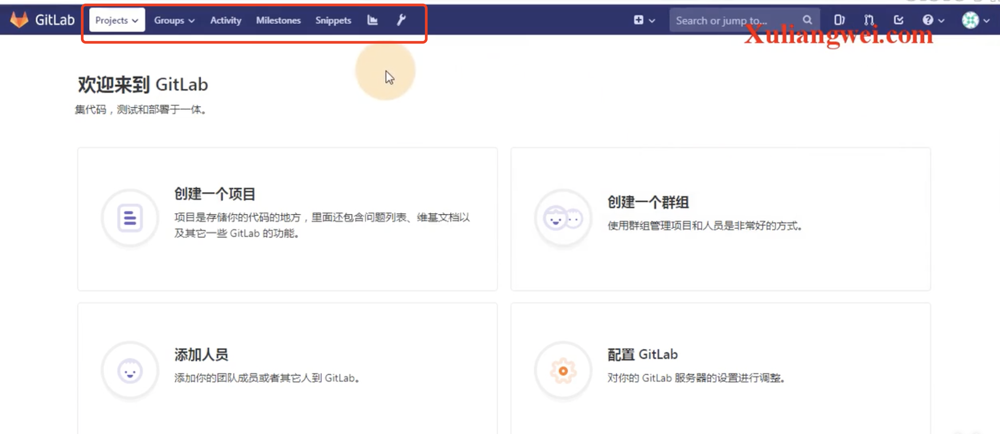

​	这个是因为他默认的字符集没调--点击settings下的Preferences--》Localization

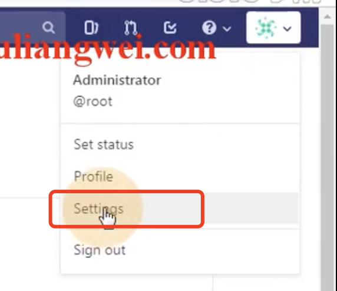

修改一下language

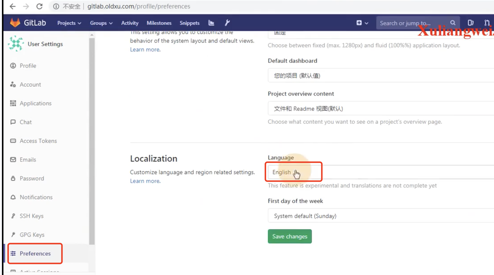

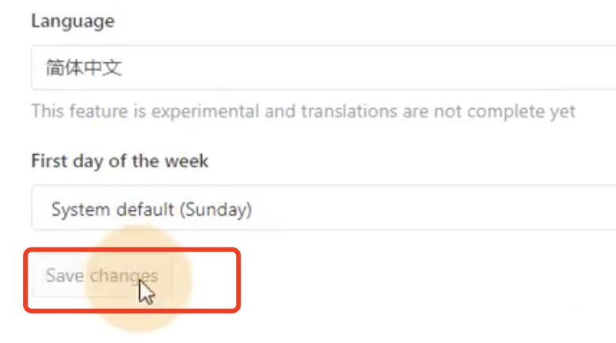

设置完成

现在就是完整的中文模式了

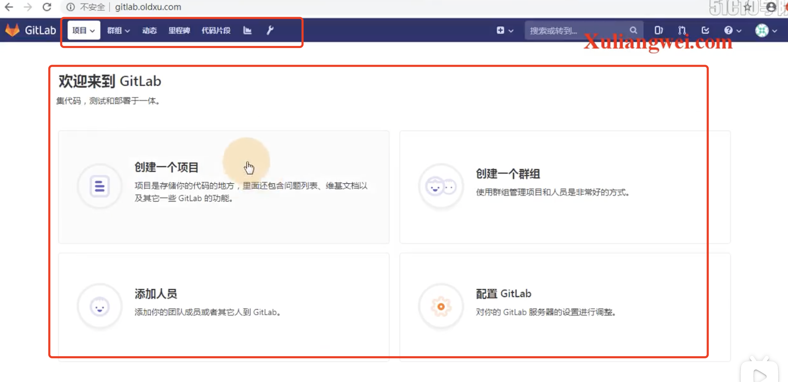

