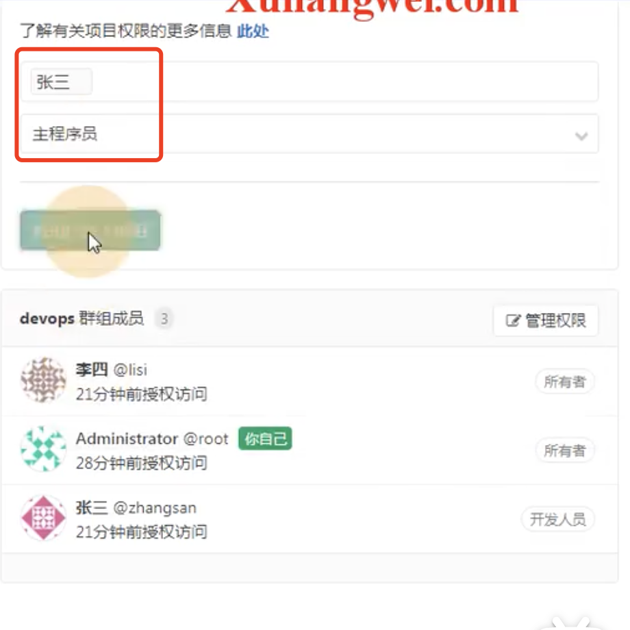

# 19.gitLab-多用户协同工作

​		首先是git的全局配置

​	创建文件夹--初始化项目

添加到暂存区和提交

​	然后就是在push推送远程仓库前设置远程仓库地址--注意这里的远程地址是http的协议

​	然后push的时候就需要用户名和密码--所以建议使用ssh的方式

#### 2、使用ssh的方式

​	先删除原先的http协议的远程仓库

设置为ssh协议的远程地址	

我们查看一下之前的公钥--然后将公钥添加到gitLab中

添加秘钥

#### 3、新用户加入如何提交代码

​		先克隆--发现是需要输入密码的，那么就说明我们的公钥并没有配置到这个用户下

​		然后生成公钥

然后给这个用户也设置公钥

​	这次克隆就不需要密码输入了--克隆成功

​	然后我们修改个文件进行push--发现push发生错误

提示： remote 不允许push到这个项目--原因是张三在组中不是主程序员

​	设置张三为主程序员

然后再次push--成功

​	然后我们知道-开发人员权限只能看代码，没有提交远程仓库的权限

​	主程序员才有push到远程仓库的权限-可以修改代码

​	管理员--可以调整对这个仓库的一切权利

​	整体的协同流程就是这样

