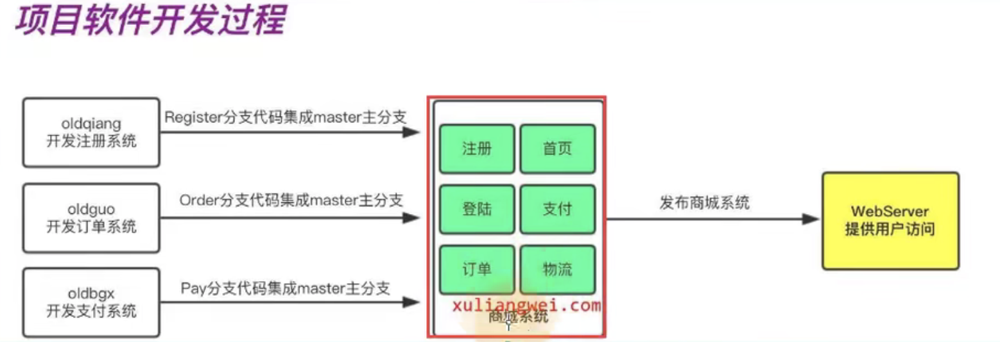
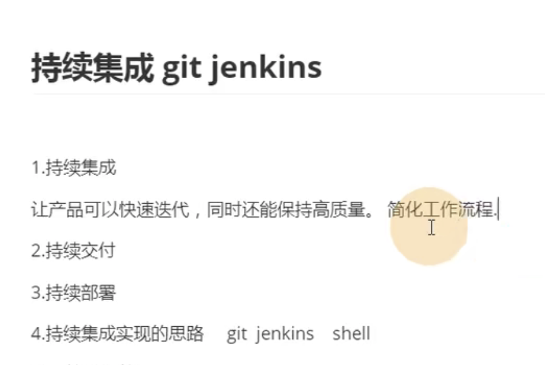

# 2.持续集成基本介绍

​			什么是持续集成？

​	比如我们现在有这么个商场系统，如果一个人开发周期很长，如果分为上图多个人开发就快速多了，不同的人开发不同的模块，最后将开发好的模块集成到系统里面来---然后所有的代码都集成在一起了，就可以部署了---这个过程就叫做集成

什么是持续集成----简单的说就是重复的集成的工作

​	如图：由开发推送代码--到代码仓库---然后到CI服务器进行Build构建，测试Test，Result返回结果通知开发人员

​		当有人提交代码到仓库--仓库就会通知Ci服务器进行构建，测试，发布等操作

#### 3、使用持续集成的好处

- 快速的发现错误，每完成一点更新，就集成到主干，可以快速发现错误，定位错误也比较容易
- 节省人力成本
- 加快软件开发进度
- 实时交付
- 防止分支大幅偏离主干，如果不经常集成，主干又在不断更新，会导致以后集成难度变大，或难以集成

#### 4、持续集成的目的

​		让产品可以快速迭代，同时还能保持高质量。

​		他的核心措施是，代码集成到主干之前，先进行自动化测试，只要有一个测试用例失败，就不能集成，当然持续集成并不能完全的消除bug，而是让他们非常容易发现和改正。

#### 5、什么情况下需要持续集成

​		如果项目开发的规模比较小，软件集成不是问题。--不需要持续集成

​		但是如果项目很大，需要不断添加新功能，或不断升级产品，则需要反复集成，这个时候就需要用到持续集成来简化我们的工作。

