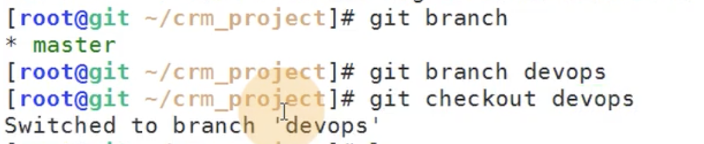
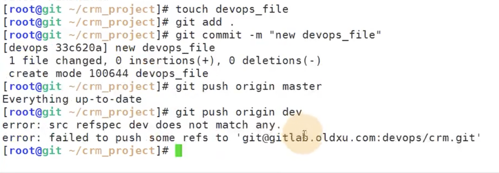
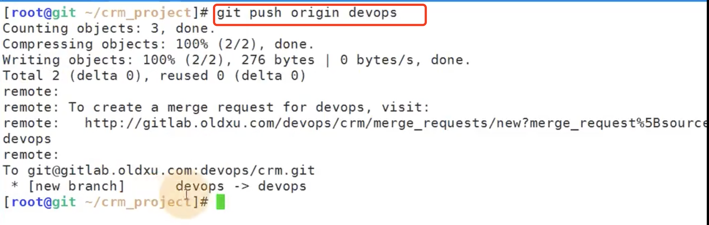
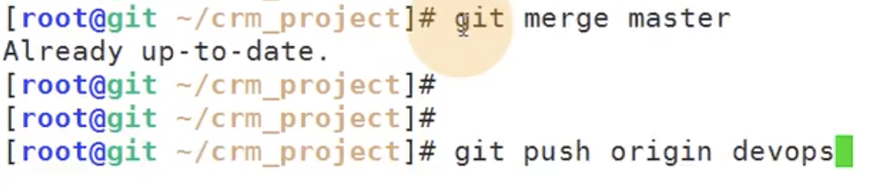
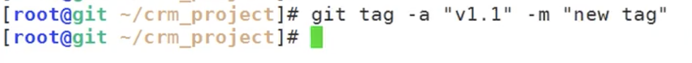
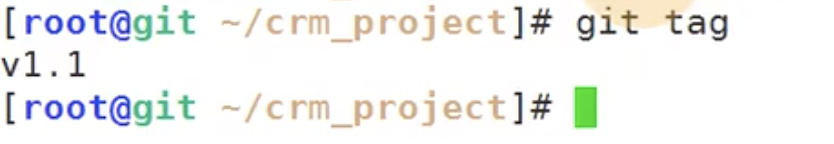
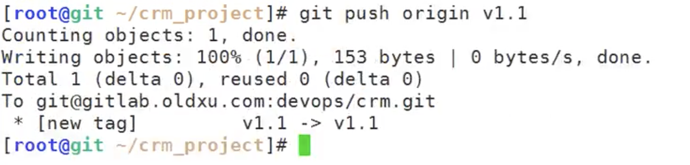
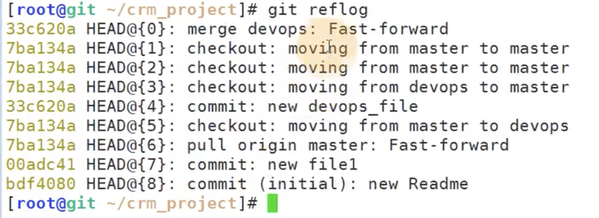
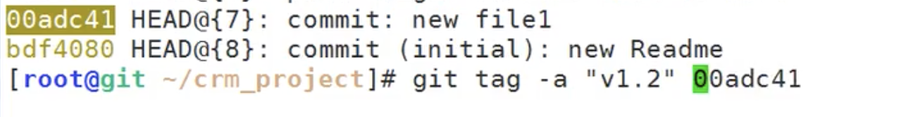
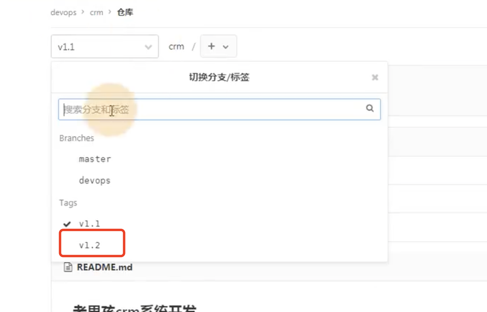

# 20.gitLab-分支-Tag的使用

​	git branch 查看当前所在分支

​	git branch 分支名称 --创建分支

​	git checkout 分支名称 ---切换到分支

​	在devops分支上创建 touch deops_file文件--》然后提交--》然后push

​	push提示：没有更新--原因是推送的是master分支，我们现在是在devops分支上

​	git push origin dev ：然后也报错--原因是分支写错了没有此分支，分支是devops

​	推送成功

​	devops分支合并master分支

​	然后再push一下

​	现在devops和master 分支就一致了

#### 打标签

​	使用 git tag -a "v1.1" -m  "描述。。"  打标签

​	注意：这个标签是在本地仓库打的

​	查看标签：

​	然后将标签推送到远程仓库

​	我们查看一下记录：

​	可以选择某个节点commitID打个标签--然后推送到远程仓库

