# 21.gitLab-基本运维-备份恢复


#### 1、gitLab如何进行备份

​	我们先查看一下默认的备份路径--》到gitLab.rb文件中查看

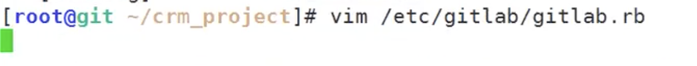


​	默认是开启备份的--并且备份是在 backups文件夹下

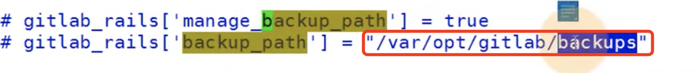


​	由于var 这个目录可能磁盘的空间并没有那么的大，我们一般有个data的目录下面挂一个大的磁盘，这样的话data更适合做备份文件夹


#### 2、设置备份

​	我们创建一个备份的文件夹--这个文件目录必须要足够大的空间--也就是说挂大磁盘

​	如果不够大就没有配置的必要了--使用默认就可以了

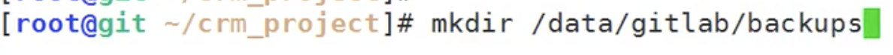

​	

​	开启备份和调整备份路径

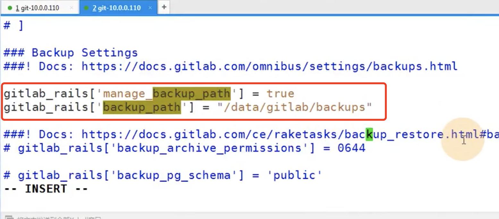


​	设置keepTime 备份时间--默认是7天备份一次

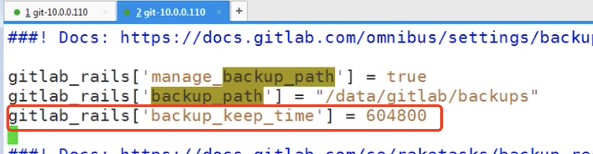


​	修改完配置文件--需要初始配置--让配置生效

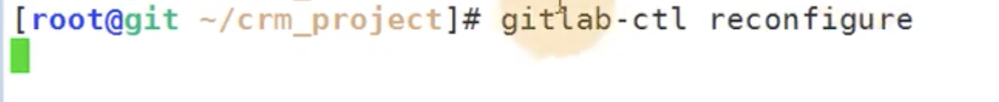


​	如果不想这样配置-想手动备份一次的话--使用gitLab-rake gitlab：backup:create 命令备份


​	注意：这个备份是备份的gitlab仓库的内容，也就是一些项目等配置，并不是备份的gitlab


​	备份完成--生成的文件是时间戳+backup 的tar包

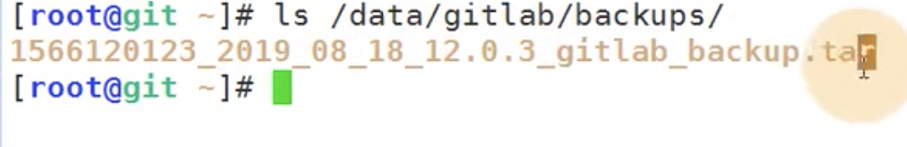


​	如果我们想每天备份一次呢--使用corn 

​		使用命令crontab -l      这个是设置定时任务

​		&>是输出的意思 输出的内容就是  /dev/null 输出个空

​		《*   *   *   *   * 》 （五个* 代表 分 时 日 月 周）

​	这个就是设置为每天2点 0分 执行备份

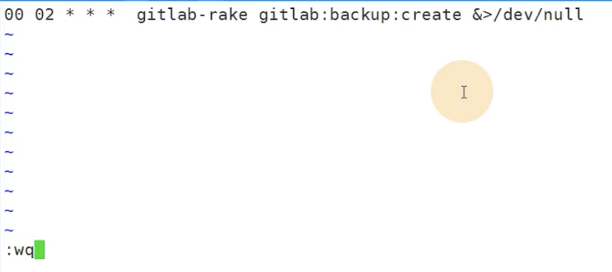


#### 3、恢复备份

​	我们不小心把项目删除掉了，现在想恢复

​	控制中心--》设置--》通用--》高级

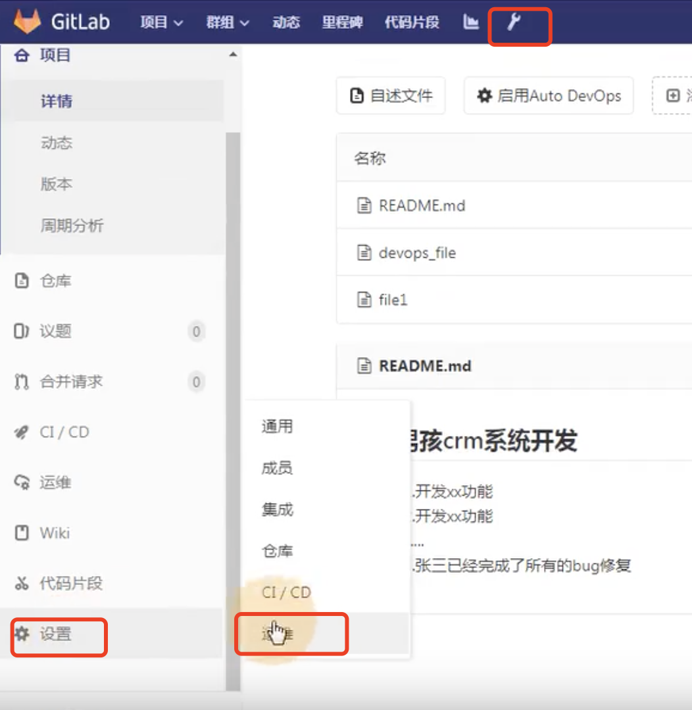

​	

​		在高级的最下面


​	删除项目：


​	

​	确认删除：		然后项目就没有了


​	现在我们想要恢复--这个项目


##### 3.1 先要停止gitLab服务或者是停止数据写入服务

​		我们使用停止数据写入服务

```
gitlab-ctl stop unicron
gitlab-vtl stop sidekiq
```


##### 3.2 开始恢复项目

​	查看备份文件名称 copy名称

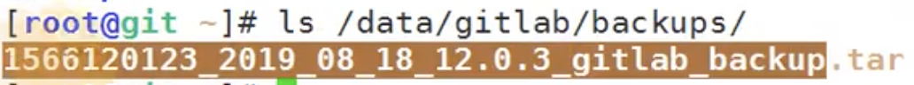


​	使用命令进行恢复  --注意：不需要.tar

```
gitlab-rake gitlab：backup：restore BACKUP= 备份文件名称
```


提示我们这个文件不存在--原因是文件名称只要时间戳的那些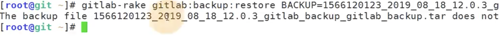


​	现在我们使用前面的时间戳就可以了

​	然后提示：开始恢复数据前-我们会删除现有的数据表-以免后期升级带来故障-是否删除yes就可以了

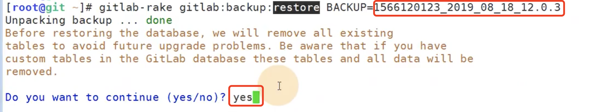

​	

​	然后又提示：继续yes--这个应该是恢复认证的keys文件

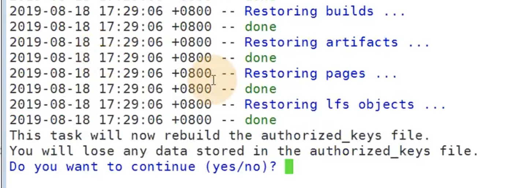


​	然后提示恢复结束--

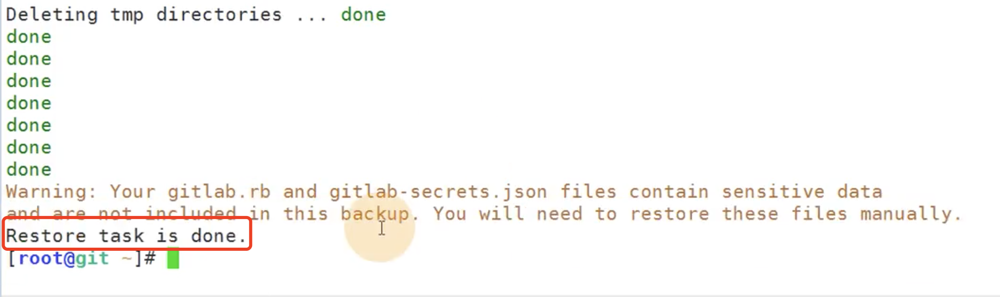


​	现在我们重启gitlab

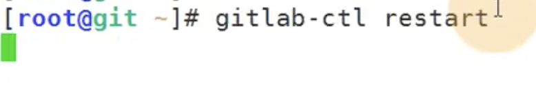


​	我们可以查看一下gitlab的日志有没有启动完成

​	gitlab-ctl tail

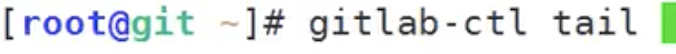

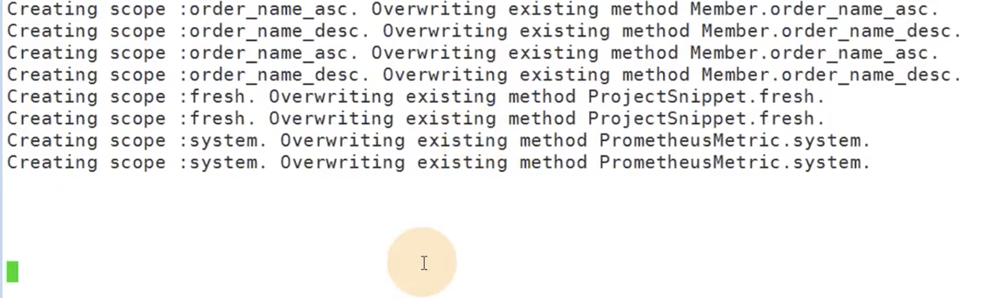


​	我们看到master 主程序启动成功了


​	这是之前没有启动起来的服务502问题


​	现在我们刷新页面： 页面正常--项目也恢复 了

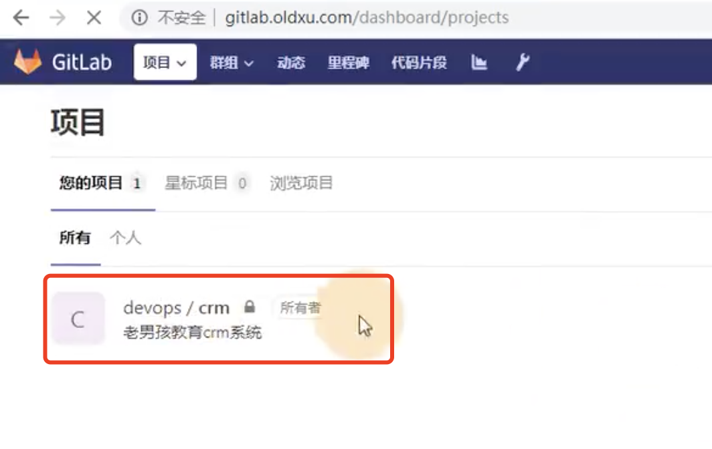


#### 4、如果是升级gitlab如何升级呢

​		先备份数据--

​	www.xuliangwei.com/bgx/803.html

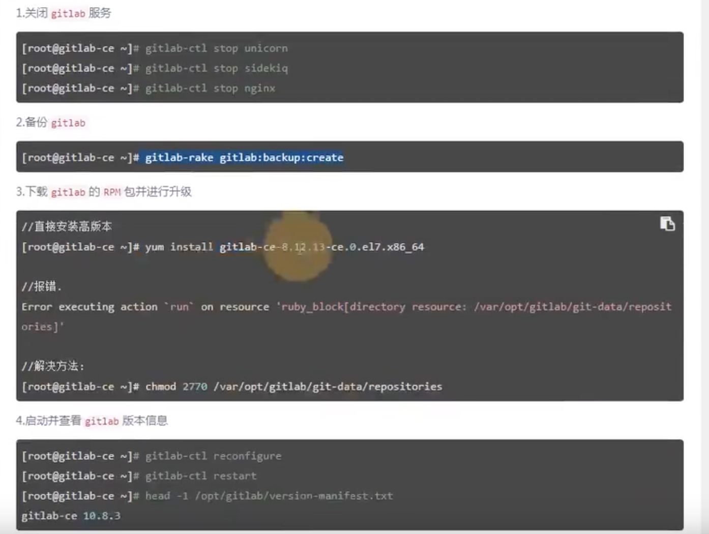


#### 5、gitlab迁移

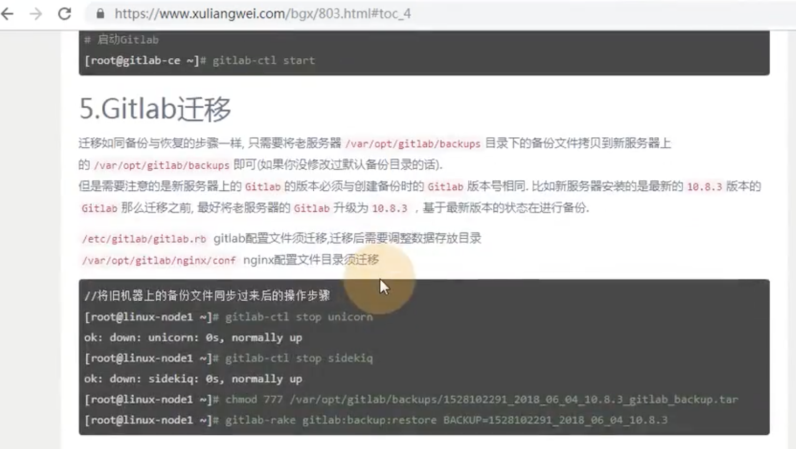


