# 7.git基本操作-提交代码

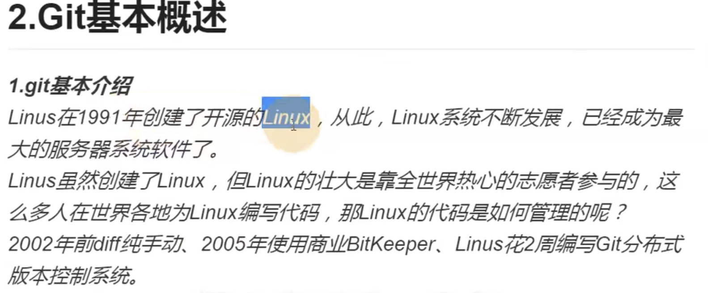

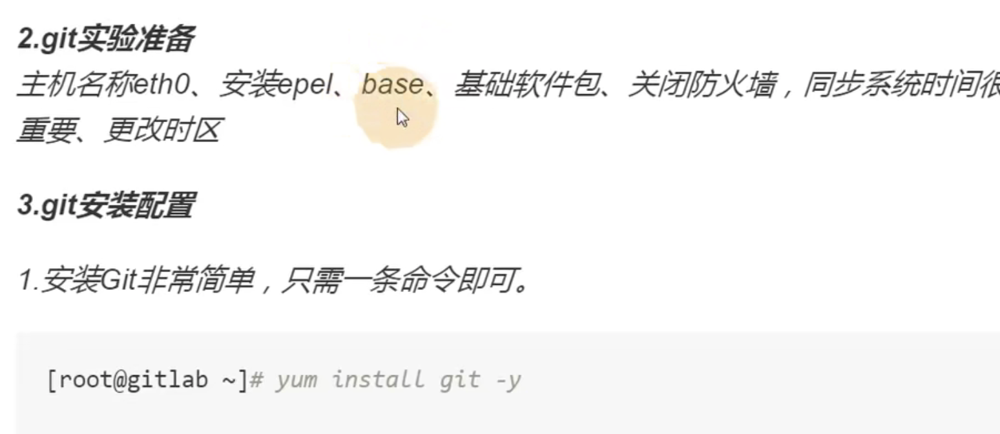

git的配置--其实这些命令 就是操作了一个配置文件

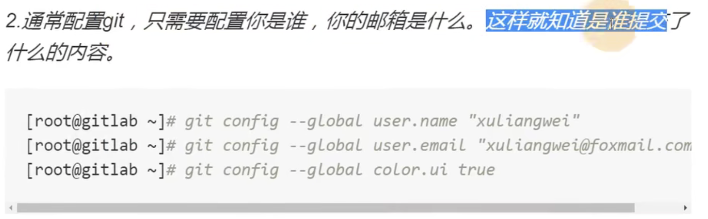

我们查看一下这个配置文件

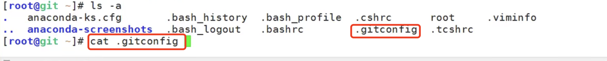

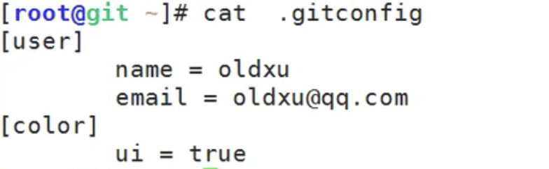

#### 创建本地仓库

​	先创建一个目录--里面放我们的代码--然后将这个目录变成一个仓库不就ok了

创建demo文件

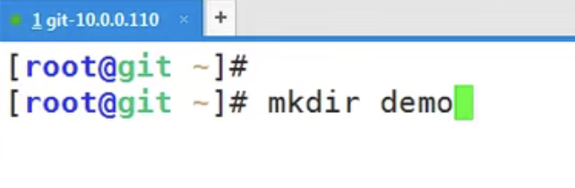

进入demo文件夹

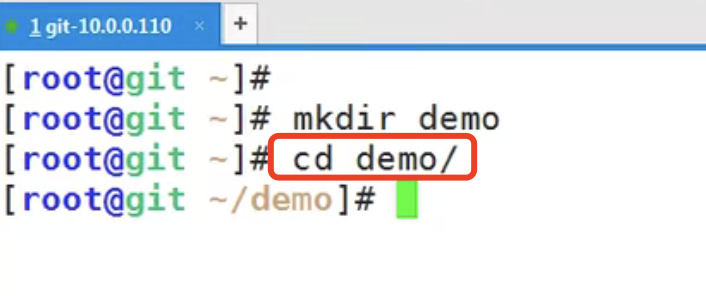

把这个文件夹初始化为一个仓库--使用git init 命令

​	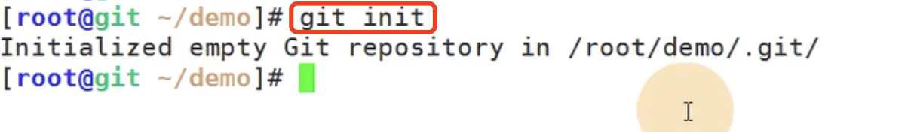

会生成一个.git的目录，你的所有版本都会记录在这个目录下-这里面的东西一定不要修改和操作

我们新增几个文件 

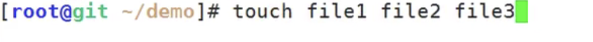

查看变化：git status

​	Untracked files --没有追踪到的文件

​	use git add **file文件名称** 提交到暂存区里

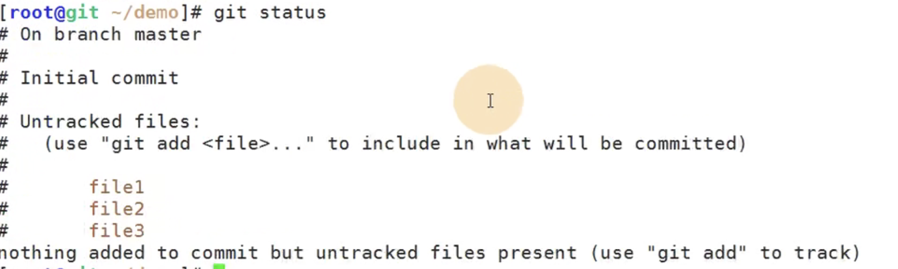

​	全部提交的话使用git add .

查看一下状态： 提示 use git rm --cached 文件名称可以从暂存区删除文件

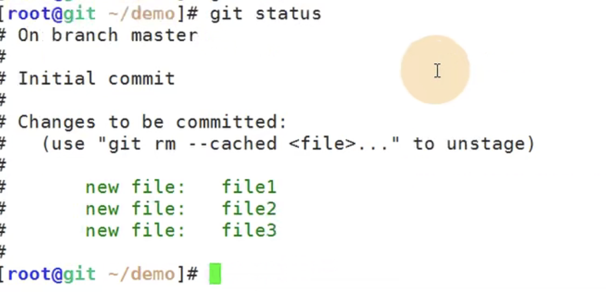

​	目前已经存放在暂存区了，但是还没有对他进行所谓的版本管理

还没有管理起来--为什么呢，因为还没有把他提交到我们的仓库里面

#### git 提交 

​	使用命令 git commit -m “描述”

为什么要写提交描述呢--因为别人也是可以看得见的，通过描述别人知道你提交了什么

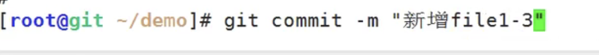

然后提示：3个文件发生改变，0个新增和0个删除因为是第一次提交

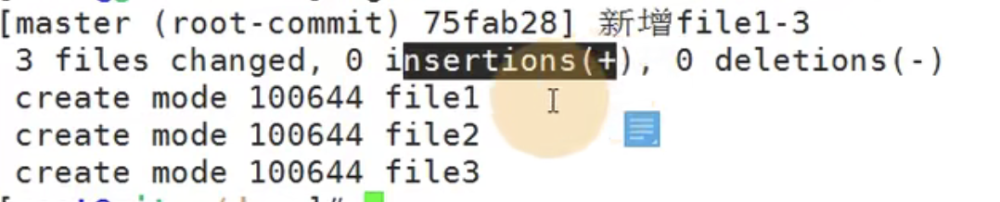

输入history命令 可以查看历史命令

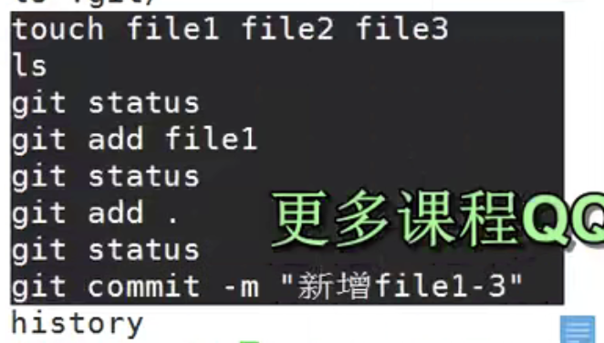

以上操作就是使用本地命令将文件上传的本地的版本仓库中

