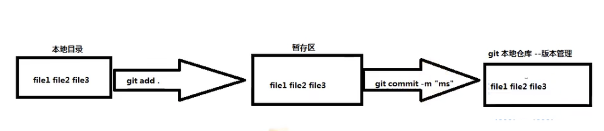
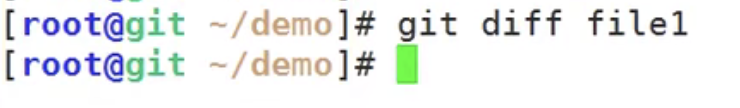
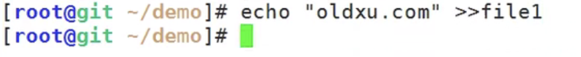
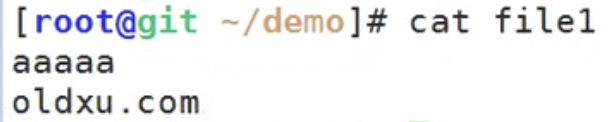
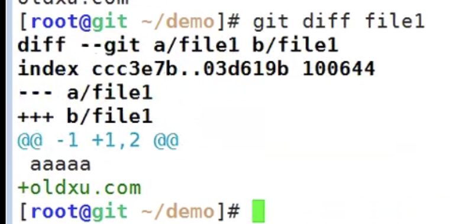
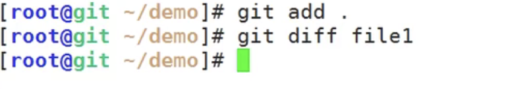
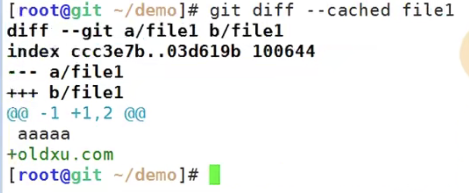
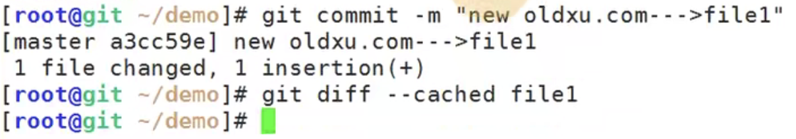

# 9.git基本操作-如何对比文件

​		如何对比 本地工作目录文件内容，暂存区文件内容，本地仓库文件内容之间的差异？

我们可以使用git的diff命令

​		为什么没有输出呢？--因为此时的工作目录-暂存区-本地仓库都是一致的

我们修改一下file1--给file1写点内容

我们查看一下修改后的文件

现在我们查看一下区别--git diff file1

​	a 表示变动前的版本，b表示变动后的版本

​	+ 绿色 ：代表新增的内容

我们把本地的内容提交到暂存区--然后进行暂存区和仓库的文件对比

​	提交后查看对比--发现没有输出说明一致，这个只是本地和暂存区的对比

那么我们如何来进行--暂存区和本地仓库的对比呢

​	使用命令 git diff --cached 文件名称

我们提交一下，再看看有没有区别--提交后就没有区别了

为什么我们要学这个比对呢？

​		比如说我们之后想回退是不是就方便了，进行比对撤销

还有就是本地文件 可以直接和仓库的文件进行比对吗？答案是不能

