# 10.git基本操作-如何实现回退

 

​	我们如何查看git的历史记录呢，可以通过git log命令

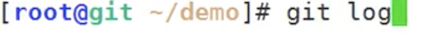

可以查看到历史记录--每次的commit 都会生成一个commit编号这个编号是唯一的

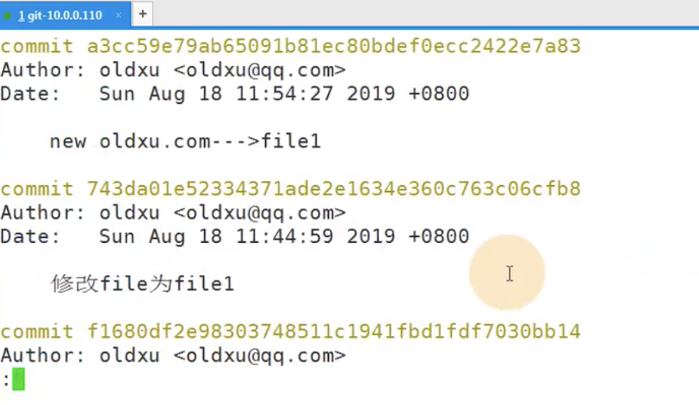

这样看起来感觉很难受 --我们可以使用一个简单的方式去查看 git log --oneline

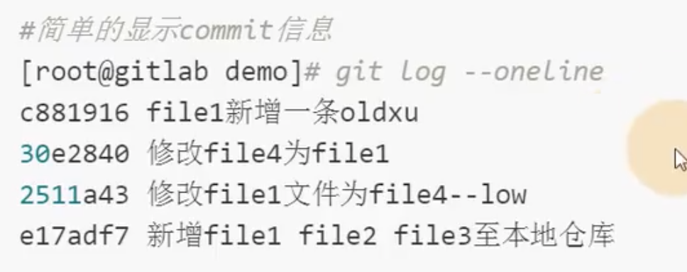

​		看这些历史记录的目的是什么：目的是想回退，我可以回到每个时刻

#### 1、文件的回退-本地和暂存区的回退

我们使用命令  > file1    将文件内容清空了

然后我们查看下git 状态

现在我们的本地和暂存区的文件已经不一致了

如果我们想回退---思路是: 我们将暂存区的内容覆盖到本地就可以了

​	如何回退呢？上面的查看状态告诉我们 use  git add 文件名 可以更新到暂存区 或者是 use git checkout --文件名可以覆盖文件

我们使用git checkout --文件名 进行回退

​		然后我们在看一下git 状态 发现工作空间是干净的，然后查看一下文件发现回退回来了

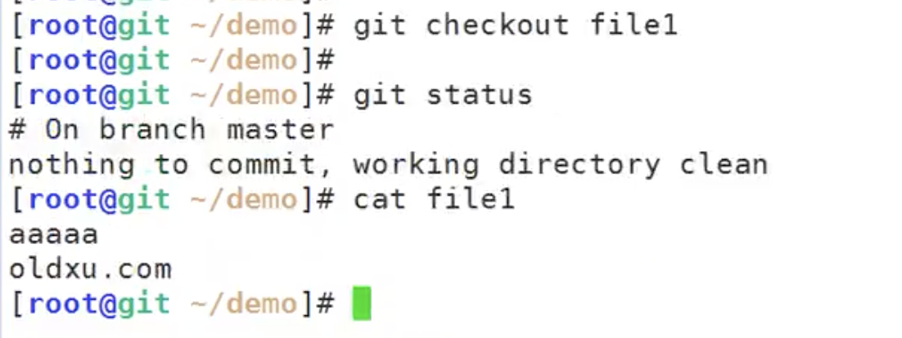

#### 2、文件的回退-本地误提交到暂存区想撤销

​	思路是：本地仓库覆盖暂存区--暂存区覆盖本地目录

演示： file1 再次被清空

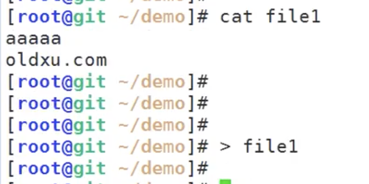

然后git add . 提交到暂存区了

​		会有提示恢复 use git reset HEAD 文件名称

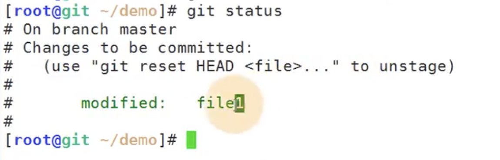

我们测试一下：撤销

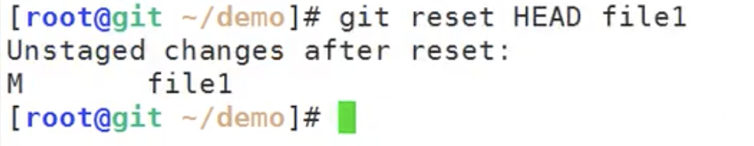

我们查看一下状态： 发现本地仓库覆盖了暂存区

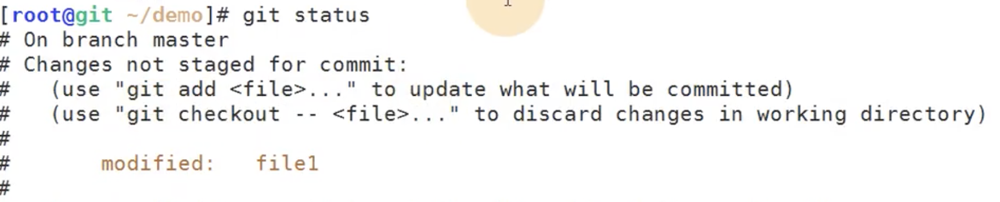

然后我们从暂存区再覆盖一下本地文件--就得到恢复了

​	git checkout --file1 进行暂存区的回退本地，查看git状态 发现没有提交的内容

​	查看文件内容发现回退了，文件回退成功

#### 3、文件回退-如果提交到本地仓库如何回退

​		如果多次提交到仓库，想回退到某个版本，怎么办？

我们先模拟多次提交：

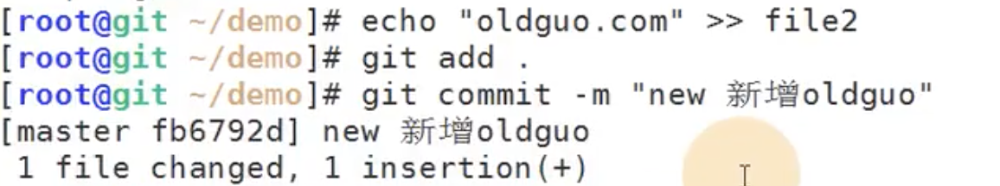

​	这个时候怎么办？我们先看一下git 日志 git log --line

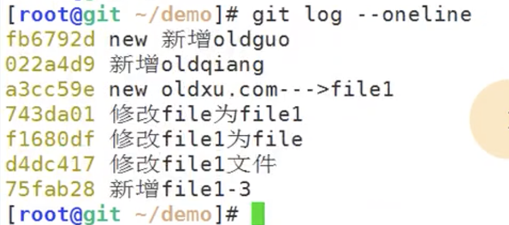

​	我们现在就想回到这个 new oldxu 这个版本

我们使用 git reset --hard 版本号

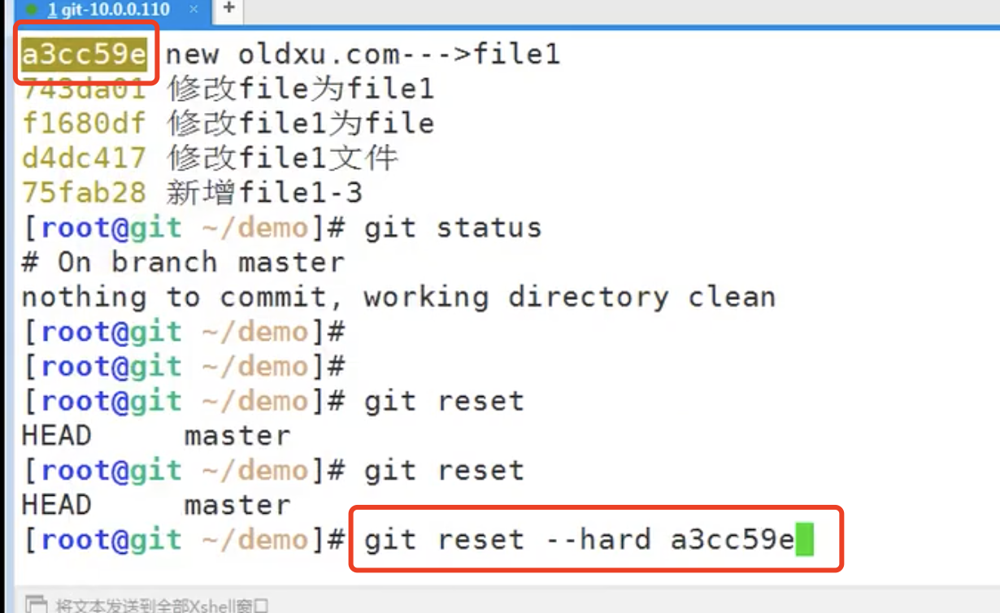

 	

查看效果： 直接就恢复了

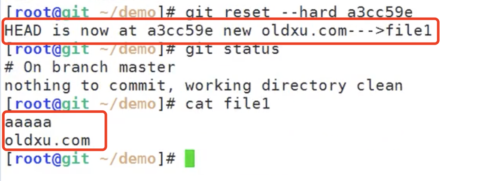

​		回退完之后发现不对，我还是想要带有oldqiang那个版本

我们还按之前的操作： git log 发现没有 oldqiang这个版本了--这可怎么办-因为是在oldqiang之后的版本了

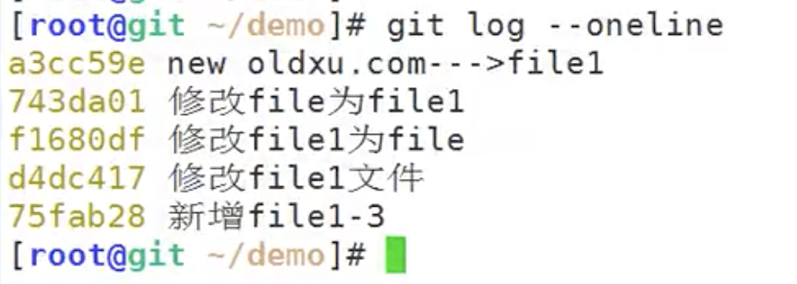

我们这次就得使用另外一个命令reflog，这个可以查看到所有的历史记录

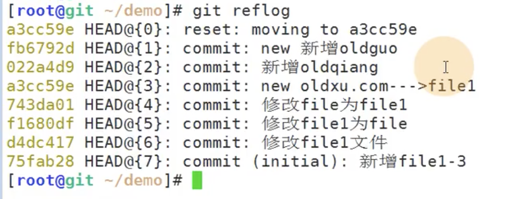

然后我们记住版本号 使用git reset --hard 版本号 进行回退

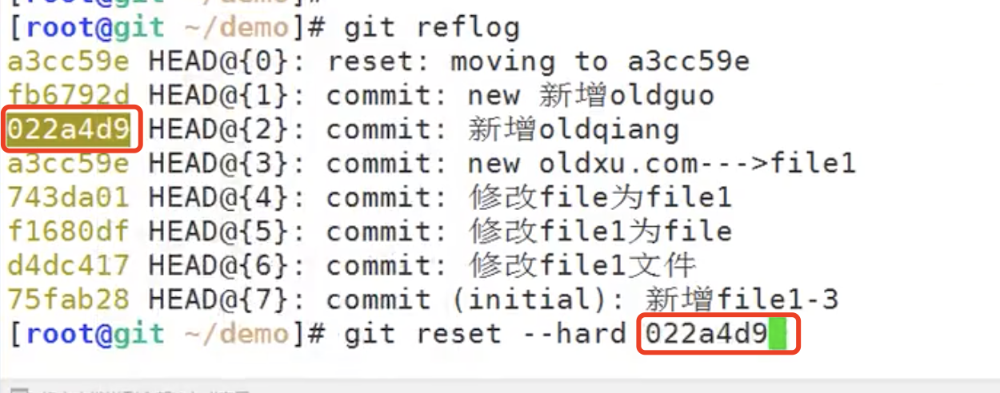

然后我们查看一下文件：发现文件回退成功

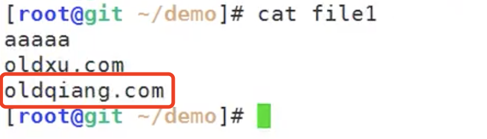

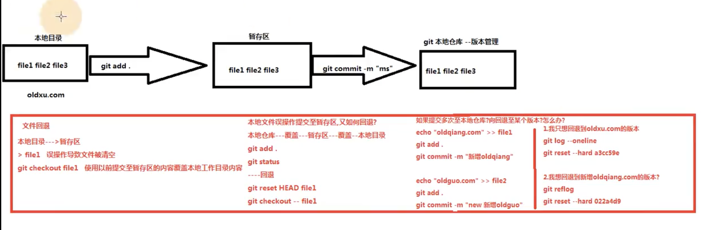

