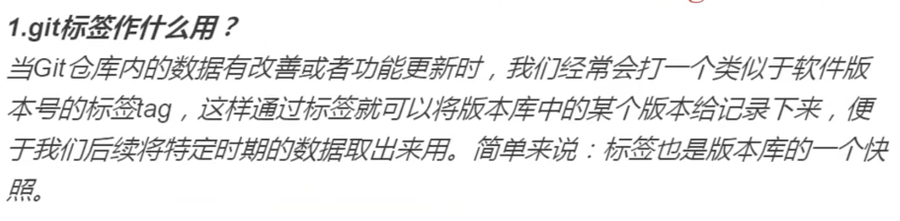
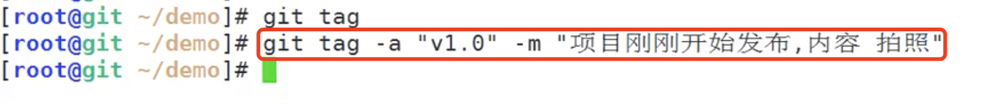
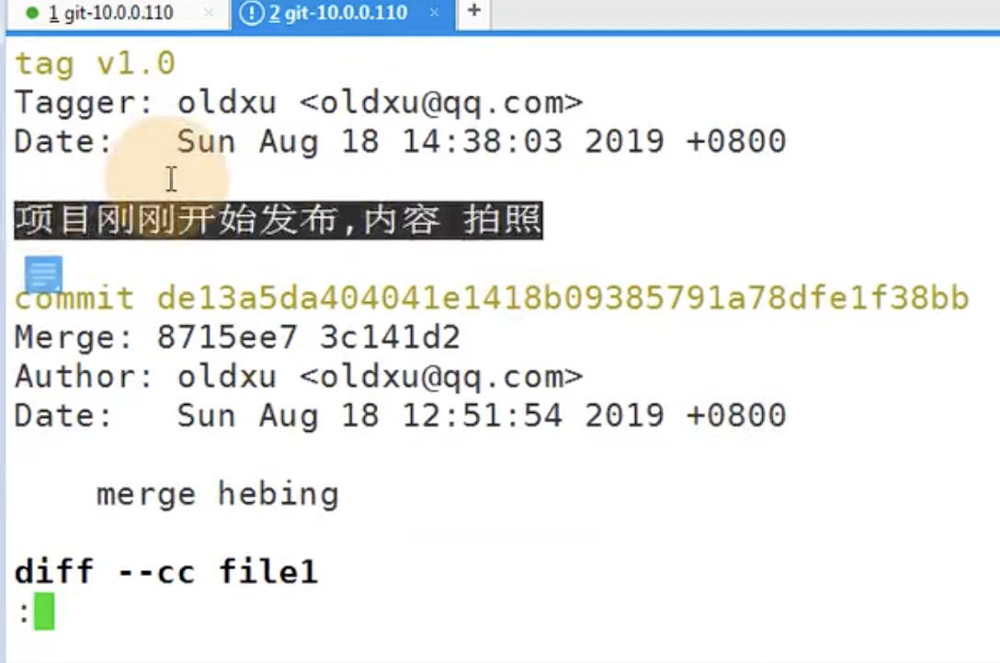
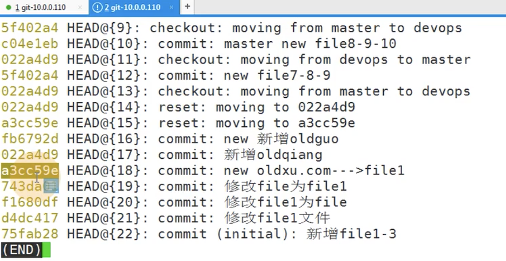
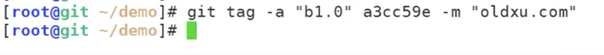
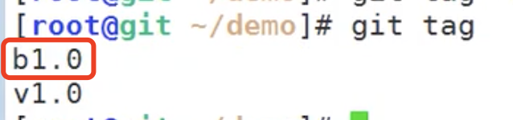
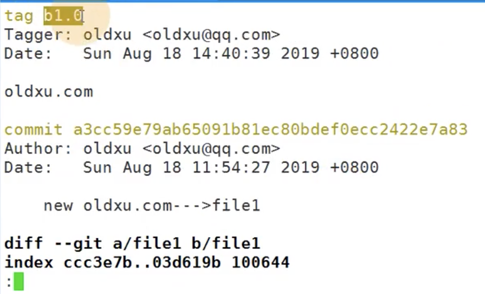
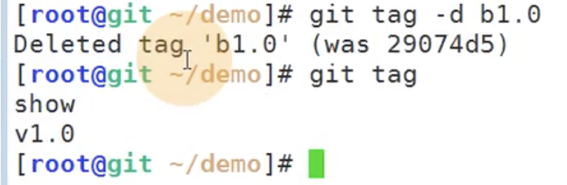
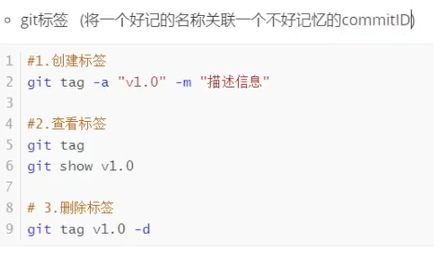

# 12.git基本操作-标签

#### 1、标签有什么用？

#### 2、为什么要使用标签？

​		比如 请把上周的那个版本打包发布，commit号是89898 一串数字字符不好找，或者说是我想回退到某个版本，但是我不记得那个版本号了，如果找就比较麻烦了，如果我们使用标签就方便多了

​	可以理解为软连接的方式-比如你打个tag v1.0 其实找的就是他对应的commitId

这个标签很重要，上线和回退都是基于这个标签来进行的

#### 3、如何打标签呢？

​		使用git tag -a “标签名称”	 -m “标签描述”

然后使用git tag 查看标签

#### 4、查看标签内容

​		使用 git show 标签名称

​		我们查看这个tag可以获取到他的版本号commitID

#### 5、指定commitId打标签

​		比如我们现在想给某个commid设置一个标签

我们先查看一下版本记录 使用 git reflog

给某个commitID打标签使用命令

git tag -a “标签名称”  版本号 -m “描述”

查看一下刚刚b1.0标签的内容

#### 6、删除标签

​		使用 git tag -d 标签名称

