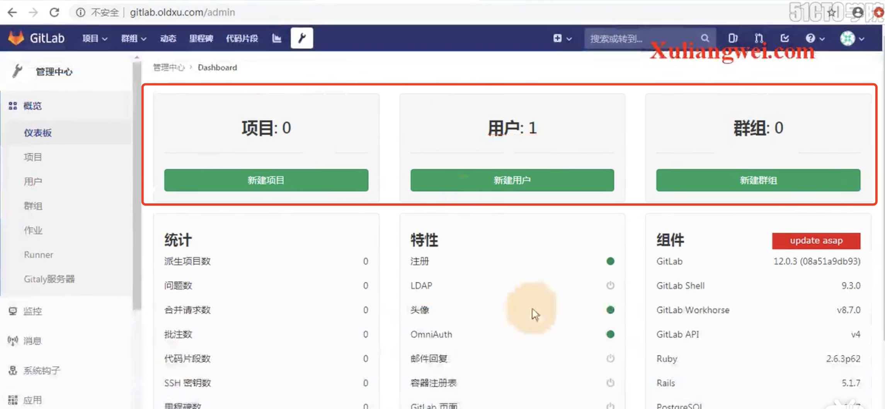
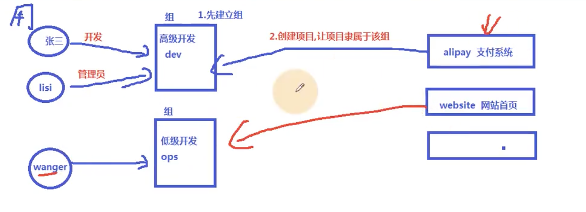

# 17.gitLab用户-用户组-关系图解

​		我们如何使用gitLab呢？

​		有项目--用户--群组 他们之间的关系是什么呢

​		首先 应该是创建组的，然后创建项目，每个项目都有隶属于的组，组里的所有成员都是可以操作属于组的项目的

​	我们为什么不使用用户直接关联项目呢--因为如果他离职了，直接关联项目的话还得继续使用他的账户进行项目的开发，或者新创建用户进行对项目的关联比较麻烦。

​	如果我们使用组-有人需要权限或者取消权限，我们添加对应的组或移除对应的组就可以了，更简单方便一些

