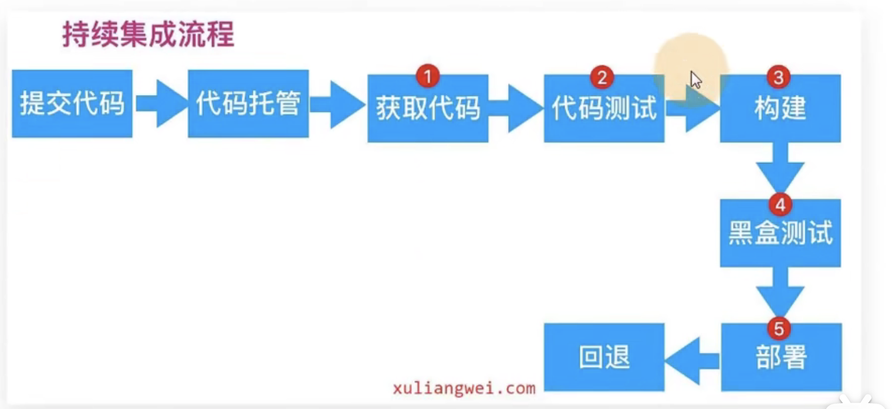

# 5.持续集成实现流程

​		根据持续集成的设计，代码从提交到生产，整个过程有以下几步：

​	

​	获取代码就会使用到Jenkins---用Jenkins去捕捉获取gitLab上的代码，捕捉后的代码放到Jenkins服务器上，然后由Jenkins跑我们的代码进行测试（这个代码测试是开发写好的-测试用例），测试完成通过了，然后再由Jenkins调用插件进行项目构建，构建完成-进行黑盒测试就是功能测试（这个使用sunarQue来进行）

​	如果功能测试没有问题，由Jenkins调用shell命令或者是onsoble来进行我们的代码部署 ---简单的说就是把打包好的产品，放到我们的站点目录（需要考虑放该怎么放）

回退：如果我们现在发布v1，2，3三个版本随时更换版本部署，思路就是--部署的时候设计一个规范：

​	比如nginx，设置转发的时候设置路径root/code/rainbow从rainbow里面去找我们的代码

​	如果我将rainbow挂一个软连接，连接到v1，就相当于读这个rainbow就是读这个v1的代码

​	如果我们更新这个v1的版本代码怎么做，删除软连接，重新设置软连接到v2，这样就实现了升级和回退的功能了

注：黑盒就是这个盒子啥也看不见（对于一个app来说你是看不见他的如何开发的，你只能有使用他的权限）--功能性测试

​	

