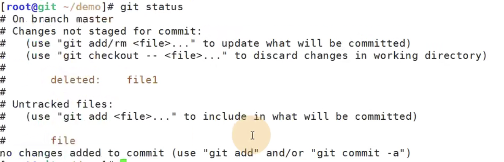
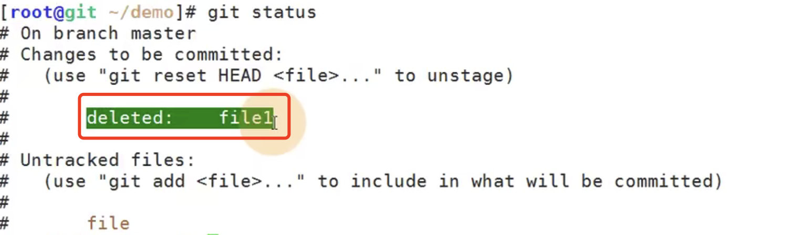
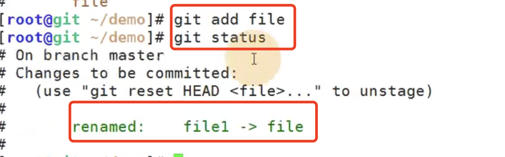
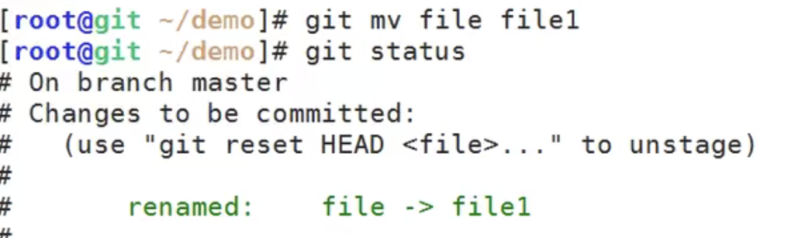

# 8.git基本操作-修改文件名称并提交

​	修改一下名称，将file1 改为file

git status 查看一下

​		修改文件名称，其实是删除文件file1，然后又去新建了file文件，里面的内容不会丢

那么我们是不是可以自己先删除一个文件 然后新建一个文件

​	

然后再添加 file文件--这样也是可以的但是比较麻烦，真正的修改名称还是使用mv的

 直接使用git mv 文件名称就可以了

