# 2.apollo的快速入门


## 一、准备工作

### 1.1 Java

- Apollo服务端：1.8+
- Apollo客户端：1.7+

由于Quick Start会在本地同时启动服务端和客户端，所以需要在本地安装Java 1.8+。

在配置好后，可以通过如下命令检查：

```shell
java -version
```


样例输出

```shell
java version "1.8.0_74"
Java(TM) SE Runtime Environment (build 1.8.0_74-b02)
Java HotSpot(TM) 64-Bit Server VM (build 25.74-b02, mixed mode)

```


Windows用户请确保JAVA_HOME环境变量已经设置。


### 1.2  MySQL--数据库版本必须高于5.6.5

- 版本要求 5.6.5+

Apollo的表结构对`timestamp`使用了多个default声明，所以需要5.6.5以上版本。

连接上MySQL后，可以通过如下命令检查：

```shell
SHOW VARIABLES WHERE Variable_name = 'version';
```


| Variable_name | Value  |
| :------------ | :----- |
| version       | 5.7.11 |


### 1.3 下载Quick Start安装包

我们准备好了一个Quick Start安装包，大家只需要下载到本地，就可以直接使用，免去了编译、打包过程。

安装包共50M，如果访问github网速不给力的话，可以从百度网盘下载。

1. 从Github下载
   - checkout或下载[apollo-build-scripts项目](https://github.com/nobodyiam/apollo-build-scripts)
   - 由于Quick Start项目比较大，所以放在了另外的repository，请注意项目地址
     - https://github.com/nobodyiam/apollo-build-scripts
2. 从百度网盘下载
   - 通过[网盘链接](https://pan.baidu.com/s/1mhVf9va#list/path=/sharelink1426331153-165614845139829/apollo-quick-start&parentPath=/sharelink1426331153-165614845139829)下载
   - 下载到本地后，在本地解压apollo-quick-start.zip
3. 为啥安装包要58M这么大？
   - 因为这是一个可以自启动的jar包，里面包含了所有依赖jar包以及一个内置的tomcat容器


#### 1.3.1 手动打包Quick Start安装包

Quick Start只针对本地测试使用，所以一般用户不需要自己下载源码打包，只需要下载已经打好的包即可。不过也有部分用户希望在修改代码后重新打包，那么可以参考如下步骤：

1. 修改apollo-configservice, apollo-adminservice和apollo-portal的pom.xml，注释掉spring-boot-maven-plugin和maven-assembly-plugin
2. 在根目录下执行`mvn clean package -pl apollo-assembly -am -DskipTests=true`
3. 复制apollo-assembly/target下的jar包，rename为apollo-all-in-one.jar


##   二、安装步骤：

### 2.1 创建数据库

Apollo服务端共需要两个数据库：`ApolloPortalDB`和`ApolloConfigDB`，我们把数据库、表的创建和样例数据都分别准备了sql文件，只需要导入数据库即可。

```
注意：如果你本地已经创建过Apollo数据库，请注意备份数据。我们准备的sql文件会清空Apollo相关的表。
```


#### 2.1.1 创建ApolloProtalDB

通过各种MySQL客户端导入[sql/apolloportaldb.sql](https://github.com/nobodyiam/apollo-build-scripts/blob/master/sql/apolloportaldb.sql)即可。

​	需要导入2个sql对应俩个库

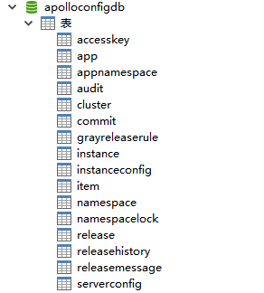

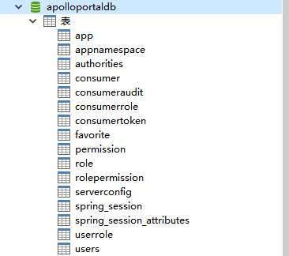


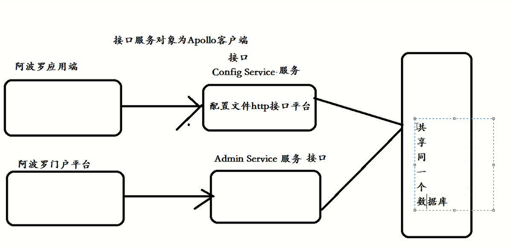

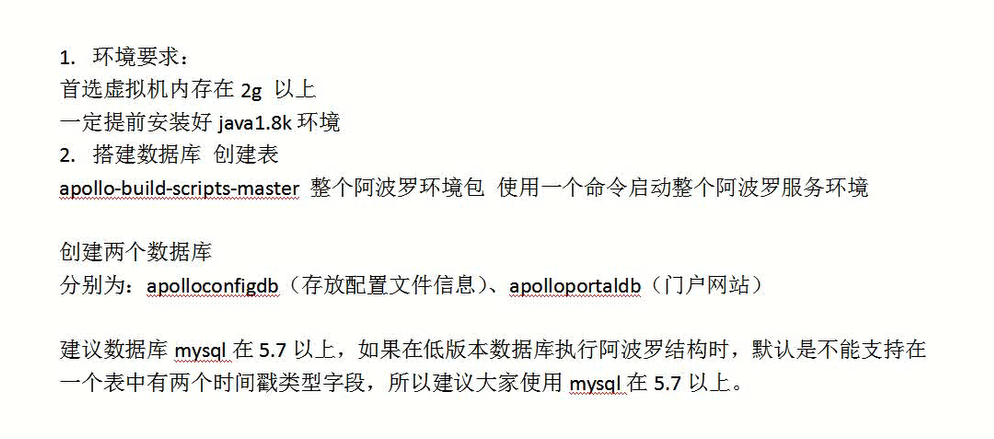


下面以MySQL原生客户端为例：

```shell
source /your_local_path/sql/apolloportaldb.sql
```


导入成功后，可以通过执行以下sql语句来验证：

```sql
select `Id`, `AppId`, `Name` from ApolloPortalDB.App;
```


| Id   | AppId     | Name       |
| :--- | :-------- | :--------- |
| 1    | SampleApp | Sample App |


#### 2.1.2  创建ApolloConfigDB

通过各种MySQL客户端导入[sql/apolloconfigdb.sql](https://github.com/nobodyiam/apollo-build-scripts/blob/master/sql/apolloconfigdb.sql)即可。

下面以MySQL原生客户端为例：

```shell
source /your_local_path/sql/apolloconfigdb.sql
```


导入成功后，可以通过执行以下sql语句来验证：

```sql
select `NamespaceId`, `Key`, `Value`, `Comment` from ApolloConfigDB.Item;
```

| NamespaceId | Key     | Value | Comment            |
| :---------- | :------ | :---- | :----------------- |
| 1           | timeout | 100   | sample timeout配置 |

将打包后的Apollo--放入linux服务器

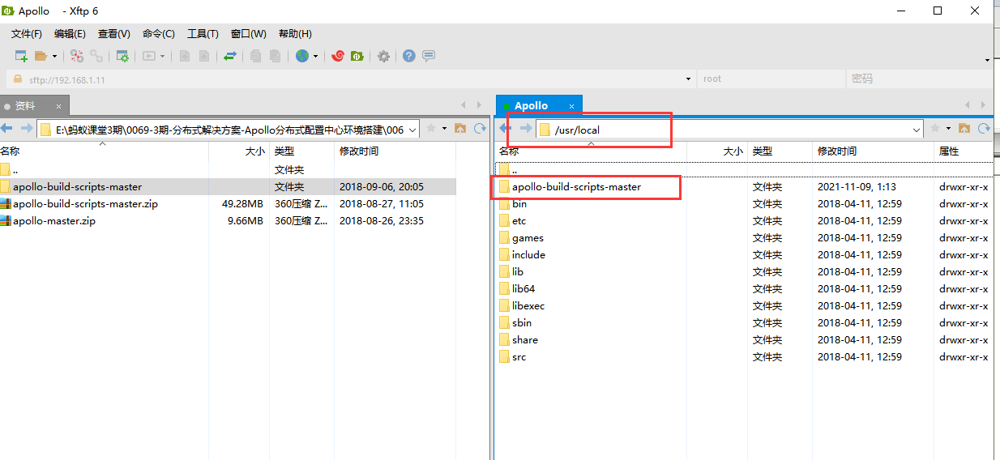


修改demo.sh

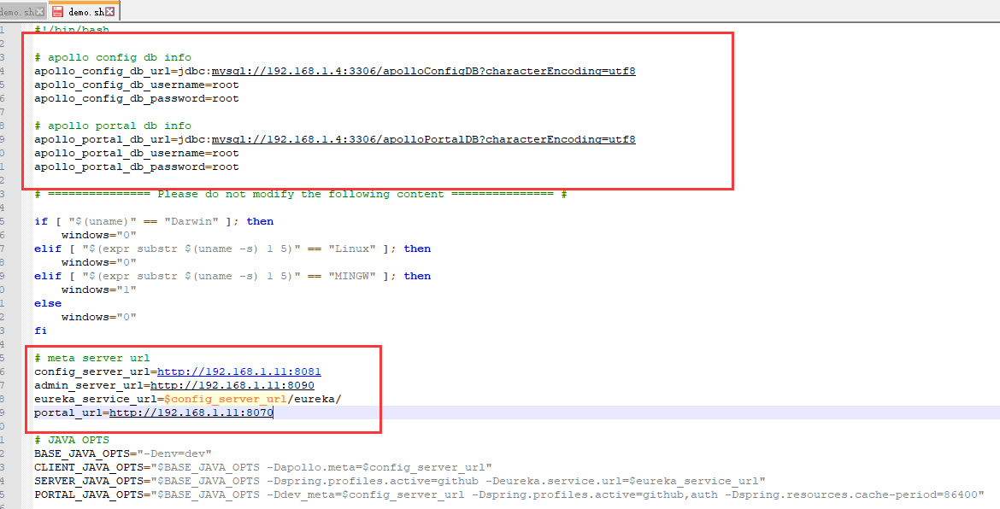


如果执行命令没有权限 输入 chmod u+x *.sh


**如果mysql不支持远程连接：**

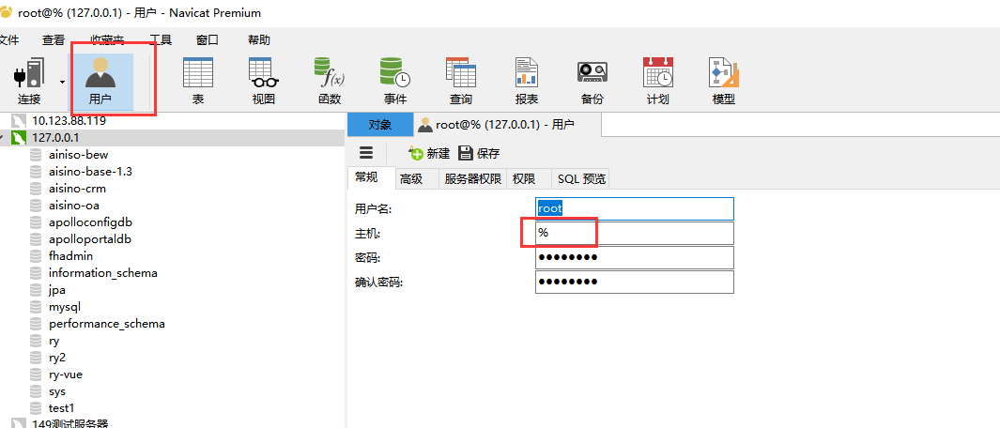


然后关闭Linux的防火墙：

systemctl stop firewalld


**Linux关闭iptable**

**一、重启后永久性生效：**

**开启：**

```
chkconfig iptables on
```

**关闭：**

```
chkconfig iptables off
```

**二、即时生效，重启后失效：**

**开启：**

```
service iptables start
```

**关闭：**

```
service iptables stop
```


```bash
==== starting service ====
Service logging file is ./service/apollo-service.log
Started [11109]
Waiting for config service startup
Config service started. You may visit http://192.168.1.11:8080 for service status now!
Waiting for admin service startup
Admin service started
==== starting portal ====
Portal logging file is ./portal/apollo-portal.log
Started [11150]
Waiting for portal startup
Portal started. You can visit http://192.168.1.11:8070 now!

// 显示这样就代表成功了

```


启动成功

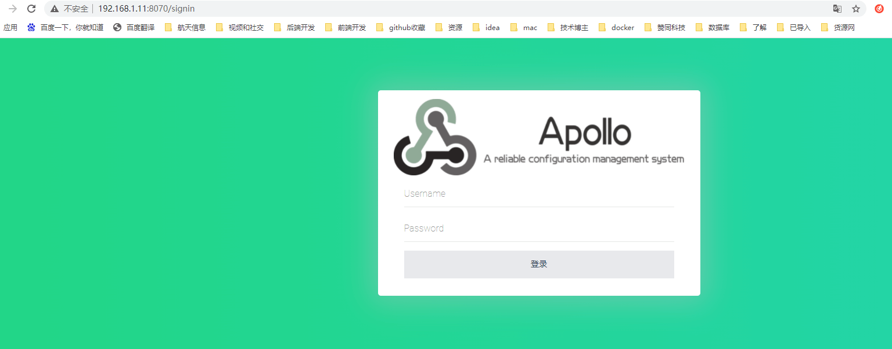


### 2.2  配置数据库连接信息

Apollo服务端需要知道如何连接到你前面创建的数据库，所以需要编辑[demo.sh](https://github.com/nobodyiam/apollo-build-scripts/blob/master/demo.sh)，修改ApolloPortalDB和ApolloConfigDB相关的数据库连接串信息。

```
注意：填入的用户需要具备对ApolloPortalDB和ApolloConfigDB数据的读写权限。
```


```shell
#apollo config db info
apollo_config_db_url=jdbc:mysql://localhost:3306/ApolloConfigDB?characterEncoding=utf8
apollo_config_db_username=用户名
apollo_config_db_password=密码（如果没有密码，留空即可）

# apollo portal db info
apollo_portal_db_url=jdbc:mysql://localhost:3306/ApolloPortalDB?characterEncoding=utf8
apollo_portal_db_username=用户名
apollo_portal_db_password=密码（如果没有密码，留空即可）

```

注意：不要修改demo.sh的其它部分


 注；我本地是用的阿里云的RDS


## 三、启动Apollo配置中心

**注：我第一次使用的是阿里云启动的，但是与SpringBoot整合的时候，我配置是公网IP，链接的时候确实私网IP，导致一直连不上，然后换了虚拟机安装了一边。**


### 3.1  确保端口未被占用

Quick Start脚本会在本地启动3个服务，分别使用8070, 8080, 8090端口，请确保这3个端口当前没有被使用。

例如，在Linux/Mac下，可以通过如下命令检查：

```
lsof -i:8080
```


### 3.2  执行启动脚本

```shell
[root@localhost apollo]# ll
总用量 62456
-rwxr-xr-x 1 root root 63931770 10月 20 11:23 apollo-all-in-one.jar
drwxr-xr-x 3 root root       63 5月   3 2019 client
-rwxr-xr-x 1 root root     5960 1月  17 10:34 demo.sh
drwxr-xr-x 2 root root      235 10月 20 11:23 images
drwxr-xr-x 2 root root       32 8月  11 2018 portal
-rw-r--r-- 1 root root    12055 10月 20 11:24 README.md
drwxr-xr-x 2 root root       33 10月 20 11:25 service
drwxr-xr-x 2 root root       58 12月 10 2018 sql
[root@localhost apollo]# ./demo.sh start
==== starting service ====
Service logging file is ./service/apollo-service.log
Started [2509]
Waiting for config service startup.........
Config service started. You may visit http://192.168.180.137:8080 for service status now!
Waiting for admin service startup....
Admin service started
==== starting portal ====
Portal logging file is ./portal/apollo-portal.log
Started [2720]
Waiting for portal startup......l..
Portal started. You can visit http://192.168.180.137:8070 now!
[root@localhost apollo]#

```


### 3.3 异常排查

如果启动遇到了异常，可以分别查看service和portal目录下的log文件排查问题。

注：在启动apollo-configservice的过程中会在日志中输出eureka注册失败的信息，如`com.sun.jersey.api.client.ClientHandlerException: java.net.ConnectException: Connection refused`。需要注意的是，这个是预期的情况，因为apollo-configservice需要向Meta Server（它自己）注册服务，但是因为在启动过程中，自己还没起来，所以会报这个错。后面会进行重试的动作，所以等自己服务起来后就会注册正常了。


### 3.4  注意

Quick Start只是用来帮助大家快速体验Apollo项目，具体实际使用时请参考：[分布式部署指南](https://github.com/ctripcorp/apollo/wiki/分布式部署指南)。

另外需要注意的是Quick Start不支持增加环境，只有通过分布式部署才可以新增环境，同样请参考：[分布式部署指南](https://github.com/ctripcorp/apollo/wiki/分布式部署指南)


## 四、使用Apollo配置中心

### 4.1 使用样例项目

#### 4.1.1 查看样例配置

1. 打开http://192.168.180.137:8070/

> Quick Start集成了[Spring Security简单认证](https://github.com/ctripcorp/apollo/wiki/Portal-实现用户登录功能#实现方式一使用apollo提供的spring-security简单认证)，更多信息可以参考[Portal 实现用户登录功能](https://github.com/ctripcorp/apollo/wiki/Portal-实现用户登录功能)


2.输入用户名apollo，密码admin后登录


3.点击SampleApp进入配置界面，进行配置

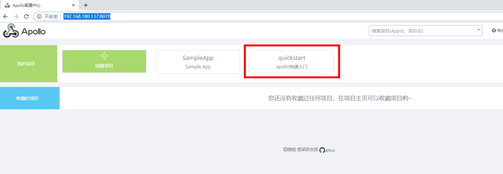


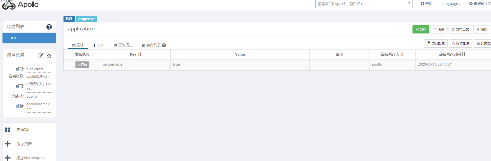


#### 4.1.2 运行客户端程序

我们准备了一个简单的[Demo客户端](https://github.com/ctripcorp/apollo/blob/master/apollo-demo/src/main/java/com/ctrip/framework/apollo/demo/api/SimpleApolloConfigDemo.java)来演示从Apollo配置中心获取配置。

程序很简单，就是用户输入一个key的名字，程序会输出这个key对应的值。


```yaml
apollo:
  meta: http://192.168.180.137:8080
  bootstrap:
    enabled: true
    eagerLoad:
      enabled: true
    namespaces: application,TEST1.common

```


```java
@Controller
public class ApolloController {

    @RequestMapping("/index")
    public String hello(){
        Config config = ConfigService.getAppConfig();
        String someKey = "sms.enable";
        String value = config.getProperty(someKey, null);
        System.out.println(value);
        return value;
    }

}

```

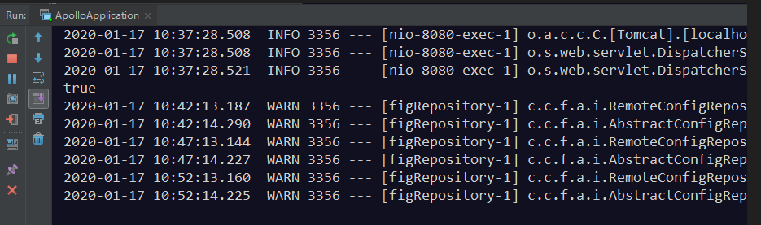


#### 4.1.3 修改配置并发布

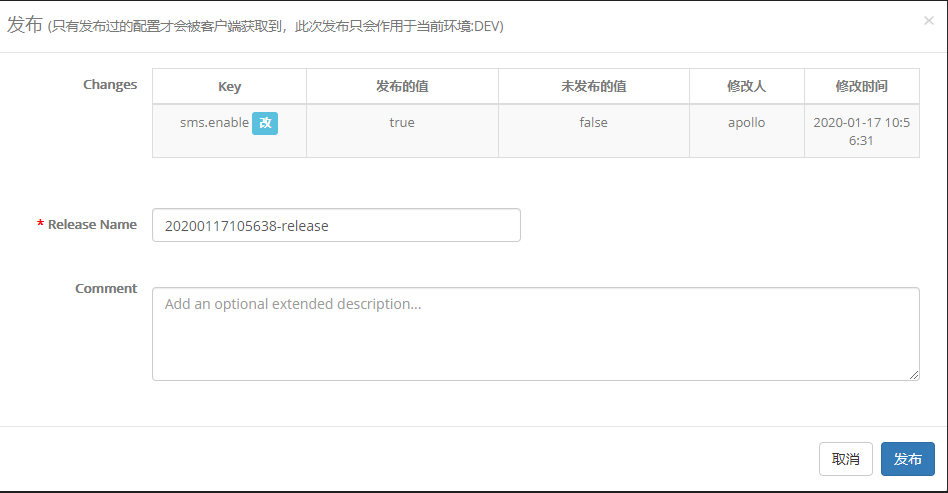


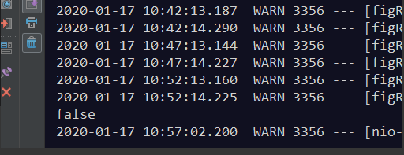


发现配置已经发生改变。


