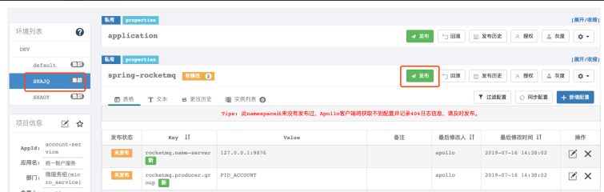

# 3.apollo应用配置


## Apollo工作原理


下图是Apollo架构模块的概览


 **各模块职责**
上图简要描述了Apollo的总体设计，我们可以从下往上看：
Config Service提供配置的读取、推送等功能，服务对象是Apollo客户端

Admin Service提供配置的修改、发布等功能，服务对象是Apollo Portal（管理界面）

Eureka提供服务注册和发现，为了简单起见，目前Eureka在部署时和Config Service是在一个JVM进程中的

Config Service和Admin Service都是多实例、无状态部署，所以需要将自己注册到Eureka中并保持心跳

在Eureka之上架了一层Meta Server用于封装Eureka的服务发现接口

Client通过域名访问Meta Server获取Config Service服务列表（IP+Port），而后直接通过IP+Port访问服务，同时在Client侧会做load balance、错误重试

Portal通过域名访问Meta Server获取Admin Service服务列表（IP+Port），而后直接通过IP+Port访问服务，同时在Portal侧会做load balance、错误重试

为了简化部署，我们实际上会把Config Service、Eureka和Meta Server三个逻辑角色部署在同一个JVM进程中


**分步执行流程**
1. Apollo启动后，Config/Admin Service会自动注册到Eureka服务注册中心，并定期发送保活心跳。
2. Apollo Client和Portal管理端通过配置的Meta Server的域名地址经由Software Load Balancer(软件负载均衡
器)进行负载均衡后分配到某一个Meta Server
3. Meta Server从Eureka获取Config Service和Admin Service的服务信息，相当于是一个Eureka Client
4. Meta Server获取Config Service和Admin Service（IP+Port）失败后会进行重试
5. 获取到正确的Config Service和Admin Service的服务信息后，Apollo Client通过Config Service为应用提供配
置获取、实时更新等功能；Apollo Portal管理端通过Admin Service提供配置新增、修改、发布等功能


**核心概念**
1. application (应用)
这个很好理解，就是实际使用配置的应用，Apollo客户端在运行时需要知道当前应用是谁，从而可以去获取
对应的配置
关键字：appId
2. environment (环境)
配置对应的环境，Apollo客户端在运行时需要知道当前应用处于哪个环境，从而可以去获取应用的配置
关键字：env
3. cluster (集群)
一个应用下不同实例的分组，比如典型的可以按照数据中心分，把上海机房的应用实例分为一个集群，把北
京机房的应用实例分为另一个集群。
关键字：cluster
4. namespace (命名空间)
一个应用下不同配置的分组，可以简单地把namespace类比为文件，不同类型的配置存放在不同的文件中，
如数据库配置文件，RPC配置文件，应用自身的配置文件等
关键字：namespaces
它们的关系如下图所示：


**项目管理**

 **基础设置**
**1.** **部门管理**
apollo 默认部门有两个。要增加自己的部门，可在系统参数中修改：
进入系统参数设置


**2.新增部门**

```json
[{"orgId":"TEST1","orgName":"样例部门1"},{"orgId":"TEST2","orgName":"样例部门2"},
{"orgId":"micro_service","orgName":"微服务部门"}]
```


**3.** **添加用户**
apollo默认提供一个超级管理员: apollo，可以自行添加用户
新建用户wgr


**4.创建项目**
1. 打开apollo-portal主页：http://192.168.180.137:8070/
2. 点击“创建项目”：account-service


3. 输入项目信息
部门：选择应用所在的部门
应用AppId：用来标识应用身份的唯一id，格式为string，需要和项目配置文件applications.properties
中配置的app.id对应
应用名称：应用名，仅用于界面展示
应用负责人：选择的人默认会成为该项目的管理员，具备项目权限管理、集群创建、Namespace创建等
权限  


 4. 点击提交
创建成功后，会自动跳转到项目首页
  5. 赋予之前添加的用户张三管理account-service服务的权限
  使用管理员apollo将指定项目授权给用户wgr 


使用wgr登录，查看项目配置


**5** **删除项目**
如果要删除整个项目，点击右上角的“管理员工具--》删除应用、集群...”
首先查询出要删除的项目，点击“删除应用


**6 配置的增删改查和之前一样**

 下面就新增一个配置


然后启动项目去获取


**7** **添加Namespace**


**添加公共Namespace**
在项目开发中，有一些配置可能是通用的，我们可以通过把这些通用的配置放到公共的Namespace中，这样其他
项目要使用时可以直接添加需要的Namespace

1. 新建common-template项目


```shell
pring.http.encoding.enabled = true
spring.http.encoding.charset = UTF‐8
spring.http.encoding.force = true
server.tomcat.remote_ip_header = x‐forwarded‐for
server.tomcat.protocol_header = x‐forwarded‐proto
server.use‐forward‐headers = true
server.servlet.context‐path = /

```


**关联公共Namespace**

1. 打开之前创建的account-service项目
2. 点击左侧的添加Namespace
3. 添加Namespace


4. 根据需求可以覆盖引入公共Namespace中的配置，下面以覆盖server.servlet.context-path为例


5. 修改server.servlet.context-path为：/account-service


6.修改


**集群管理**
在有些情况下，应用有需求对不同的集群做不同的配置，比如部署在A机房的应用连接的RocketMQ服务器地址和
部署在B机房的应用连接的RocketMQ服务器地址不一样。另外在项目开发过程中，也可为不同的开发人员创建不
同的集群来满足开发人员的自定义配置 

创建集群

1. 点击页面左侧的“添加集群”按钮


切换到对应的集群，修改配置并发布即可





