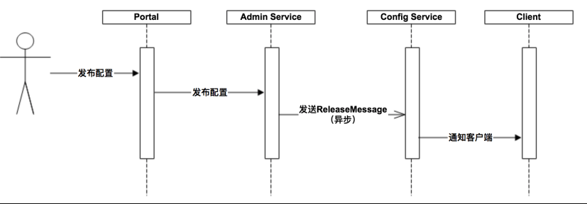
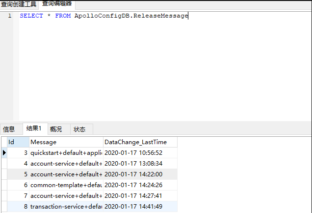
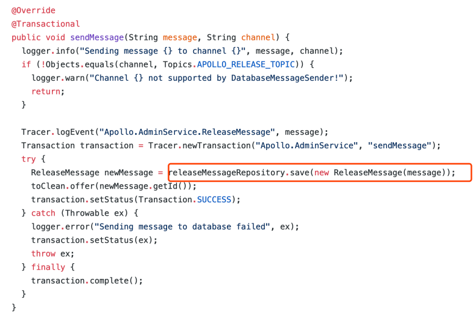
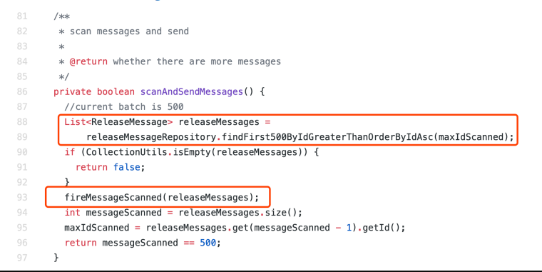
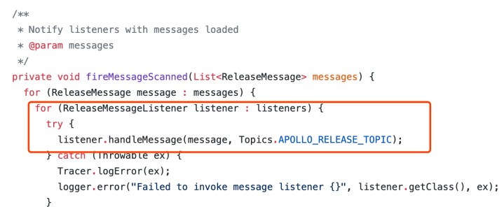
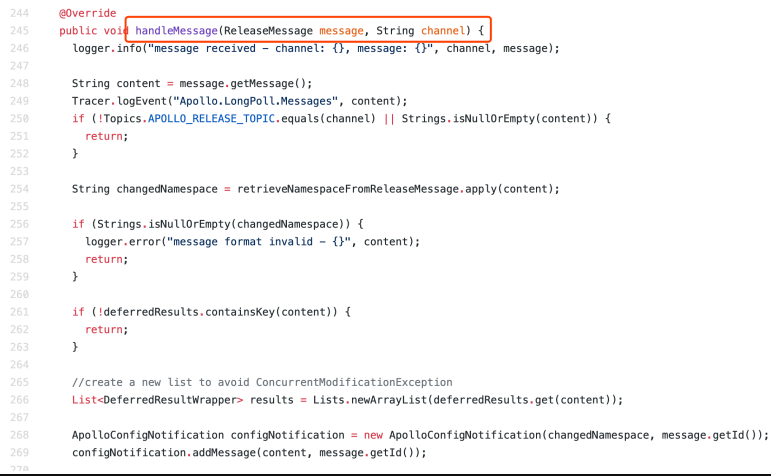
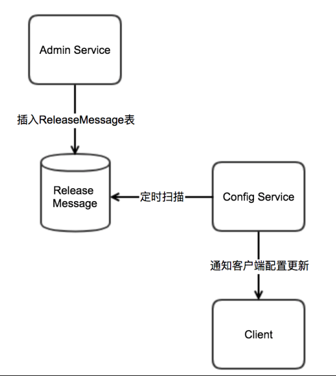
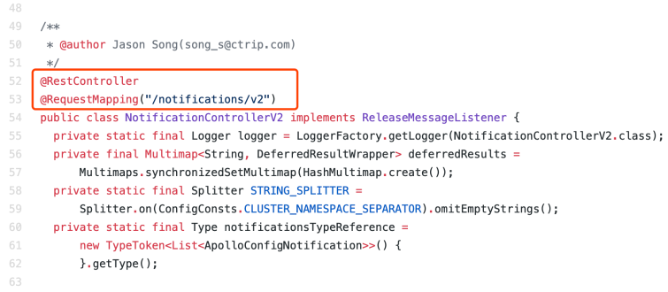
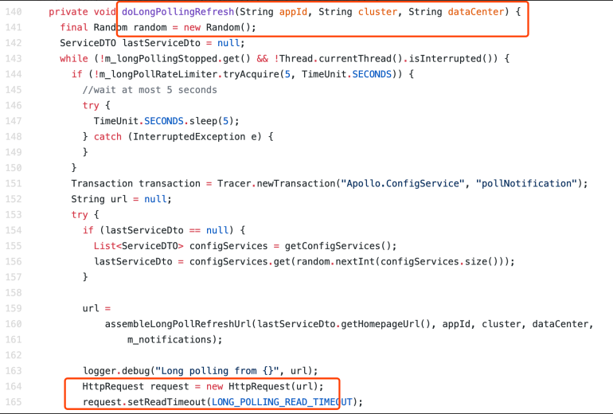

# 4.Apollo配置发布原理

**设计实现**

在配置中心中，一个重要的功能就是配置发布后实时推送到客户端。

上图简要描述了配置发布的主要过程：
1. 用户在Portal操作配置发布
2. Portal调用Admin Service的接口操作发布
3. Admin Service发布配置后，发送ReleaseMessage给各个Config Service
4. Config Service收到ReleaseMessage后，通知对应的客户端

**发送ReleaseMessage**
Admin Service在配置发布后，需要通知所有的Config Service有配置发布，从而Config Service可以通知对应的客
户端来拉取最新的配置。
从概念上来看，这是一个典型的消息使用场景，Admin Service作为producer（生产者）发出消息，各个Config
Service作为consumer（消费者）消费消息。通过一个消息队列组件（Message Queue）就能很好的实现Admin
Service和Config Service的解耦。
在实现上，考虑到Apollo的实际使用场景，以及为了尽可能减少外部依赖，我们没有采用外部的消息中间件，而是
通过数据库实现了一个简单的消息队列。
具体实现方式如下：

1. Admin Service在配置发布后会往ReleaseMessage表插入一条消息记录，消息内容就是配置发布的
AppId+Cluster+Namespace

 1 消息发送类 

Config Service有一个线程会每秒扫描一次ReleaseMessage表，看看是否有新的消息记录

2 消息扫描类：ReleaseMessageScanner

3. Config Service如果发现有新的消息记录，那么就会通知到所有的消息监听器

然后调用消息监听类的handleMessage方法：NotificationControllerV2

4. NotificationControllerV2得到配置发布的AppId+Cluster+Namespace后，会通知对应的客户端

**Config Service通知客户端**
上一节中简要描述了NotificationControllerV2是如何得知有配置发布的，那NotificationControllerV2在得知有配
置发布后是如何通知到客户端的呢？
实现方式如下：

1. 客户端会发起一个Http请求到Config Service的 notifications/v2 接口NotificationControllerV2

客户端发送请求类：RemoteConfigLongPollService

2. NotificationControllerV2不会立即返回结果，而是把请求挂起。考虑到会有数万客户端向服务端发起长连，
   因此在服务端使用了async servlet(Spring DeferredResult)来服务Http Long Polling请求。

3. 如果在60秒内没有该客户端关心的配置发布，那么会返回Http状态码304给客户端。

4. 如果有该客户端关心的配置发布，NotificationControllerV2会调用DeferredResult的setResult方法，传入有
   配置变化的namespace信息，同时该请求会立即返回。客户端从返回的结果中获取到配置变化的namespace
   后，会立即请求Config Service获取该namespace的最新配置 

**客户端读取设计**
除了之前介绍的客户端和服务端保持一个长连接，从而能第一时间获得配置更新的推送外，客户端还会定时从Apollo配置中心服务端拉取应用的最新配置。
1 这是一个备用机制，为了防止推送机制失效导致配置不更新
2 客户端定时拉取会上报本地版本，所以一般情况下，对于定时拉取的操作，服务端都会返回304 - NotModified
3 定时频率默认为每5分钟拉取一次，客户端也可以通过在运行时指定System Property:apollo.refreshInterval 来覆盖，单位为分钟

