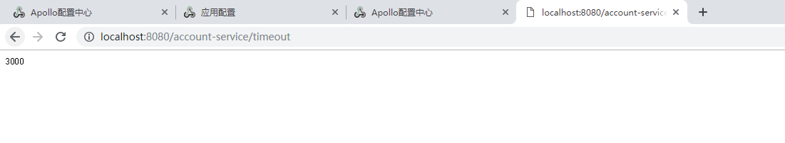

# 5.apollo整合springboot开发


**创建项目**

pom.xml

```xml
<dependencies>
        <dependency>
            <groupId>org.springframework.boot</groupId>
            <artifactId>spring-boot-starter</artifactId>
            <exclusions>
                <exclusion>
                    <groupId>org.springframework.boot</groupId>
                    <artifactId>spring-boot-starter-logging</artifactId>
                </exclusion>
            </exclusions>
        </dependency>

        <dependency>
            <groupId>org.springframework.boot</groupId>
            <artifactId>spring-boot-starter-log4j2</artifactId>
        </dependency>

        <dependency>
            <groupId>org.springframework.boot</groupId>
            <artifactId>spring-boot-starter-web</artifactId>
        </dependency>

        <dependency>
            <groupId>org.springframework.boot</groupId>
            <artifactId>spring-boot-configuration-processor</artifactId>
            <optional>true</optional>
        </dependency>

        <dependency>
            <groupId>com.ctrip.framework.apollo</groupId>
            <artifactId>apollo-client</artifactId>
            <version>1.3.0</version>
        </dependency>

    </dependencies>

```


**必选配置**

```shell
app.id=account-service
apollo.cacheDir=/opt/data/apollo‐config
apollo.cluster=SHAJQ
```


```yaml
apollo:
  meta: http://192.168.180.137:8080
  bootstrap:
    enabled: true
    eagerLoad:
      enabled: true
    namespaces: application,micro_service.spring‐boot‐http,spring‐rocketmq,spring-boot-druid

```


配置类

```java
@SpringBootApplication
@EnableApolloConfig
public class AccountServiceApplication {

    public static void main(String[] args) {
        SpringApplication.run(AccountServiceApplication.class, args);
    }

}

```


web层


  ```java
@RestController
public class AccountController {

    @Value("${sms.enable}")
    private Boolean smsEnable;

    @GetMapping("/hi")
    public String hi() {
        return "hi";
    }

    @Value("${timeout}")
    private Long timeout;

    @GetMapping("/timeout")
    public Long getTimeout() {
        return timeout;
    }

}

  ```

**进行读取配置**

[](https://img2018.cnblogs.com/i-beta/1829785/202001/1829785-20200119203854981-1720618961.png)

 

 说明配置已经生效了。


  注意： **如果我们本地的配置文件和Apollo的配置内容有一致的情况，那么默认是Apollo的优先级高，会使用Apollo的配置，如果需要以本地配置为准，那么可以在本地代码中设置Apollo的优先级。**


