# 6.apollo的灰度发布

**灰度发布**
**定义**
灰度发布是指在黑与白之间，能够平滑过渡的一种发布方式。在其上可以进行A/B testing，即让一部分用户继续用
产品特性A，一部分用户开始用产品特性B，如果用户对B没有什么反对意见，那么逐步扩大范围，把所有用户都迁
移到B上面来。
 **Apollo实现的功能**

1. 对于一些对程序有比较大影响的配置，可以先在一个或者多个实例生效，观察一段时间没问题后再全量发布
  配置。

2. 对于一些需要调优的配置参数，可以通过灰度发布功能来实现A/B测试。可以在不同的机器上应用不同的配
  置，不断调整、测评一段时间后找出较优的配置再全量发布配置。

  

**创建2个客户端**

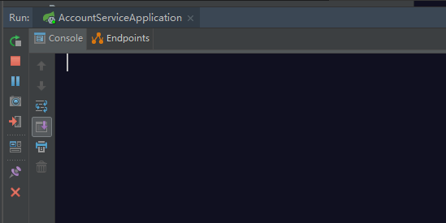

然后把本地的代码打成jar包，在虚拟机里面运行

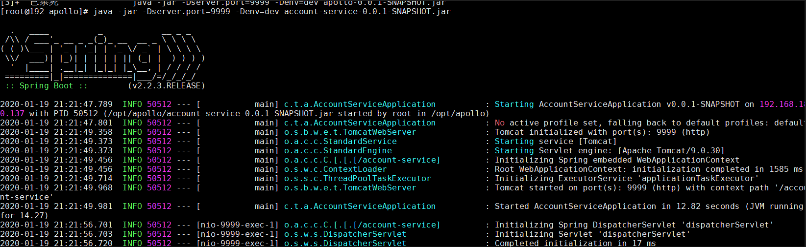

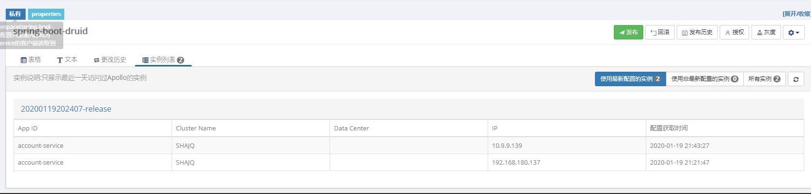

 灰度配置

1. 点击 主版本的配置 中，timeout配置最右侧的 对此配置灰度 按钮

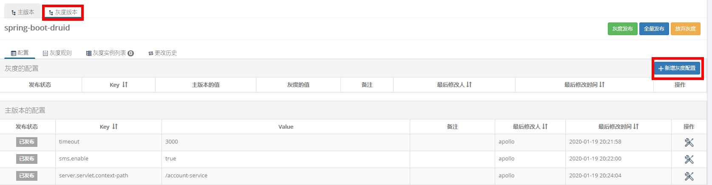

修改配置

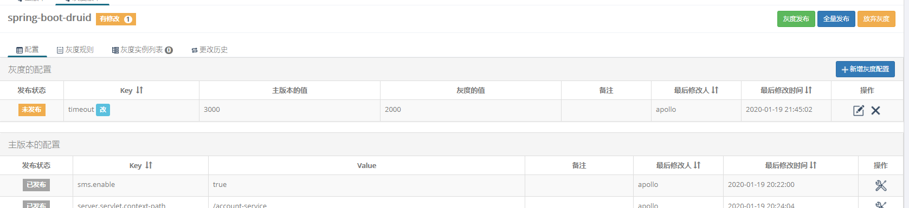

 选中灰度发布的实例

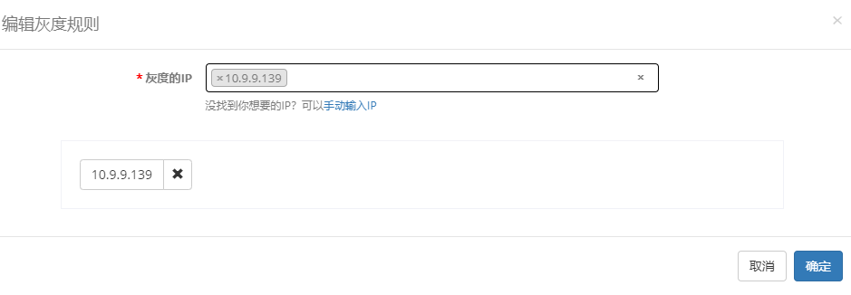

测试：

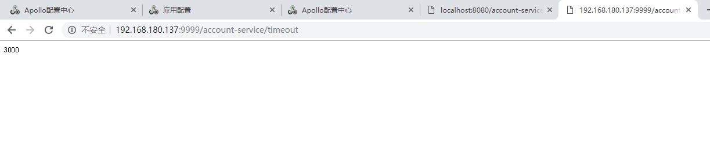

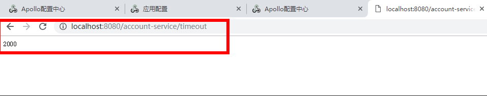

全量发布
如果灰度的配置测试下来比较理想，符合预期，那么就可以操作 全量发布 。
全量发布的效果是：
1. 灰度版本的配置会合并回主版本，在这个例子中，就是主版本的timeout会被更新成2000
2. 主版本的配置会自动进行一次发布
3. 在全量发布页面，可以选择是否保留当前灰度版本，默认为不保留

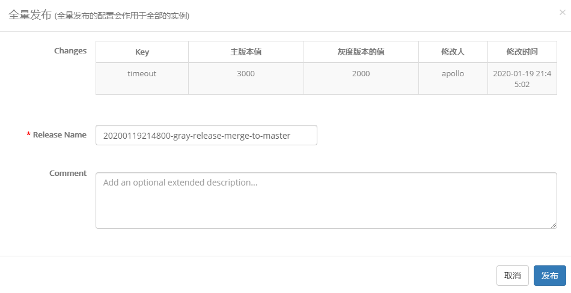

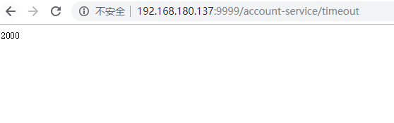

**放弃灰度**

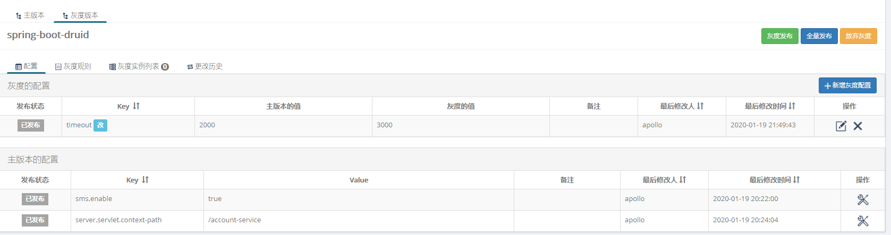

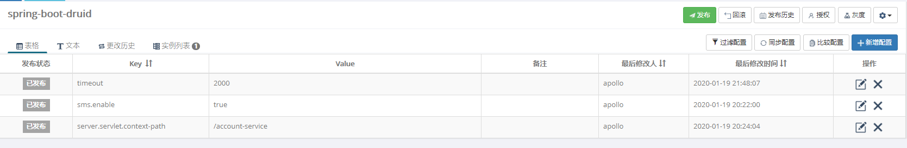

更改历史

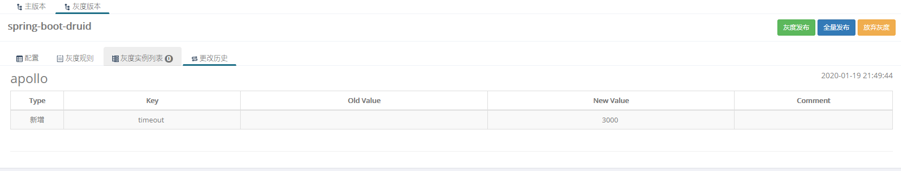

