# 7.使用virtualBox进行服务部署


常用的虚拟机有 VMware和virtualBox


那么我们使用virtualBox的好处是--Oracle给提供的**非常小巧玲珑免费的虚拟机**


安装他直接下一步下一步的安装就可以了非常简单


```
注意：我们今天用的是尚硅谷之前提供的一个虚拟系统
	用户名：root
	密码是：123456
```


## 1、工具介绍

目前还没有安装任何的虚拟操作系统

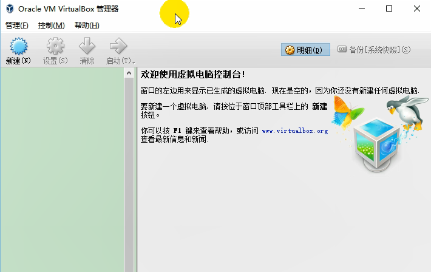


我们将这个ova的Linux操作系统导入进来就可以了

​	那么.ova是什么文件，其实ova文件就是虚拟机导出的系统文件

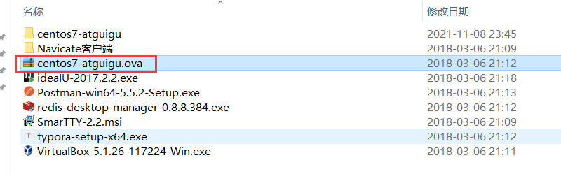


比如你要导出现在使用的虚拟机内的系统

​	导出虚拟电脑

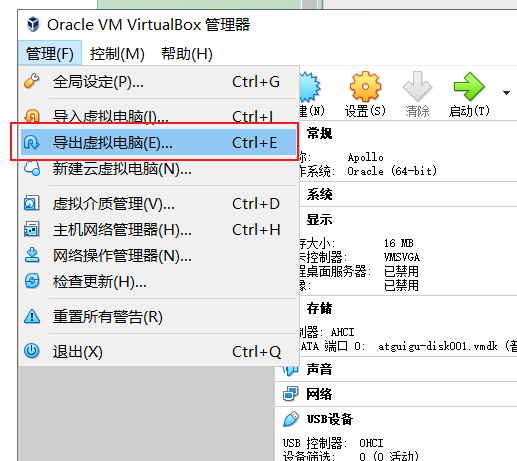


文件输出的格式就是ova

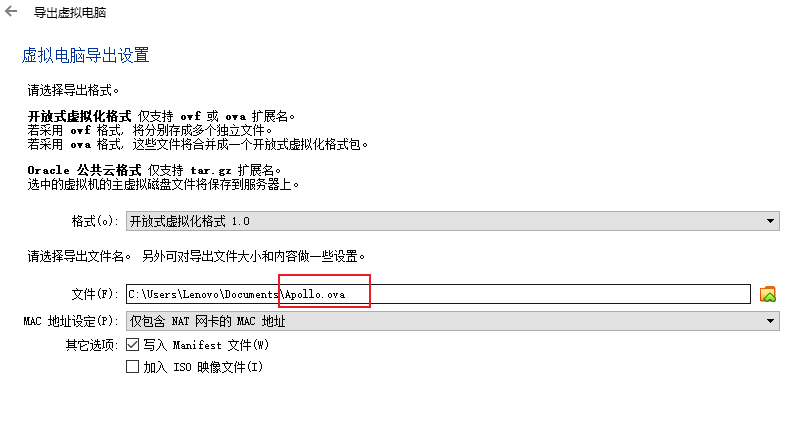


## 2、安装系统

#### 2.1安装

我们直接导入ova文件就可以了

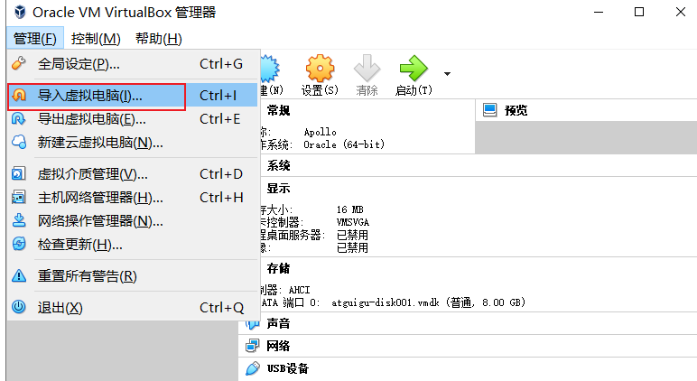


或者是我们可以新建

​	控制--新建

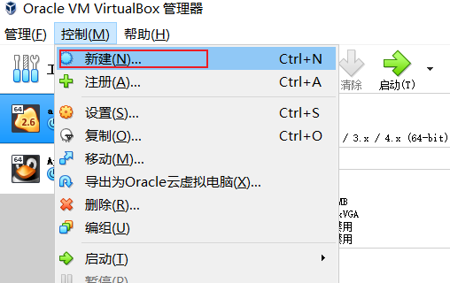


**选择：  **类型和版本

**注意：如果选择版本的时候发现没有64 bit选项，说明你的电脑没有开启CPU虚拟化**

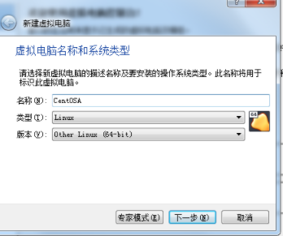


**双击运行“securable”程序（百度搜索securable 下载），在打开的程序主界面中就可以查看CPU是否支持虚拟化功能，如图所示，出现“YES”绿色标记，就表明CPU具有虚拟化功能**

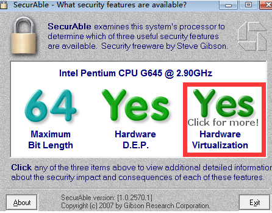


开启虚拟化共功能方法：开机--》BIOS--》**Configuration--》****Intel Virtualization Technology --enable 回车**

下一步。


#### 2.1分配内存

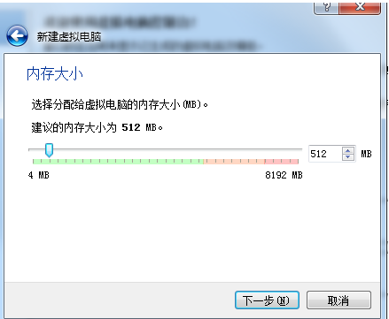


使用建议的内存大小即可，根据宿主机的配置可以自己进行调整，这里的值可以理解为虚拟机最大可占用宿主机的多少内存


#### 2.3、设置虚拟硬盘

这里有三个选项，可以选择使用已有的虚拟硬盘文件，或者先不添加虚拟硬盘，等创建好虚拟机后再添加，这里我们选择第二个现在创建虚拟硬盘


## **2.4、点击创建，进入虚拟硬盘文件类型选项**

一般选第一个 那两个没有用过，不过也可以尝试下。

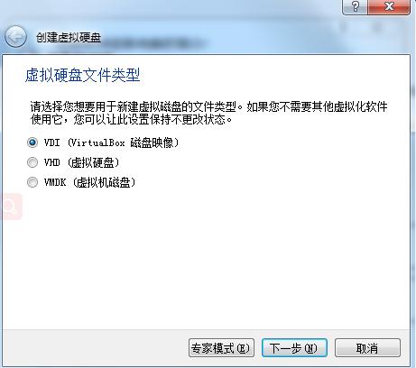


## **2.5、点击下一步，进行设置如何分配虚拟硬盘**

默认即可

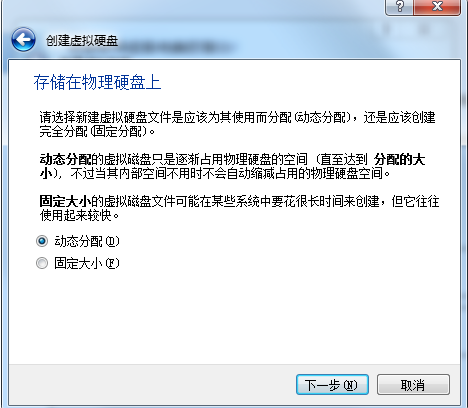


## **2.6、点击下一步，指定虚拟硬盘文件的存放位置和虚拟硬盘的大小。**

位置最好选择空间大的磁盘，不要放C盘哦，大小就是推荐的8G


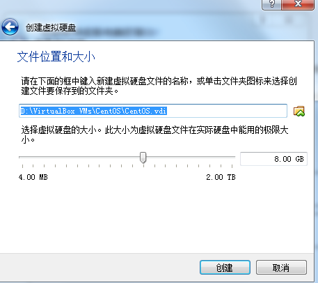


## **2.7、点击创建，代表创建完成**

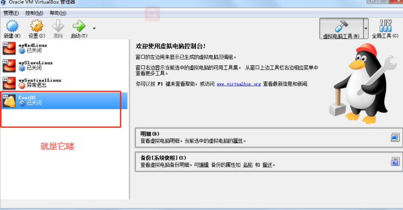


# **3、安装虚拟环境**

右键点击--》设置

## **3.1、选择网卡**

设置网络选择桥接网卡，

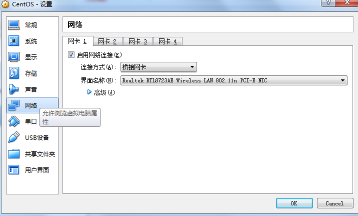


## **3.2、设置镜像文件**

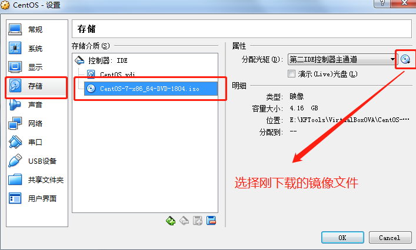


## **3.3、启动虚拟机**

第一个选项是安装CentOS7，第二个选项是检查操作系统文件是否损坏并安装CentOS7

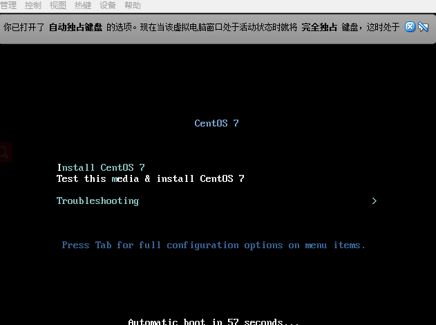


## **3.4、选择第一个安装CentOS7,进入语言选择**

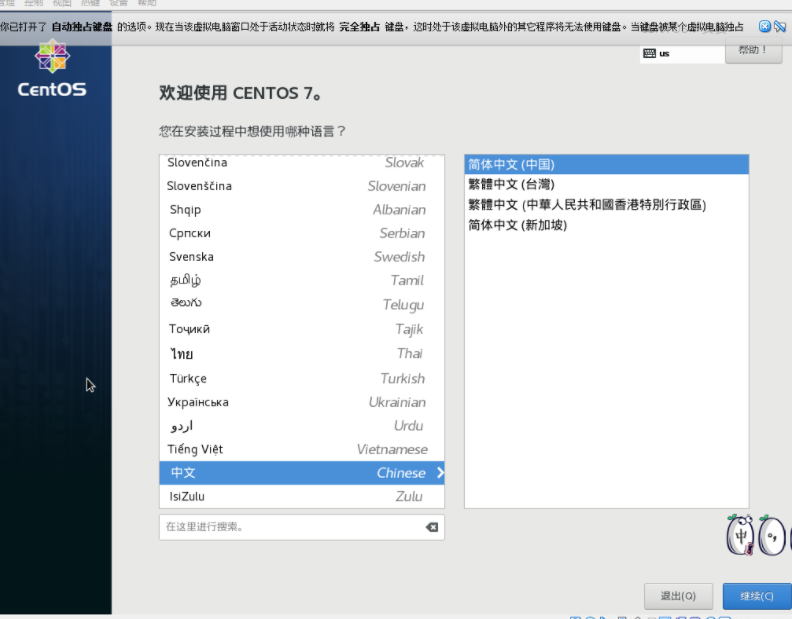


以下的操作可以在网络上寻找，或者博客https://www.cnblogs.com/haolb123/p/14949278.html


