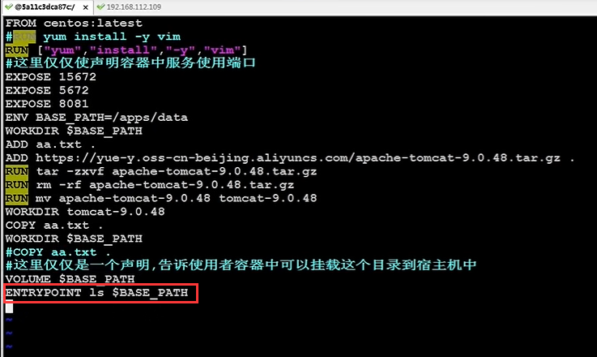

# dockerFile基本语法3

官方文档：

https://docs.docker.com/develop/develop-images/dockerfile_best-practices/#from

reference --参考：https://docs.docker.com/engine/reference/builder/#from

## 1、指令

#### 	1.1、FROM：

​	FROM--指令初始化新的构建阶段，并为后续指令设置基本映像。因此，有效的 `Dockerfile` 必须以 `FROM` 指令开始。映像可以是任何有效的映像-从公共存储库中提取映像开始特别容易。

#### 	1.2、RUN：

​	RUN有两种形式--

​			shell形式，该命令在shell中运行，默认情况下在Linux上为 `/bin/sh -c` ，在Windows上为 `cmd /S /C`

​			

​	`	RUN` 指令将在当前镜像之上的新层中执行任何命令并提交结果。得到的提交映像将用于 `Dockerfile` 中的下一步。

​	例如：RUN ["/bin/bash", "-c", "echo hello"]

​	其实run就是执行一些 脚本

#### 	1.3、ADD

​			add命令--其实就是添加一些内容，他和copy基本差不多

​			比copy命令强大的地方是 可以设置一个连接 可以自动的帮我们下载

#### 	1.4、CMD

​				cmd翻译过来就是 command 命令行

​				CMD可以有多个指令--但是只有最后一个生效

​				

​			无论是CMD还是ENTRYPOINT都是俩种语法格式

​				1、直接命令的方式

​						如：java -jar ems.jar

​				2、还支持json数组的方式

​						【“java”,"-jar", "ems.jar"】

​			

​	案例：我们希望在容器启动的后，展示app-data下的文件

​		编写dockerfile文件

​	构建镜像：

​		我们运行这个镜像的时候，他就会执行CMD中的指令 ls

​	将CMD命令切换为ENTRYPOINT看看效果：

​	我们看到效果是一致的

​		那么--CMD和ENTRYPOINT的区别是什么？

​			举例：假设我们现在不想看apps/data,而是 apps

​		我们发现报错了

​		如果我们使用 ls /apps就可以了

​		这就是为什么建议使用json的方式了，因为这种方式不支持传参

​		如果我们使用 json数组的方式

​	注意 环境变量也得加引号

​	可能是环境变量不能这么用--路径写死把

​	

​		如果我们想变命令，按之前数组的顺序就可以进行参数传递和替换

​	

​	但是如果是使用ENTRYPOINT 命令的话，参数也是传递进来了，但是并没有覆盖，都执行了

​	如果使用ENTRYPOINT命令想覆盖命令的话 就需要加上参数 -- entrypoint=key

​	

https://www.bilibili.com/video/BV1wQ4y1Y7SE?p=26&vd_source=243ad3a9b323313aa1441e5dd414a4ef

​		

​	其实CMD和ENTRYPOINT是配合使用的，一些固定的命令 我们使用ENTRYPOINT，一些可变的命令我们使用CMD

​	直接传参的方式--执行命令，替换CMD之前的命令

​		

		

#### 	1.5、ENTRYPOINT

​				entryPoint -- 就是俩个单词合并--进入点 也就是执行点

​				与CMD 命令的作用一样

​				用来指定容器启动时，默认执行的指令

​			

​		比如：redis镜像，我们在docker run redis 这个镜像的时候，为什么我们在这里run就可以启动这个redis服务呢，原因是人家这个redis容器内部  执行了 redis-server 这个脚本

​		那么就是在运行redis容器的时候，它默认 就是执行 一个redis-server的这个指令

​		假设我们自己的EMS项目的镜像，如果要启动这个容器，那么就需要默认执行一个 java -jar ems.jar的指令

​	所以说 EntryPoint 和CMD都是用来指定容器默认执行的指令/命令的

​		无论是CMD还是ENTRYPOINT都是俩种语法格式

​				1、直接命令的方式

​						如：java -jar ems.jar

​				2、还支持json数组的方式

​						【“java”,"-jar", "ems.jar"】

​	这俩种方式 推荐 使用json数组的方式

