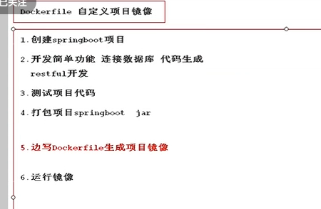
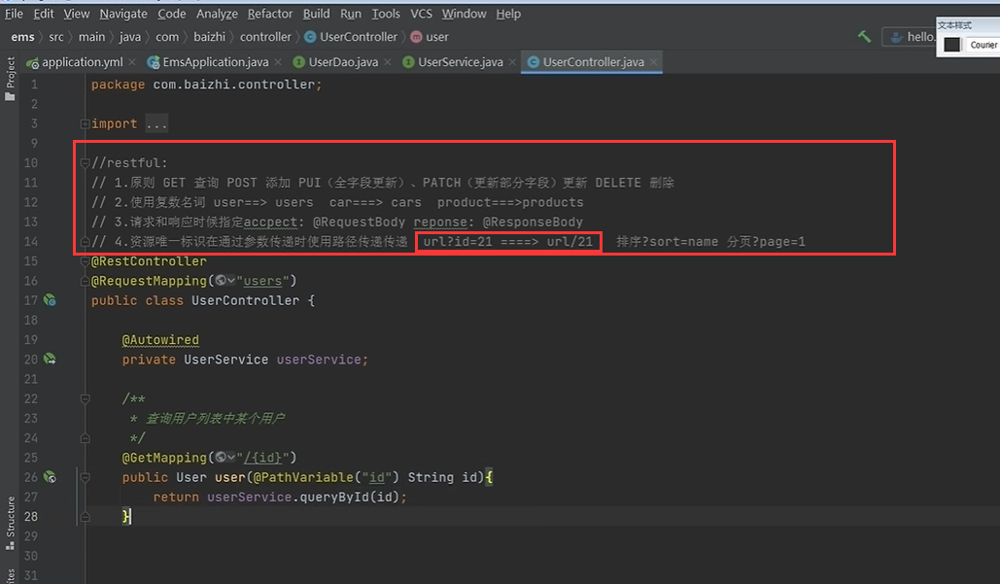
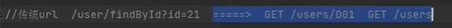
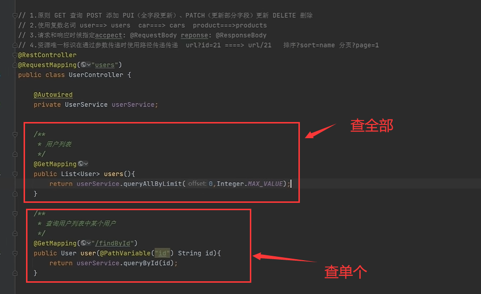
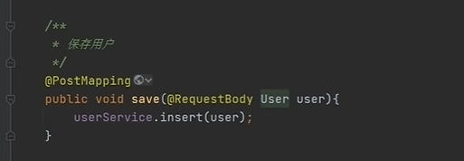
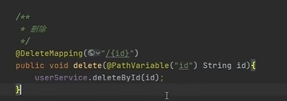

# 27、dockerfile构建应用1

## 	1、自定义项目镜像

​	代码中的controller---restful原则

什么是restful 其实就是一些大神觉得之前的url有点啰嗦，进行的一个简化，因为如果是走上面的user的控制器，那么使用GET请求，有参数就是查询某个id，无参数就是查询全部，就不需要什么 getById等等这些路径方法，如果使用类似这样的方法那么其实就不算Restful接口

保存用户

​	更新用户

删除

https://www.bilibili.com/video/BV1wQ4y1Y7SE?p=27&spm_id_from=pageDriver&vd_source=243ad3a9b323313aa1441e5dd414a4ef

