# 28、dockerfile构建应用2


​		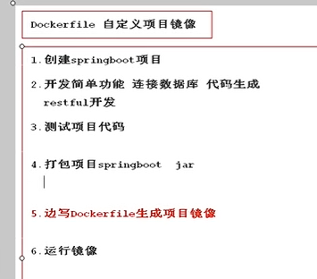

​		前面我们已经完成了前三步，接下来就是项目打包


## 1、打包

​		打包前我们先跳过测试

​		点击一下maven中的test，然后点击idea的闪电标识，代表跳过测试

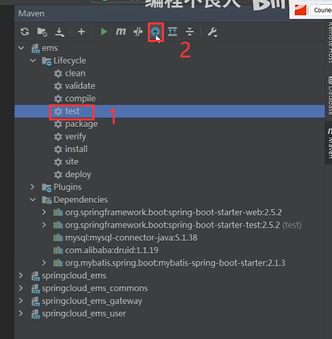


​	然后test就变成灰色的了--然后点击package

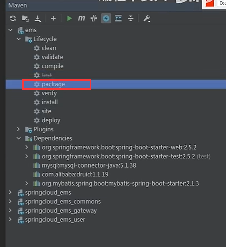


​	jar包已生成

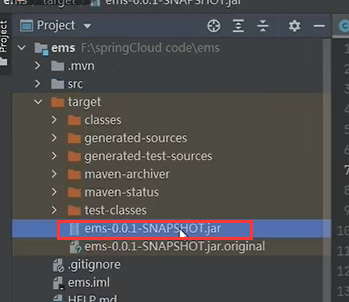


## 2、根据jar包生成镜像

#### 	1、创建dockerfile

​	SFTP连接一下远程主机---因为我们的docker引擎是在远程主机上的

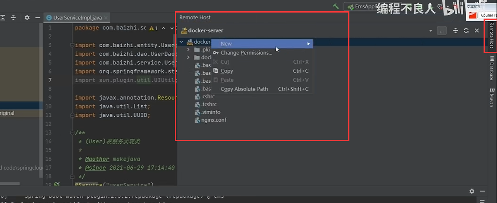


​	创建一个apps目录---用来运行我们自己的项目

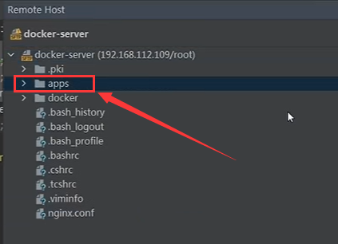


​	这个apps作为dockerfile的上下文，将jar包传上来，然后再创建一个dockerfile文件

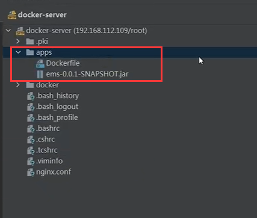


idea的终端工具是在Tools下--这样可以使用sftp进行连接

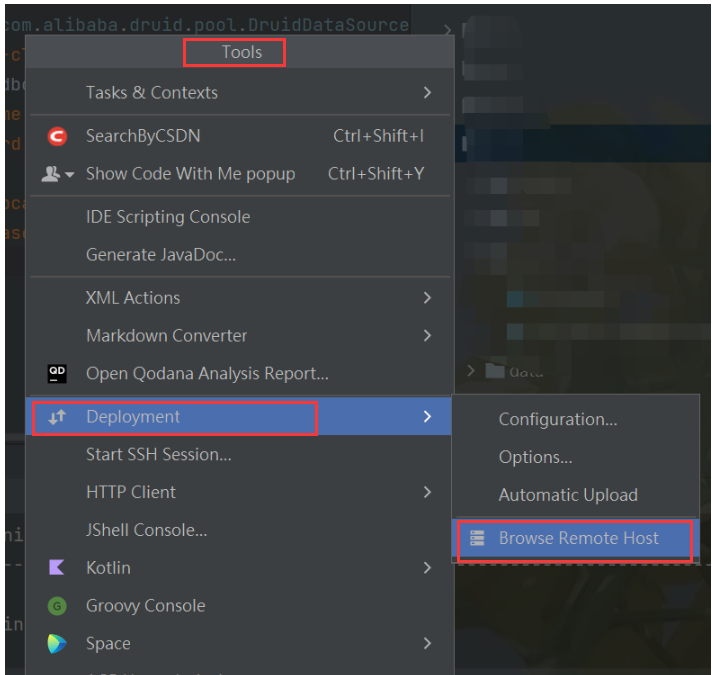


#### 	2、我们需要基于jdk的镜像

​			在docker hub 中寻找jdk8的版本

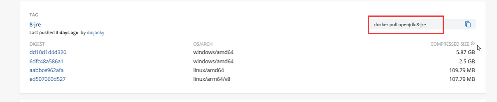


​	基础镜像是java8的jre


#### 	3、编写dockerfile文件

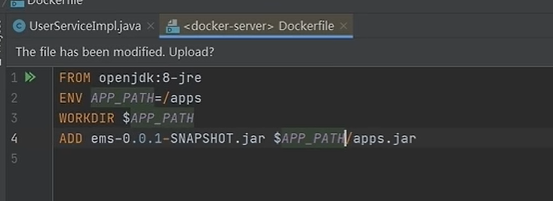

​		基础镜像 --》环境变量设置了个路径 --》工作路径 workdir --》添加jar包，且修改名字为apps.jar


​			描述端口 Expose 8989

​		存储卷 不需要


​			运行是-- ENTRYPOINT ，然后CMD 我们需要运行参数可变的是 apps.jar

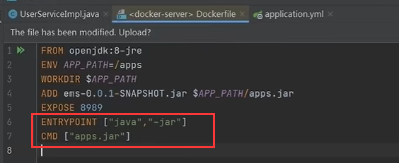

​		

​		修改完成--点击上传按钮 ，上传到SFTP服务器

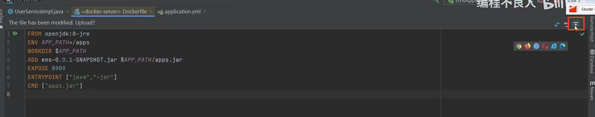


#### 4、开始构建

​		我们构建一个apps 1.0的版本


构建完成后我们查看一下

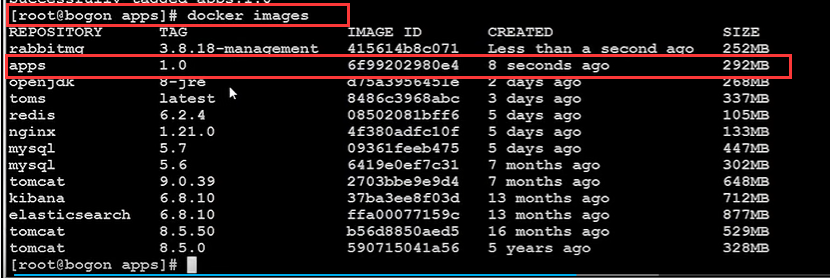


#### 5、运行镜像

​	加个  -p  将端口映射出来

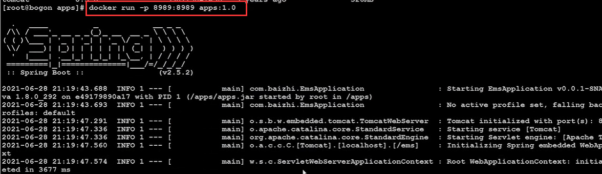


我们在访问的时候发现报错了

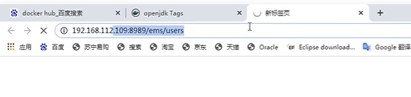


​	原因是他没有数据库

​	所以所我们需要把应用所依赖的这些数据库 和中间件先运行起来


#### 6、运行一下mysql

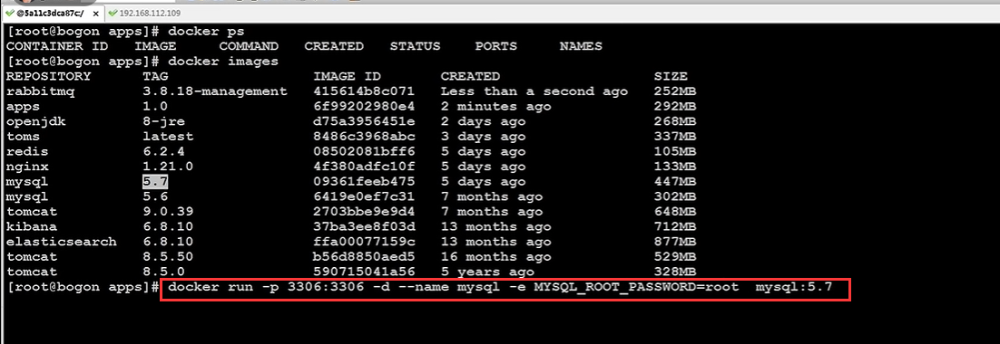


​	还需要加个-v数据持久化

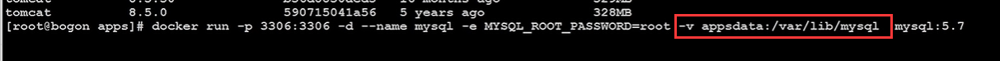


​	检查mysql运行没有问题

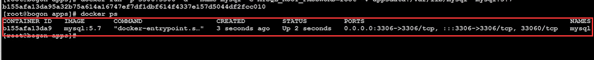


#### 7、数据库初始化

​		连接创建数据库

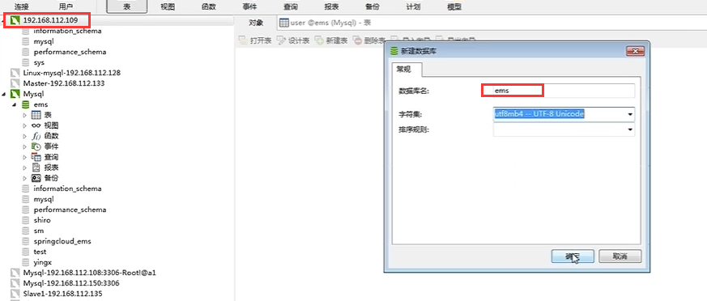


​	将表数据同步上来

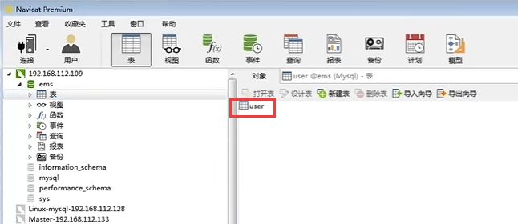


​	那么我们现在已经有mysql了，如果运行apps 1.0 的话需要他们在同一个网络中才可以进行连接


#### 8、构建一个网络

```
	docker network create app
```

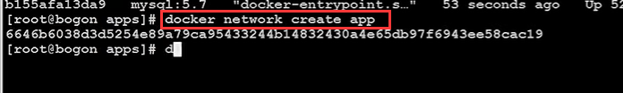


​	然后网络连接mysql

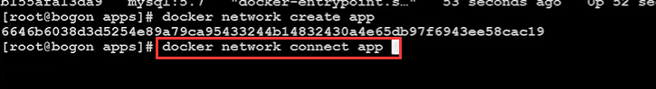


​	我们看一下这个网络---mysql已加入


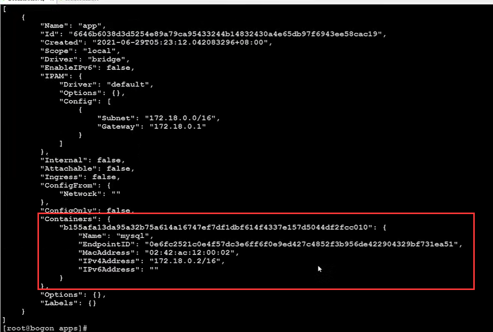


既然这个app网络里面有mysql了

​	

我们的应用只需要和mysql在同一个网络里就可以通信了

​	这样的话我们的项目的数据库地址就可以写成 mysql了--这个mysql是容器的名称

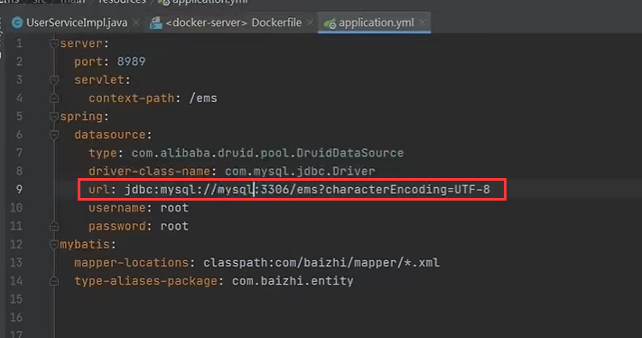


​	然后重新打包，重新构建


​	


#### 9、重新构建运行镜像


#### 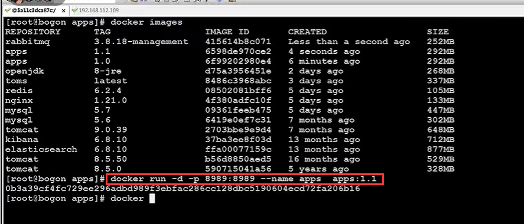

​		查看日志

​		docker logs 

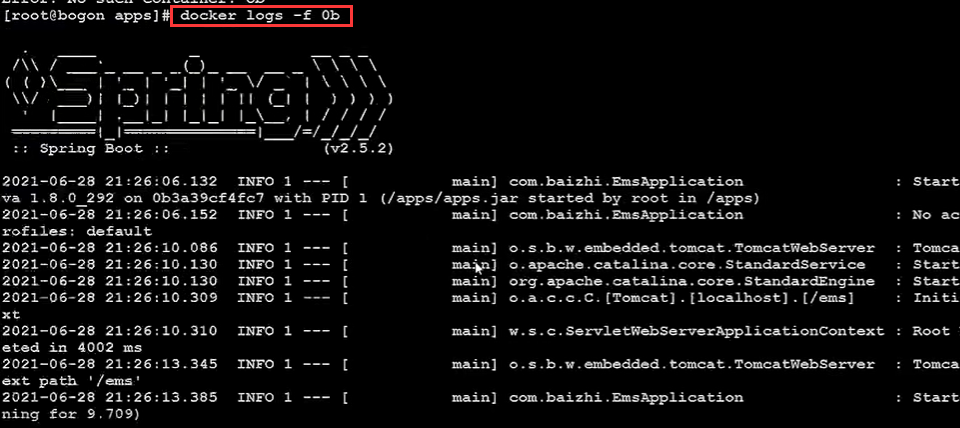			


把apps也加入到网络中

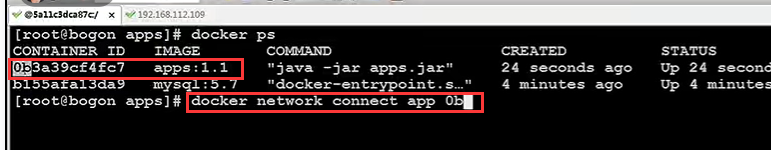


现在访问就可以了

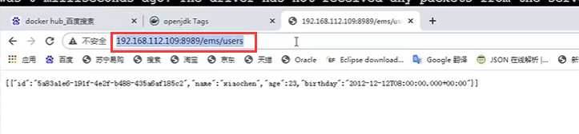


https://www.bilibili.com/video/BV1wQ4y1Y7SE?p=29&spm_id_from=pageDriver&vd_source=243ad3a9b323313aa1441e5dd414a4ef


