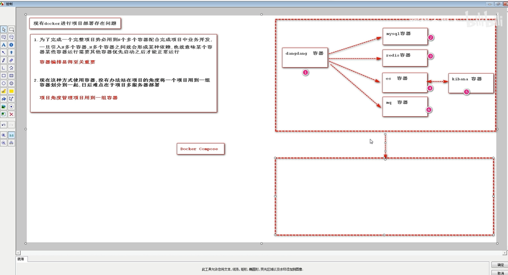
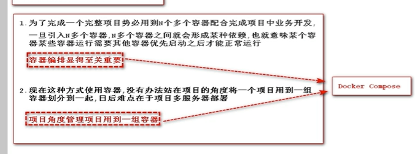

# 29、docker-compose的引入

​		现有docker进行项目部署存在的问题

​			1、部署存在容器之间依赖的问题，需要编排有先后顺序才可以

​			2、多服务器部署--之前的部署方式会存在 容器启动太多可能造成混乱

​		docker-compose就是解决这个问题的，提供容器编排的功能

​		

https://www.bilibili.com/video/BV1wQ4y1Y7SE?p=29&spm_id_from=pageDriver&vd_source=243ad3a9b323313aa1441e5dd414a4ef

