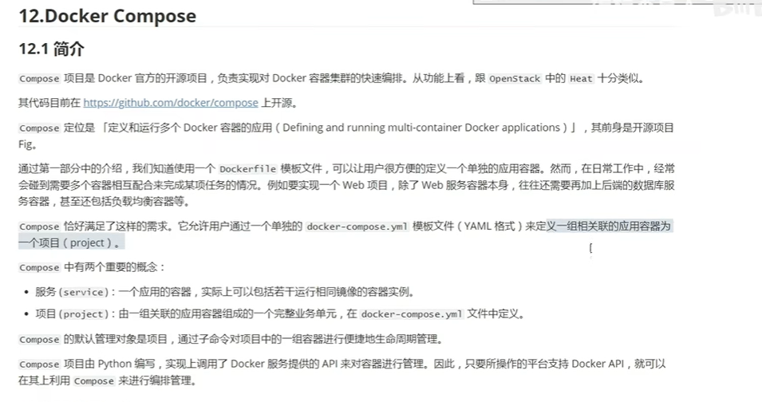

# 30、docker-compose的简介和安装

​		

## 	1、什么的docker-compose

​			他主要是做容器编排的---就是把一组容器关联到一起

​	compose的定位：是对于多个容器的管理 ---单个容器就不建议使用了

​	

## 	2、如何使用docker-compose

## 	3、docker-compose安装

​	将docker-compose下载放入到usr/local/bin/           路径下

​					

​	添加权限

## 4、docker-compose第一案例

​	

​		启动docker-compose

​	tomcat就启动起来了，然后我们验证一下

如果我们想启动多个同样的容器 -- 服务名称不能一致，端口不冲突就可以

​		没有问题--都能访问

​	现在我们再加一个redis

​	添加mysql并且设置mysql的环境

​	连接也没有问题--然后查看容器的启动 可以看到全部都启动了

​	又有问题了，我们在使用mysql容器的时候，需要把数据持久化到宿主机上，不然出现问题数据丢失了就麻烦了

​    以前的docker run -v /root/mysqldata宿主机路径 ：/var/lib/mysql 容器的mysql数据存放路径  ---这样的话我们的数据就存放在宿主机上了

​	现在我们使用docker-compose可以使用volumes

​		注意：docker-compose使用绝对路径 要求必须先创建才能使用

​	我们创建一个 mkdir /root/mysqldata

​	启动docker-compose

​	我们启动后发现mysql挂载的路径就有文件内容了

#### 		使用别名的方式

​		需要先声明数据卷

​	

创建的数据卷 会携带 docker-compose的项目名称

​	然后我们查看一下这个数据卷

​	宿主机的挂载点

​	我们cd进入查看一下--没有问题

#### 	给容器指定名称

​	

​	启动容器

​	查看--发现容器名称修改了

​		推荐使用默认--防止名称冲突

https://www.bilibili.com/video/BV1wQ4y1Y7SE?p=30&spm_id_from=pageDriver&vd_source=243ad3a9b323313aa1441e5dd414a4ef

