# 31、docker-compose模板命令


​	docker-compose.yml可以帮助我们启动一组容器，当然在使用的过程中就会发现一点问题了，这个compose文件是一个yml文件，所以我们写起来没有提示这个格式很容易出错

​	我们还是可以利用idea写docker-compose的，利用idea中的插件就可以对docker-compose.yml文件模板进行一些提示


## 1、使用idea编辑docker-compose


​	我们先sftp连接docker服务器--然后创建一个新的文件夹

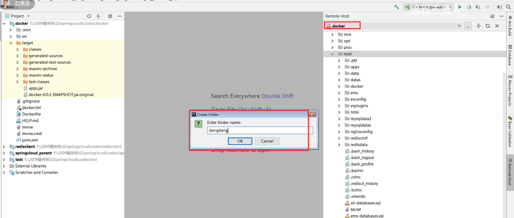


​	然后创建一个docker-compose.yml

​	我们创建后，idea也会自动帮我们打开这个文件

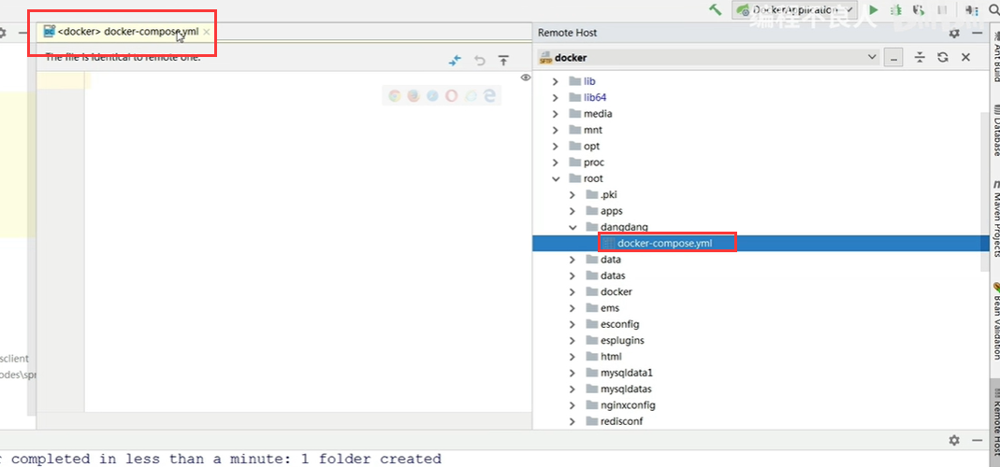


​	因为我们安装了docker插件，所以在编辑的时候就会有提示的信息

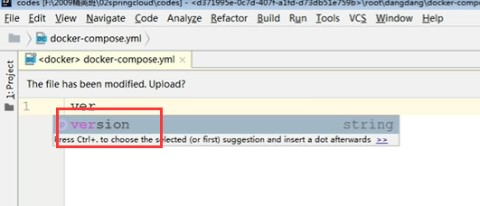


​	端口可以使用双引号---也可以不使用双引号，建议使用带引号的

​		点击右侧的上传按钮--将文件上传到服务器

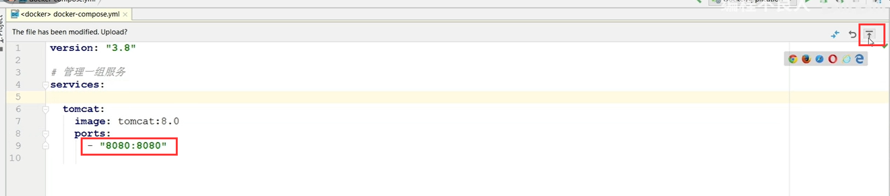


​	测试启动容器


​	

访问也没有问题

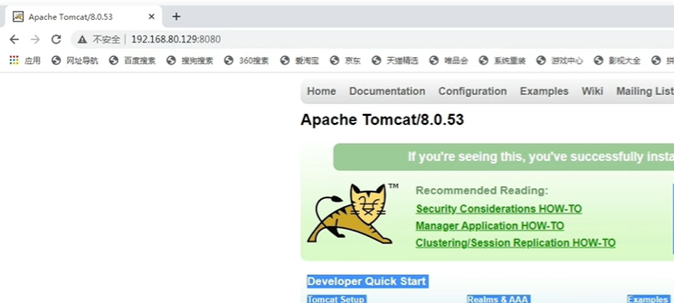


## 2、模板指令

​		其实就是哪些命令可以写在docker-compose里面，这些指令写在compose里面又代表什么意义


​		例如--这些只是一部分命令，其实是有很多的命令的

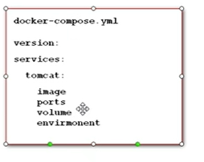


​	我们查看文档看看官方支持的compose命令

​		发现有很多命令--有些命令已经废弃了，有些是大量使用的命令

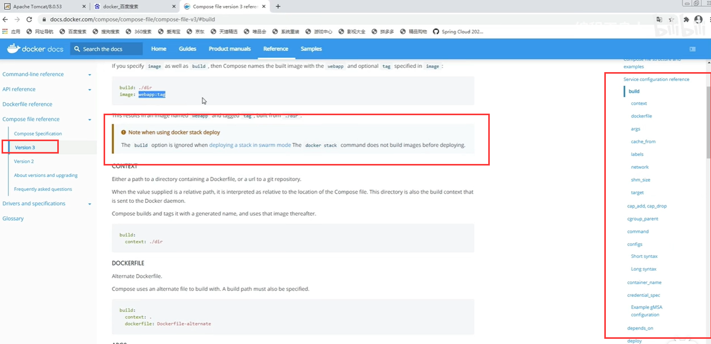


我们也可以查阅中文文档

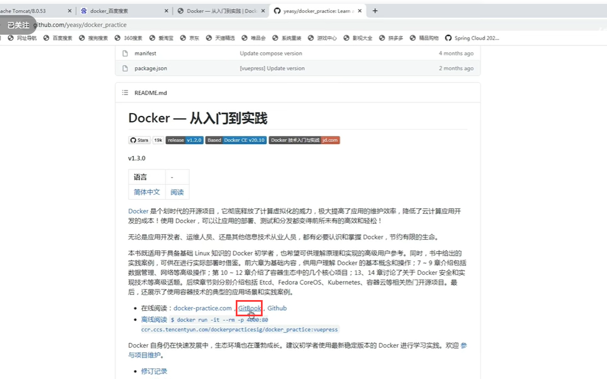

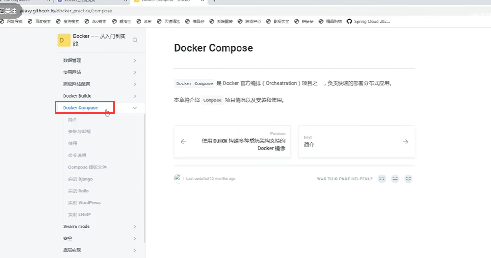


#### 	1.Build指令

​			用于构建镜像---注意build和image指令不能同时使用，image代表使用已有的仓库中的镜像，build是在使用这个容器之前 基于 dockerfile先构建镜像

​		如果build和image同时使用，那么你究竟是使用的那个容器呢，docker引擎就没发分辨了

​	构建我们指定的镜像， 上下文./代表当前路径下

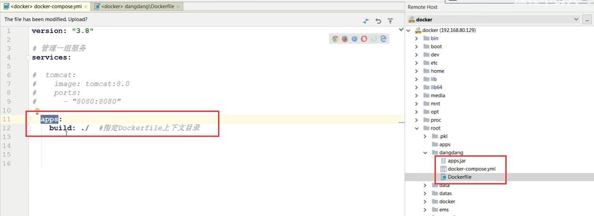


​	在执行 docker-compose up 命令后会构建完成后启动容器

​	

​	目前我们如果想访问还访问不了，因为没有映射端口到宿主机上

​	端口映射 -- 前面是宿主机，后面是容器的端口

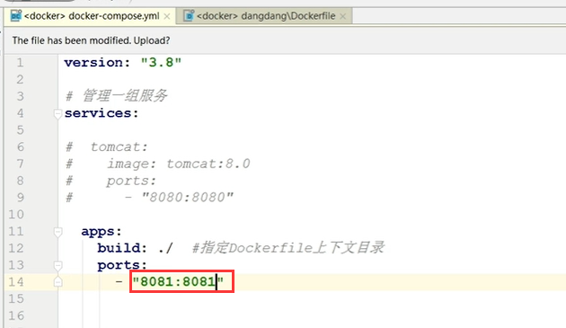


再次访问--没有问题


​	也可以指定上下文路径和文件名称

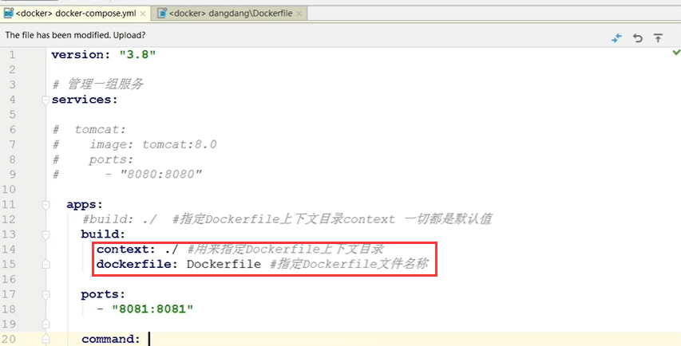


#### 2、command指令

​		比如我们想更新jar包，覆盖

​		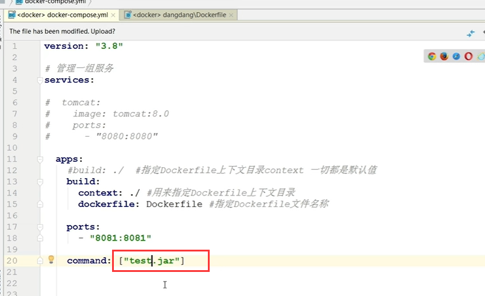


执行docker-compose up 启动容器，因为我们目前没有test.jar所以肯定会报错

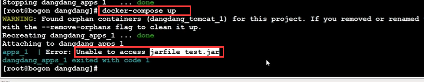

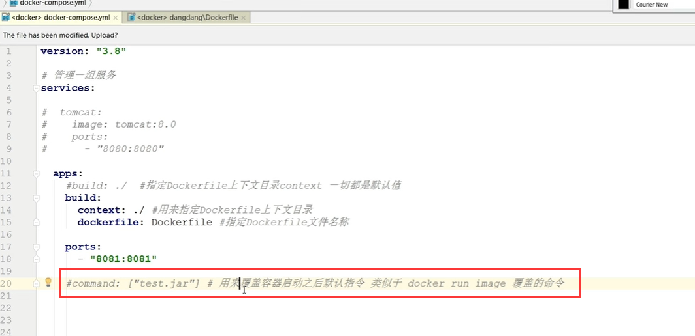


#### 3、depends_on 指令

​		解决容器的依赖，启动的先后问题

​	添加的依赖服务 会优先启动，启动完成后启动自己

​	写的都是服务的名字

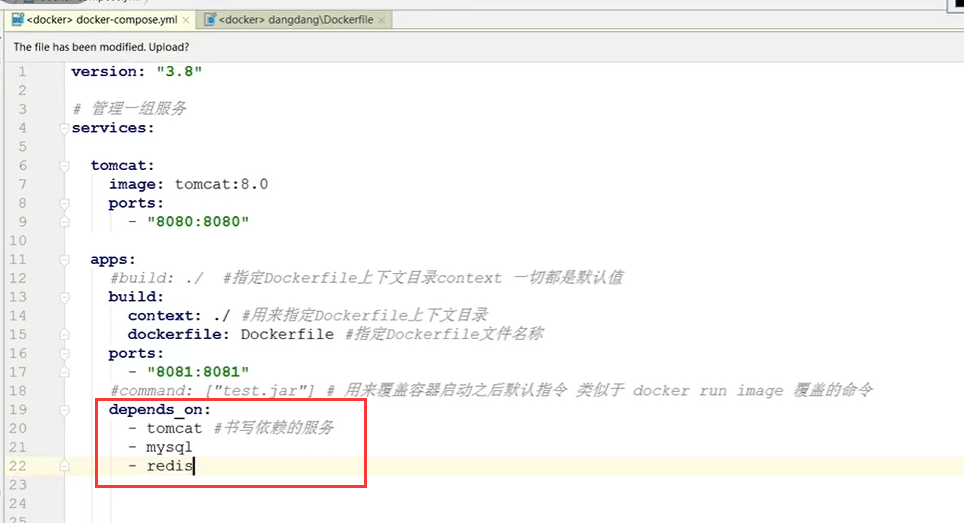


​	我们现在测试一下，期待是 先启动tomcat 然后再启动apps

​		没问题--就是先启动tomcat

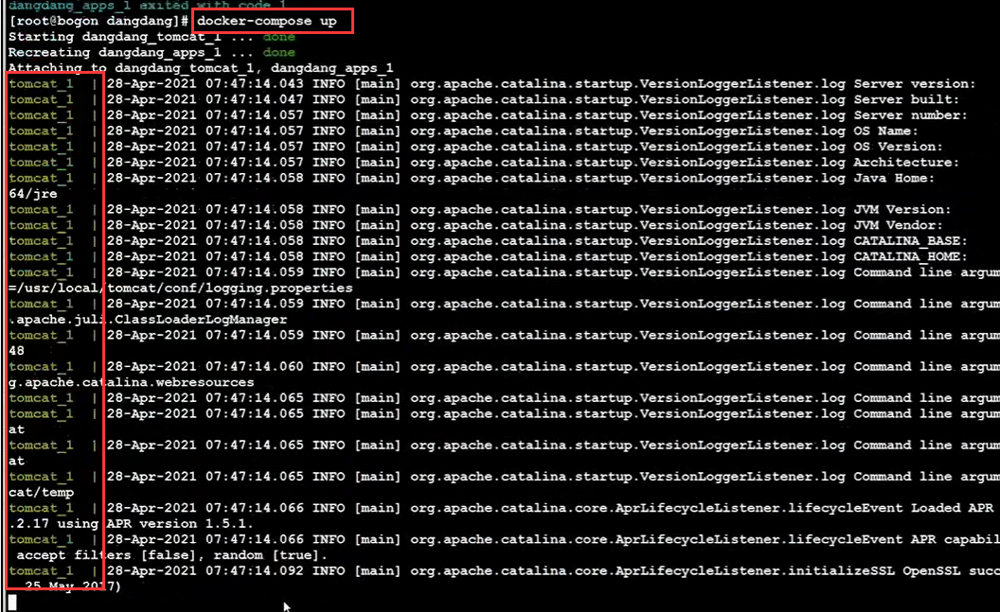


​		注意：不会等待 依赖服务 完全启动后 才启动


#### 4、environment指令

​			环境--- 用来给容器启动时指定环境变量 相当于docker run -e选项       比如设置mysql的密码

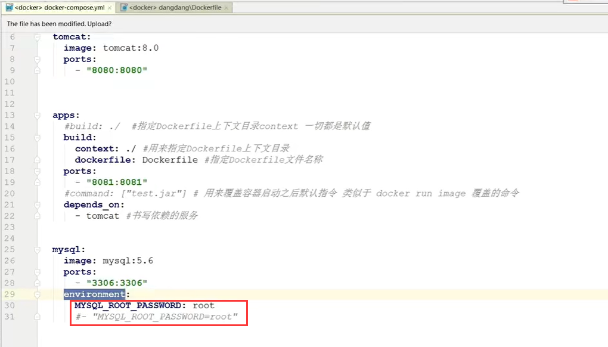

​	

​	我们现在上传一下compose文件，然后运行一下

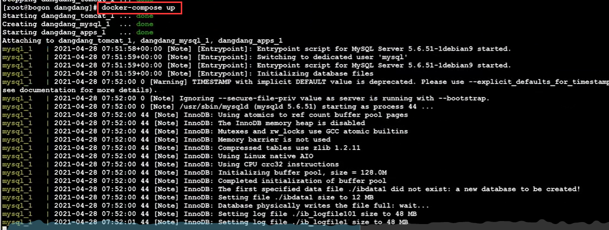


我们去连接一下--发现也没有问题


​	这是通过environment的方式


#### 5、env_file指令

​			env_file 指令和我们的environment 指令没区别----都是用来给容器启动时指定环境变量的

​			这个是使用的一个文件 

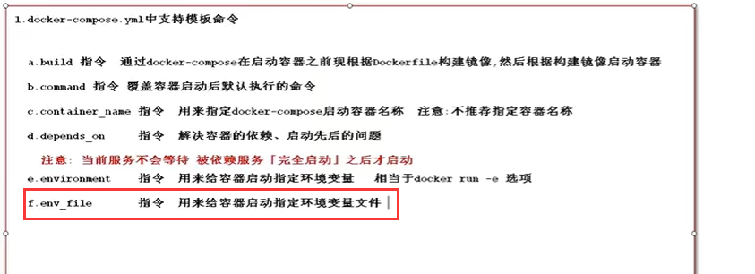

​		如果用环境这种指令对于我们来讲 不安全，因为使用environment中直接将数据库密码就暴露在当前文件中了

​	所以为了进一步 保证我们的密码 这些比较私密的内容的安全性，我们就使用env_file，使用env_file就是不想展示在docker-compose中的内容封装一层，如果没有什么私密的内容可直接使用environment

​	

​	我们创建env文件 ./代表当前路径

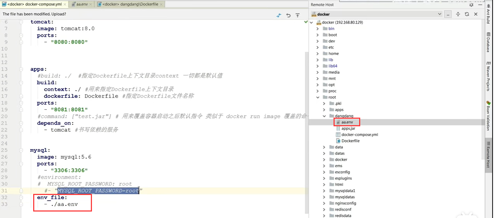


​	如何写内容呢？和之前的内容一样，只不过是放到了单个文件中

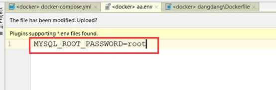


​		这个时候我们有个疑问，这么写和我们在environment写没有区别

​				其实是有区别的，在linux中我们不要给这个文件起名，就叫.env文件，那么linux中是会隐藏此文件的

​		也就相当于默认隐藏文件  .文件夹 --- 都属于隐藏文件

​		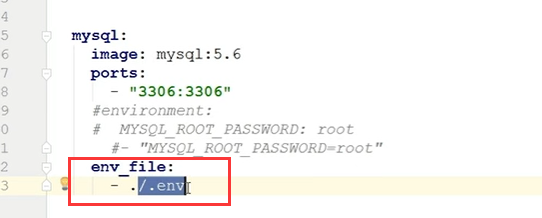


​	

#### 6、expose 指令

​			用来指定构建镜像过程中 容器暴露的端口号 -- 容器内部端口

​			他只能用于构建镜像时使用 --- 一般不用


​	

#### 7、image 指令

​			这个用来指定启动容器使用的镜像是谁 相当于  docker run image镜像名称


#### 8、healthcheck 指令

​			健康检查 -- 例如执行一个ping的命令 设置超时时间作为健康检查指标

```
	healthcheck:
	  test: ["CMD", "mysqladmin", "ping", "-h", "localhsot"]
	  interval: 5s
	  timeout: 10s
	  retries: 10
	  
	  
```


#### 9、labels 指令

​			用于给镜像添加一些描述信息

​		比如我们之前的给mysql设置了存储卷---我们在查看的时候 docker inspect 可以看到在创建存储卷的时候默认加了一下label的信息，这些信息其实就是一些描述信息

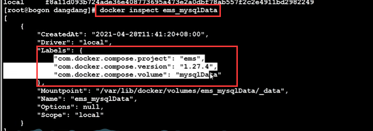


#### 10、network 指令

​			这个指令比较重要----用来指定启动的容器使用的**网桥** 相当于 docker run --network


​		我们之后的一个整体的项目--应该是在一个网桥中，那么 在docker-compose中的每个服务都应该加一个network

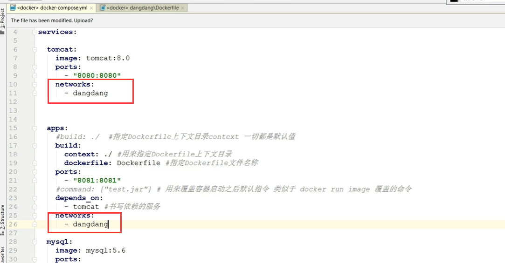


这么写需要注意，原来这么写在docker里面是可以自动创建这个网络的，但是在整个docker-compose中 他是不能自动创建的 -- 所以我们还需要自己申明一下 这个网桥

​	

​		声明网桥 -- 注意冒号

​				一旦声明了网桥--他在启动的时候就会创建网桥

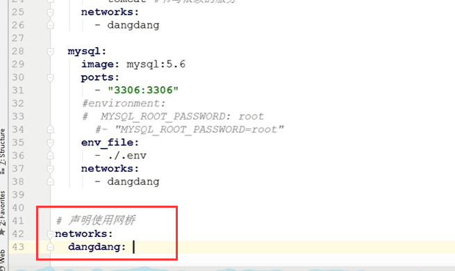


​	我们验证一下，先查看一下现有的网桥

​			docker network ls

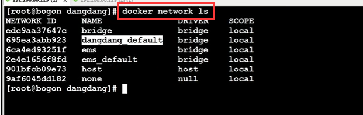


​		我们将现有的compose文件上传运行一下

​			我们发现在启动的时候--先创建一个我们声明的 network 网桥


​		我们再查下网桥--发现会有一个项目为dangdang，网桥为dangdang的网桥

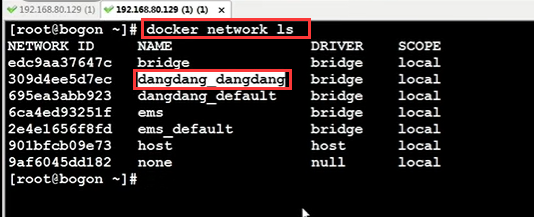


​	切入查看一下

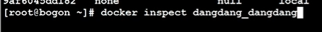


​	网络的网段也一致

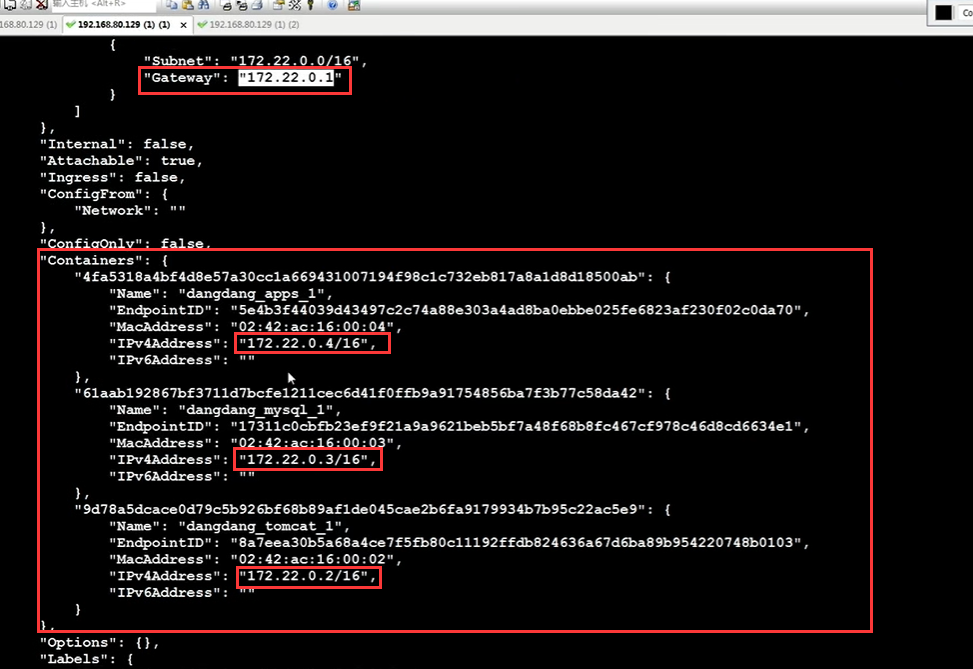


​	那么之后利用这个网桥--我们是不是就可以进入任何一个容器了


​	我们先进入一下tomcat的容器

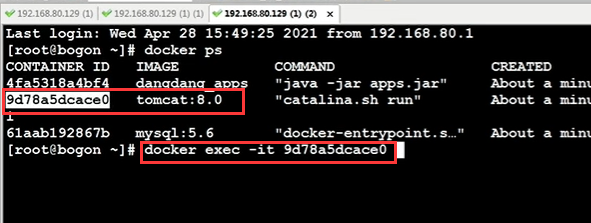


​	我们在tomcat中访问一下 dangdang

​			访问成功

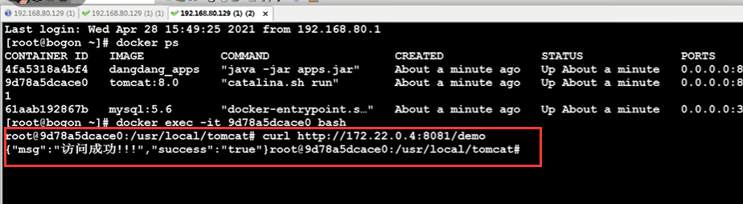

​		需要注意的是，在docker-compose中就不能使用容器的名字访问另外一台容器了


#### 	11、port 指令

​					用来宿主机和容器端口映射 -- 相当于 docker run -p


#### 	12、volumes 指令

​				用来指定宿主机中目录和容器中目录的映射

​				相当于 docker run -v 

​		如果使用别名的方式则必须要声明

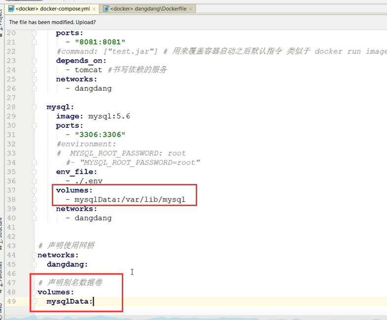


#### 	13、restart 指令

​		用来指定 docker容器 服务 总是运行

​				相当于 docker run --restart=always


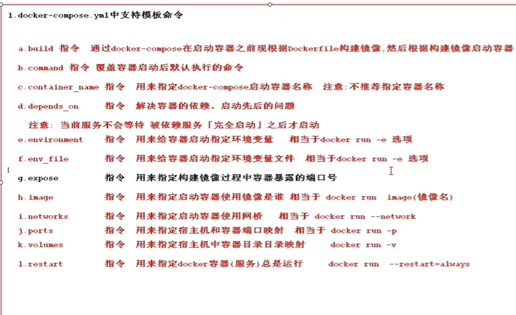


https://www.bilibili.com/video/BV1wQ4y1Y7SE?p=31&spm_id_from=pageDriver&vd_source=243ad3a9b323313aa1441e5dd414a4ef


## 3、真实环境的docker-compose配置

​	docker-compose.yml

```
version: "2.1"
services:
  nacos:
    image: nacos/nacos-server:v2.2.1-slim
    container_name: nacos
    env_file:
      - ./env/nacos.env
    volumes:
      - ./tmp/logs/:/home/nacos/logs
    ports:
      - "8848:8848"
      - "9848:9848"
    depends_on:
      mysql:
        condition: service_healthy
    restart: always
    networks:
      - nacos-network

  mysql:
    container_name: mysql
    image: mysql:8.0.32
    env_file:
      - ./env/mysql.env
    volumes:
      - ./mysql/conf/my.cnf:/etc/mysql/conf.d/my.cnf
      - ./tmp/mysql:/var/lib/mysql
      - ./init.d/:/docker-entrypoint-initdb.d/
    ports:
      - "3306:3306"
    healthcheck:
      test: [ "CMD", "mysqladmin" ,"ping", "-h", "localhost" ]
      interval: 5s
      timeout: 10s
      retries: 10
    networks:
      - nacos-network

#  mysql5:
#    container_name: mysql5
#    image: registry.aircas.com/public/mysql:arm
#    env_file:
#      - ./env/mysql5.env
#    command:
#      --lower_case_table_names=1
#      --sql_mode="STRICT_TRANS_TABLES,NO_ZERO_IN_DATE,NO_ZERO_DATE,ERROR_FOR_DIVISION_BY_ZERO,NO_ENGINE_SUBSTITUTION"
#      --default-authentication-plugin=mysql_native_password
#    volumes:
#      - ./mysql5/conf/my.cnf:/etc/mysql/conf.d/my.cnf
#      - ./tmp/mysql5:/var/lib/mysql
#      - ./mysql5/init.d/:/docker-entrypoint-initdb.d/
#    ports:
#      - "33060:3306"
#    healthcheck:
#      test: [ "CMD", "mysqladmin" ,"ping", "-h", "localhost" ]
#      interval: 5s
#      timeout: 10s
#      retries: 10
#    networks:
#      - nacos-network

  redis:
    container_name: redis
    image: redis:6.2.11-alpine
    command: [ "redis-server", "/etc/redis/redis.conf" ]
    environment:
      TZ: Asia/Shanghai
    volumes:
      - ./redis/conf/redis.conf:/etc/redis/redis.conf
      - ./tmp/redis:/data
    ports:
      - "6379:6379"
    networks:
      - nacos-network
  elasticsearch:
    container_name: elasticsearch
    image: elasticsearch:7.16.3
    ports:
      - "9200:9200"
      - "9300:9300"
    ulimits:
      memlock:
        soft: -1
        hard: -1
      nofile:
        soft: 65536
        hard: 65536
    volumes:
      - ./elasticsearch/conf/elasticsearch.yml:/usr/share/elasticsearch/config/elasticsearch.yml
      - ./elasticsearch/conf/jvm.options:/usr/share/elasticsearch/config/jvm.options.d/jvm.options
      - ./tmp/elasticsearch:/usr/share/elasticsearch/data
    networks:
      - nacos-network

networks:
  nacos-network:
```


