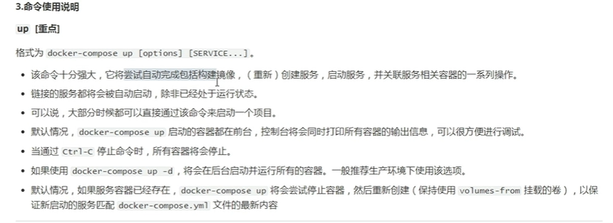
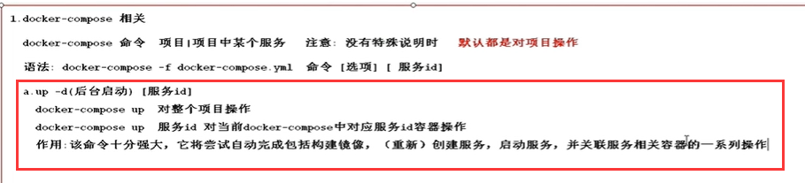
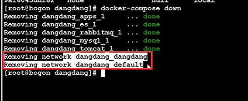
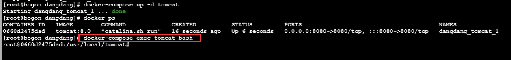
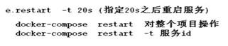
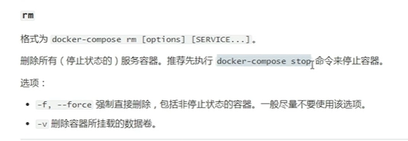
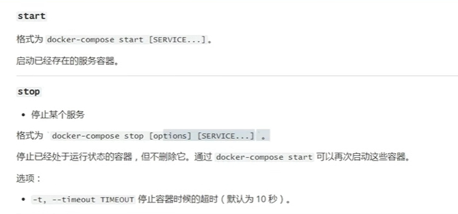
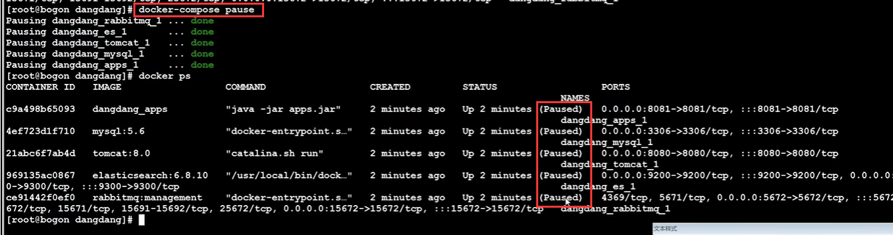
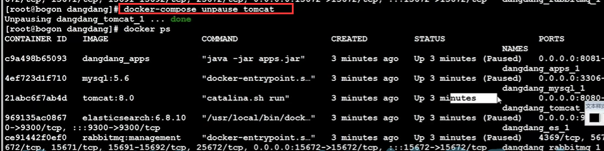
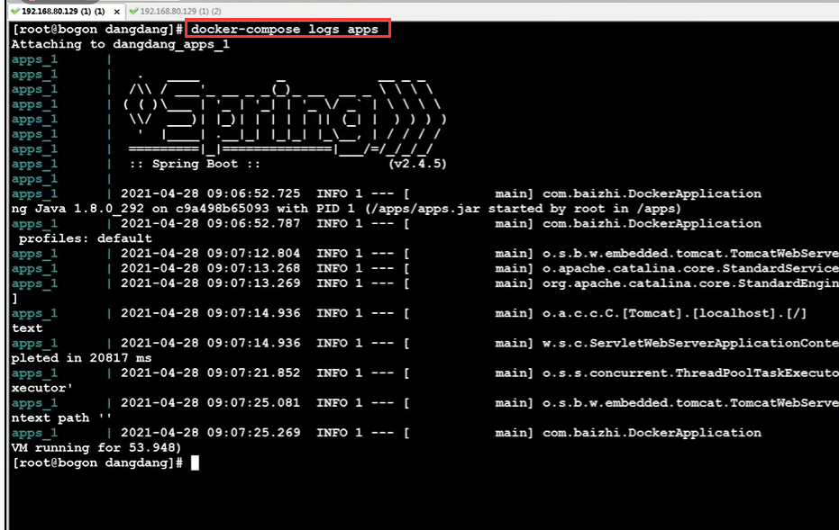

# 32、docker-compose命令

​		操作docker-compose的命令

​	

​		在docker-compose命令的后面 可以跟 项目，也可以是项目中的某个服务，如果什么都不跟 那么默认是对项目进行操作

#### 1、up 命令

​			会自动完成构建镜像，创建启动服务 -- 我们大部分使用这个命令来启动 

​	

​			这个up命令的后面也可以跟 service

​				up 【服务id】  -- 这个意思是只启动docker-compose中的某个服务

​			

​	

#### 	2、down 命令

​	docker-compose down 对整个项目的停止

​	docker-compose down 服务id  关闭单个服务

​	down的时候 会移除镜像-----还会移除网桥

#### 	3、exec 命令

​		这个命令只能针对于具体的某个服务 -- 作用是进入到某个服务内部

​		docker-compose exec 服务id bash

#### 	4、ps命令

​		 列出所有运行的服务

#### 	5、restart 命令

​		重启服务或项目

#### 	6、rm命令

​		删除某个服务 -- 只能删除停止的服务，也可以强制删除 加f参数

#### 	7、start--stop 启动和停止服务

#### 	8、top 指令

​				docker-compose top 服务id

​				查看整个项目的所有服务容器内运行的进程，或 查看某个指定id服务的容器的进程

#### 	9、pause 和 unpause

​			暂停和恢复

​	

​	单独恢复某个服务

#### 	10、logs指令

​		docker-compose logs 服务id 

​		查看服务的日志

​		如果加上 -f 就代表实时的运行日志

https://www.bilibili.com/video/BV1wQ4y1Y7SE?p=32&spm_id_from=pageDriver&vd_source=243ad3a9b323313aa1441e5dd414a4ef

