# 33、Portainer可视化工具

​		

​		这个可视化工具 可以帮助我们解决 --- 展示当前这台机器的docker镜像，所运行的容器

​	也可以把每个容器的日志 图形化 的方式界面中 展示

​		这个就是别的公司基于这个docker引擎，它可以做的就是展示这个docker引擎上运行的所有容器，对他们做的一个监控。

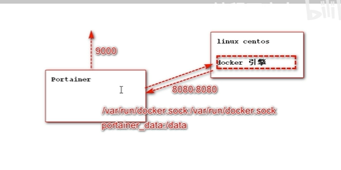

​	他也是个镜像

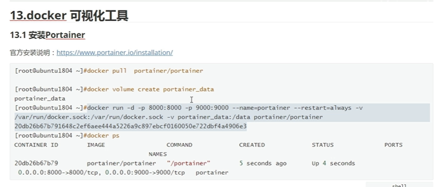

首次设置密码

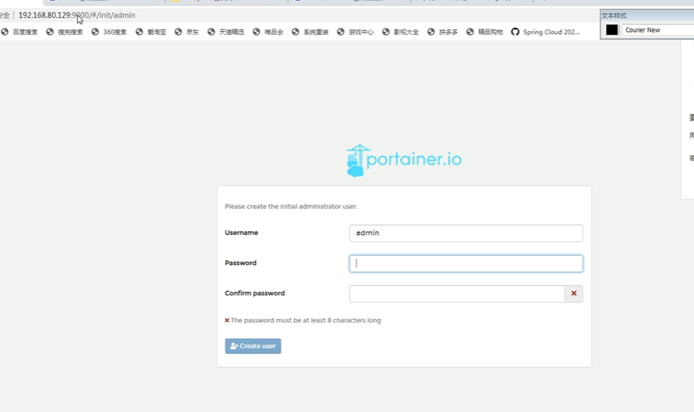

​	可以连接本地--可以连接远程，我们目前连接本地

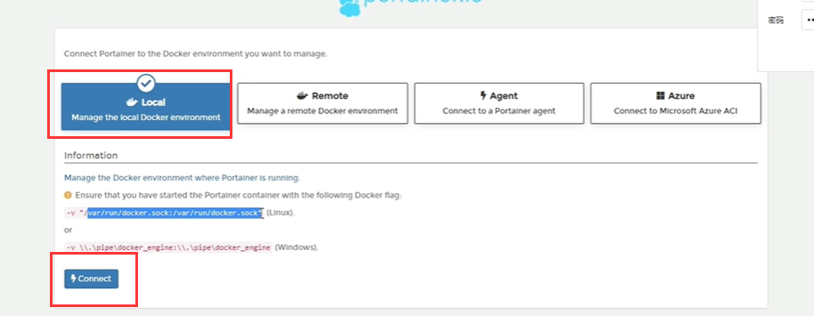

​	这就是我们的docker引擎

​			2个stacks 就代表2个项目 --俩个docker-compose

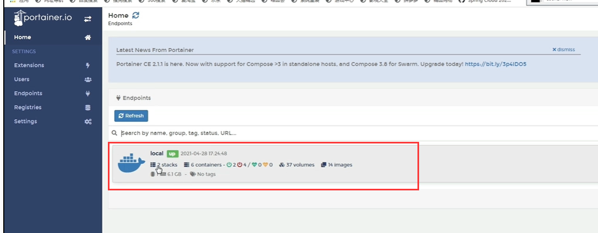

​	可以看到有10个容器

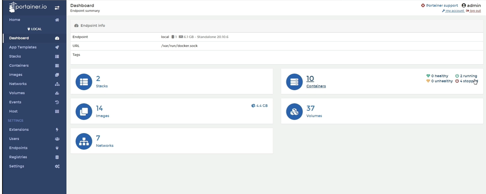

比如想删除某个镜像

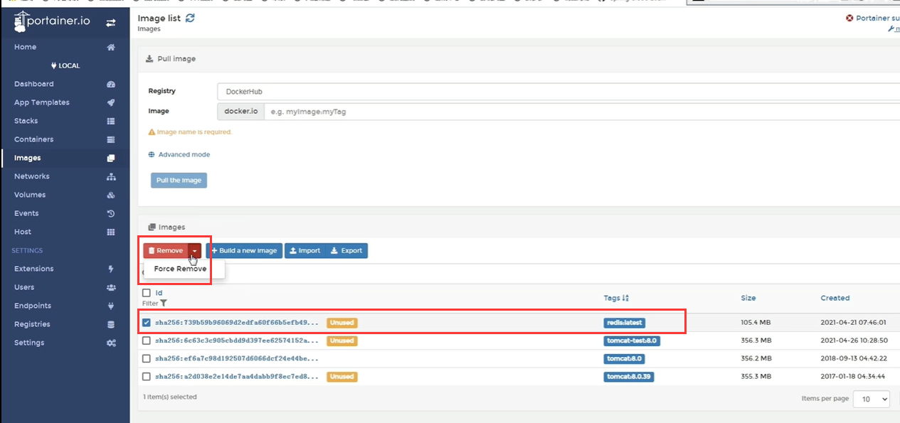

可以看每个容器的日志

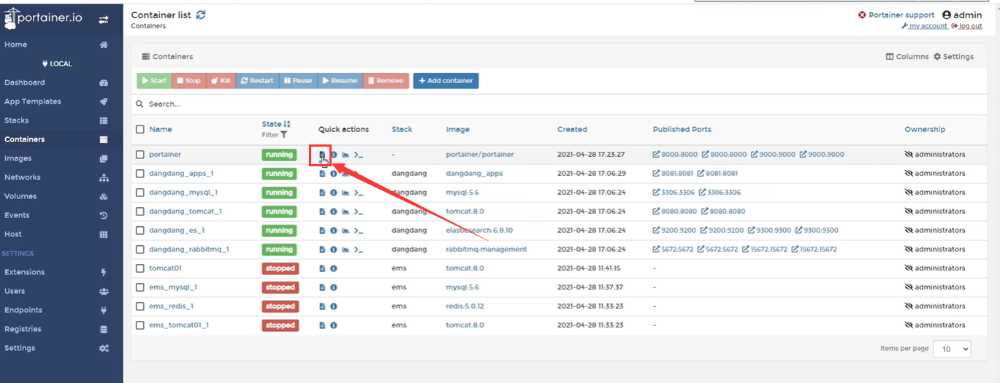

​	还可以看容器的资源运行情况

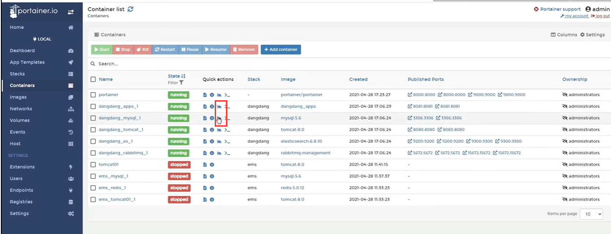

还可以直接进入容器

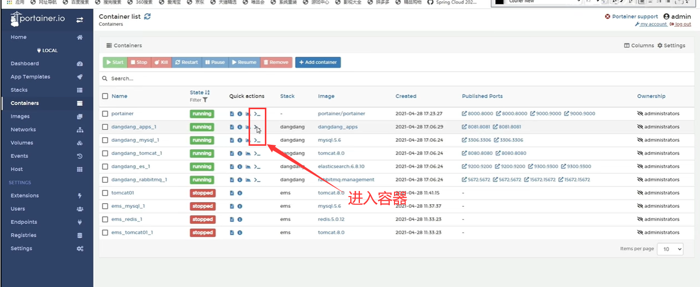

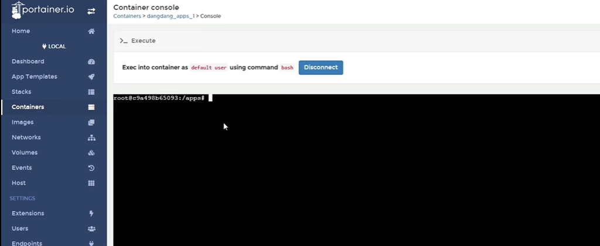

https://www.bilibili.com/video/BV1wQ4y1Y7SE?p=33&spm_id_from=pageDriver&vd_source=243ad3a9b323313aa1441e5dd414a4ef

