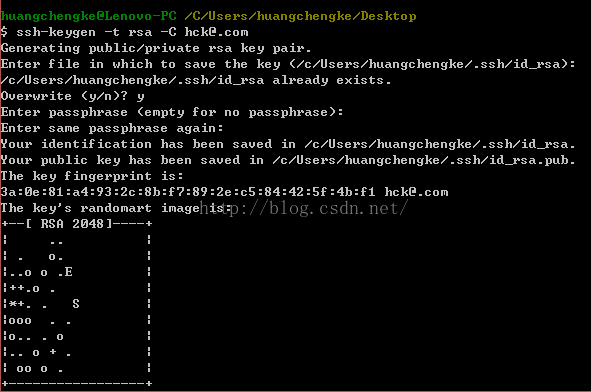
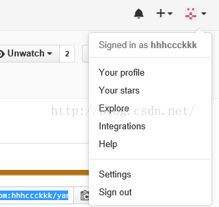
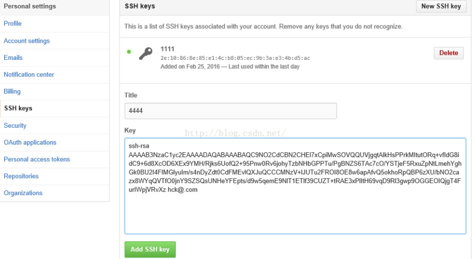

# github秘钥配置

我们在githob创建项目后，本地使用git 克隆代码 需要在githob配置密钥，才可以

步骤：

下载git，进行安装，安装好后。点击桌面，右键，选择》》git  bash

在弹出的黑框口里面输入

ssh-keygen -t rsa -C 你的邮箱

比如 ：ssh-keygen -t rsa -C  hck@.com

  然后一直回车，就行了

最后得到如图

它会生成一个 id _rsa.pub 文件，看上面截图，它有 保存路径的地址说明，按照保存路径找到文件，打开，复制里面的内容

登录到githob，点击右上角 小三角，出现如图

点击settings》》sshkey》》new ssh key（右上）

在页面随便填入一个title，然后key里面，把刚才复制的那个文本信息拷贝进去

点击add ssh key ，没有提示错误，就ok了。如果出现问题，可能是你的key没有复制完成导致