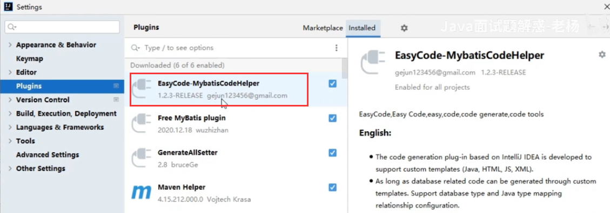
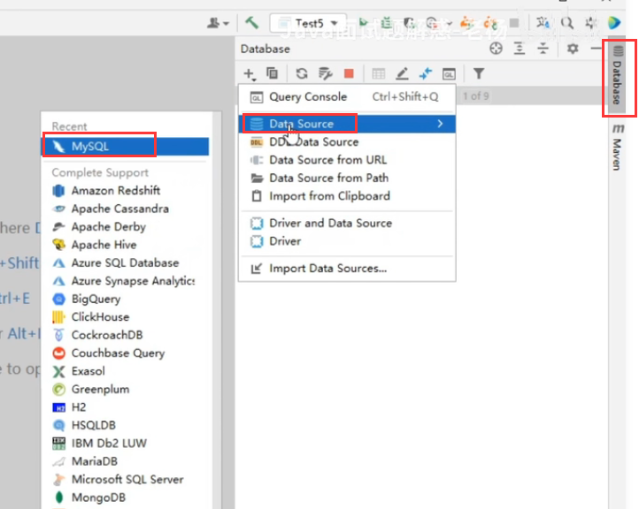
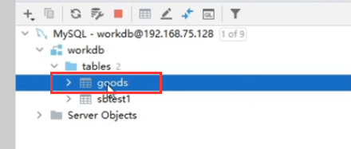
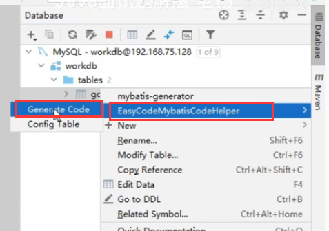
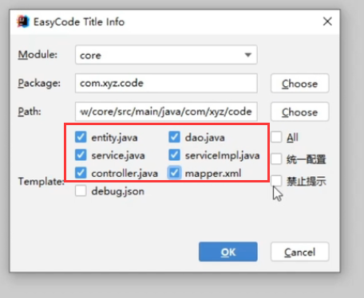
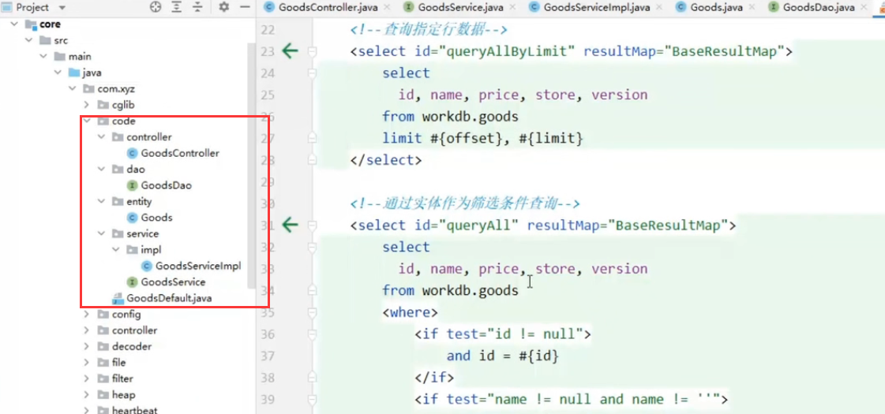

# 1.idea代码生成器

​	我们的IDEA只需要安装一个插件，就可以一键生成Controller，Service，Dao

​	我们点击File--settings--Plugins，插件的名字叫EasyCode

​	我们把这个插件安装好之后就可以一键生成Controller，Service，Dao了，我们下面演示一下

首先我们需要配置好我们的数据库连接

​	连接上之后--比如我们想对某个表一键生成代码

​	那么就右键--然后选择EasyCode***然后点击Generate Code生成代码

​	然后对这个表选择生成的模块module，包package，可以点击Choose来进行路径的修改选择

​	选择我们需要生成的代码，也可以选择全部生成

我们在搭建项目的时候，可以使用这个快速的把项目基本结构生成好，非常的方便

https://www.bilibili.com/video/BV1V34y1U7LH/?spm_id_from=autoNext&vd_source=243ad3a9b323313aa1441e5dd414a4ef

