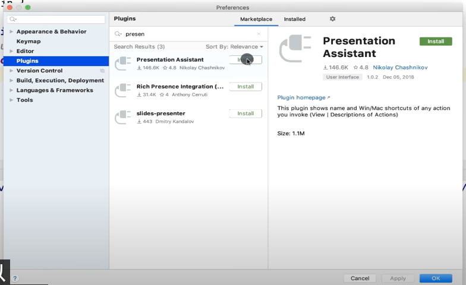
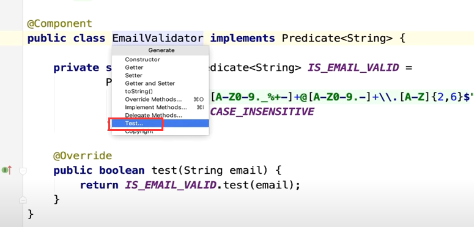

# 3、油管Intellij学习


​	参考文档地址：https://www.jetbrains.com/help/idea/sharing-your-ide-settings.html


## 1、导入配置

我们在新的idea中，可以通过导入配置的方式将之前idea的配置导入，那么就可以和之前的idea拥有相同的配置了。

​		也可以选择不导入配置那么就是一个全新的idea


## 

 是否同意收集一些数据 -- 一般不同意


​	

## 2、主题选择

​		 -- 跳过并默认设置


## 3、.idea文件夹

.idea文件夹是专门放idea的项目工作区配置的

​	比如项目编码模板，还有一些描述文件description.html

​	我们基本不需要关心这个文件夹的内容


## 4、关于菜单

### 1、首选项

​	


​	这里可以配置比如插件   --等等配置


### 2、文件菜单File

​	New---创建文件

​	Open -- 打开项目

​	Open URL -- 指定项目的url路径

​	Open Recent -- 打开最近的项目

​	Close Project -- 关闭项目

​	Settings -- 设置

​	Project Structure -- 项目结构


​	Import Settings -- 导入设置

​	Export Settings -- 导出设置 导出的文件为settings.zip

​	Settings Repository -- 设置存储库: 它允许你同步任何可配置的组件(除了启用和禁用的插件列表) ，但是需要设置一个 Git 存储库和你想要共享的设置

如果希望在团队成员中实现相同的设置，或使用自定义设置存储，则此选项非常有用。


​	Export Project to Eclipse -- 导出为Eclipse项目

​	Export to Zip File -- 导出项目为Zip 包

​	Save All -- 保存

​	Synchronize -- 同步ide设置 这个需要联网 而且需要jetbrains账号 使用 JetBrains Toolbox 工具盒，共享设置

​	Invalidate Caches / Restart -- 无效缓存 或 重启，我们有时会遇到一些idea的问题这个可以帮我们重启和清除缓存

​	

​	add to favorites -- 添加收藏，喜欢的代码收藏起来。


​	File Encoding -- 设置编码

​	Line Separators -- 行间隔，就是几个空格

​	Make File Read Only -- 使文件只读

​	power save mode -- 省电模式 -- 这个不要开，这个对眼睛不好


### 3、编辑菜单Edit

​	在我们编辑的时候--这里会有很多使用到的地方 -- 这里大部分都是有快捷键的，需要会使用这些快捷键

​	Redo Reload to Disk -- 从磁盘重新加载

1.Undo：撤销

2.Redo Duplicate Line or Selection：重新复制行或选择。（返回撤销之前）

3.Cut：剪切

4.Copy：复制

5.Copy：复制文件路径

6.Copy Reference

7.Paste：粘贴

8.Paste from History…：从剪切板中选择历史复制的内容粘贴

9.Paste without ForMatting -- 无格式粘贴

10.Delete：删除

11.Find：单个文件中查找 和替换

```
	Find （ 在当前文件查找 ） Ctrl + F 
 	Replace （ 在当前文件查找替换 ） Ctrl + R 
 	Find Next / Move to Next Occurrence （ 让光标快速移动到所选内容的下一个出现处 ） F3 
 	Find Previous / Move to Previoud Occurrence （ 让光标快速移动到所选内容的上一个出现处 ） Shift + F3 
 
	Find Word at Caret Ctrl + F3 
 	Select All Occurrences （ 选择当前选中内容在当前文件的全部内容。举个栗子：当前文件选中了“User”，那么当前文件中的所有“User”都会被选择，可用于快速更改或删除 ） Ctrl +Alt + Shift + J 
 	Add Selection for Next Occurrence （ 依次往下开始选择当前选中内容的下一个同一内容 ） Alt + J 
 Unselect Occurrence （ 依次往下取消选择当前选中内容的下一个同一内容 ） Alt + Shift + J
 
    Find in Path （ 在路径中查找，全局查找 ） Ctrl + Shift + F 
    Replace in Path （ 在路径中查找替换，全局查找替换 ） Ctrl + Shift + R 
	Search Structurally （ 通过模板结构查找 ）
	Replace Structurally （ 替换模板结构 ）
	Find Usages （ 查找所选内容在项目中的所有出现处 ） Alt + F7 
	Find Usages Settings Ctrl + Alt + Shift + F7 
 	Show Usages （ 在项目中查找展示所选内容的全部使用处 ） Ctrl + Alt + F7 
 	Find Usages in File （ 在当前文件中查找所选内容的使用处 ） Ctrl + F7 
	Highlight Usages in File （ 在当前文件中高亮所选内容使用处 ） Ctrl + Shift + F7 
	Recent Find Usages
	Find by XPath Ctrl + Alt + X , F 


```


​	Column Select mode -- 列选择模式，可以批量修改内容

​	Extend Selection -- 扩展选择，和鼠标双击效果一样

​	Shrink Selection --  缩小选择范围

​	Complete Current Statement -- **把光标快速定位到当前代码块外 ）** 鼠标点击那里可以编辑那里

​	

```
 Duplicate Kibe （ 向下复制整行 ） Ctrl + D 
Indent Selection （ 整行缩进 ） Tab 
Unindent Line or Selection （ 整行缩退 ） Shift + Tab 
 Toggle Cas （ 大小写切换 ） Ctrl + Shift + U 
Concert Indents （ 切换缩进风格 ） 
Shift-Up Ctrl + Alt + Shift + 句点 
Shift-Down Ctrl + Alt + Shift + 逗号 
 Shift-Up more （ 快速修改驼峰单词定义，可转换为按“-”或者“_”分隔 ） Ctrl + Alt + Shift + K 
 Shift-Down more （ 选择当前选中内容在当前文件的全部内容。举个栗子：当前文件选中了“User”，那么当前文件中的所有“User”都会被选择，可用于快速更改或删除 ） Ctrl + Alt + Shift + J 
Edit as Table

```


​	


### 4、视图菜单View


​	Tool Windows -- 各种窗口的显示与隐藏

​	Quick Difinition -- 快速定义 


### 5、导航

​		这里是我们代码导航的地方

​		例如我们想搜索一个 class

​				Ctrl + N


###  6、code代码

​		这里可以帮助我们 生成一些代码，可以添加注释，上下移动语句，基本上可以帮助我们更快的编写代码


### 7、代码分析Analyze

​		这里面例如我们可能会使用到 代码测试的覆盖率


### 8、代码重构Refactor

​		这里是我们代码重构的地方--比如我们需要分解代码 -- 这里很重要


### 9、构建 Build菜单

​	我们需要了解构建菜单--这里是我们构建项目的地方，编译项目的地方


### 10、run运行菜单

​	这里就是运行程序的地方

​		运行--调试debug--Coverage覆盖率--编辑配置Profile


### 11、Tools工具菜单

​		这里我们可以切换任务，可以设置模板，可以管理项目模板

​			还可以生成我们的java文档

​			还有一些用于控制台如JShell，Groovy控制台


### 12、VCS 版本控制

​		主要是为了集成git，svn等版本控制

​		idea集成的版本控制非常强大--甚至我们都不需要使用终端来控制git


### 13、Windows窗口菜单

​		这里主要是控制我们显示的窗口，管理我们的idea窗口

​			如果我们把窗口弄乱了，想恢复默认，也可以通过这个菜单来处理


### 14、help帮助菜单

​	在这里可以获得我们需要的帮助 -- 或文档信息，idea的版本等等

​	

​	例如我们使用想查看所有的快捷键  keymap Reference


​	Tip of the day -- 今日提醒，这个很好使用，会提示我们一些快捷的使用方式


####  字体调整


#### 控制台 字体调整

​	点击Color Scheme -- 配色方案--》console Font


## 5、快捷键插件

Presentation 

-- 演示助手




​	注意他需要设置一下，需要设置成 我们想要提示的快捷键方式 比如IDEA的Eclipse的


​	你每次的操作他都会提醒快捷键


## 6、常用快捷键操作

##### 	1、ctrl + alt + v 提取变量

##### 	2、ctrl +alt + n -- 内联 

​	--其实就是 把使用的变量直接放入方法，取消之前的定义

​	比如之前定义的String s = "hello world"；现在直接放了


##### 3、find 搜索

我们在使用搜索的时候--可以按驼峰首字母进行搜索，这样效率更高


​	搜索这个切换的话 按 tab就可以切换


搜索单词和正则表达 -- shift + ctrl + F

​		可以使用正则搜索，模块搜索，项目搜索等等

​	在某个包上全局搜索的话--那么搜索的就是这个包下的内容


##### 4、文件结构

​	如果我们有一个很多代码的类，我们就希望查看这个文件结构，查看它的方法

​	我们可以通过文件选项卡--Structure


​	也可以通过导航菜单找到Structure

​		ctrl + F3/F12


##### 	5、调用层次结构 Call Hierarchy

​		例如我们想找一下 在整个项目中 调用此方法的地方

​		我们选择方法--然后选择Call Hierarchy


​	

​		Scop是作用域--我们不关心测试Test的链路，我们只关心生产


​		最下面的这个其实就是调用的入口：

​		由这个Controller调用，然后是Service，然后使用的这个方法


​			idea快捷键 ctrl +alt + h 

​			eclipse 快捷键   Alt + Shift + H

​		

​		shift + esc 转义键 -----这个是快捷关闭右侧的调用层次		


##### 6、find usages -查找使用点

​		查找使用该方法的位置--这个只能看到谁调用了它，并不能看出调用链路


​		更推荐在方法上使用层次结构的方式查看


##### 		7、键入方法 ctrl + B 

​			idea 查看实现  ctrl + alt + b

​			ctrl + T 是eclipse ---- idea是ctrl +B


## 7、如何在没有鼠标的情况下使用idea

​	

​		例如：我们在idea中可以看到 -- 有7个标数字的页签


​	alt + 1 或者是 ctrl + 1 数字

​		无论我们看到什么数字都可以 使用这种快捷键的方式打开

​	如果我们全部隐藏 这些默认的数字 按下shift + F12 


#### 	1、方向键可以切换文件

​			上下 切换文件--回车键入

​			左右 键 --左键 向上级跳跃/关闭包，右键 打开包


#### 	2、打开文件编辑文件

​		我们通过方向键 -- 按回车进入到文件中

​		那么我们如何编辑代码呢-- 按下 转义键 Esc 就可以编辑代码了--光标切入到文件中

​			alt + 上下 方向键 -- 切换光标到方法

​			alt + 左右 -- 光标上次的位置

​		如果我们想回到 项目中那么按下 alt + 1 就退出编辑了


​	ctrl + F4 可以关闭，我们目前打开的文件

​	


#### 	3、终端与代码的切换

​			Alt + F12 -- 快速呼出终端，可输入命令，执行完命令 再按一次返回到文件代码中


#### 	4、使用切换器导航 Use the switcher for navigation

​		 ctrl + tab ---这个是我们现在打开的标签文件 来回切换

​	按 Tab 在元素间移动。按 Backspace 从列表中删除选定的文件并在编辑器中关闭它


#### 	5、快速切换tab和方法

​	跳转到导航栏 -- 按 Alt + Home

​			Alt + 左右，切换打开的页签 

​			Alt + 上下，快速切换方法


## 8、ace插件AceJump

​		AceJump是单个字符搜索，选择和跳转的一个IntelliJ平台插件

​	代码跳转插件


​	在代码中 按 ctrl + ； 出现蓝色光标

​		这个蓝色光标 意味着 如果 我们按 方向键up 上

​		我们可以通过 简单的 按下对应高亮的字母 来导航的某行代码中 


​	如果我们按 ctrl + end 方向键 右

​	我们可以跳转到任意位置的结尾 输入对应的字母即可跳转


可以通过方向键 切换


​	例如我们想调整到 某个特定地址 如等于号

​	ctrl + ； 然后按 =


## 9、代码生成Generating Code

​	我们该学习在编写代码的时候，如何提高生产力

​	

​		我们先创建一个包---alt +1 打开项目切换到创建包的地方

​		alt + insert --创建   然后选择package 回车


​	现在我们创建好了包和类：


​	我们要生成代码--比如构造函数，getter，setter 这种样板的代码基本idea都可以生成

​	

​	输入alt + insert 


​		然后回车创建

​			这样就可以生成各种模板的代码了


#### 		2、如何将方法中的变量提取

​		

​			例如：我们将这个字符串变量提取出来

​			我们希望他是一个变量，以便我们在整个代码中重复使用


​		ctrl + alt + v 是**提取变量**


​	如果是多个使用同一内联的话，我们ctrl + alt + v 会提示是否全部使用变量替换


#### 	3、将变量内联	

​			ctrl + alt + n


#### 	4、 全部选中 -- 相当于双击

​		ctrl + w 按多次选中的范围会变大


#### 		5、方法提取

​			


​		 ctrl + alt + m --- 提取方法


​		例如--方法中这种硬编码的问题，我们想通过参数获取的话


​	我们选择这个message变量

​			然后按 ctrl + alt + p ---P是参数的意思，其实就是提取参数


​	现在可以看到完全符合我们的预期效果了


#### 	6、删除行ctrl + y


#### 	7、复制行ctrl + D 


​				1：33分


## 10、创建和运行测试

​			在类上面--点击右键 

​			或   Alt + insert   -- 选择Test测试




​	可以看到他在尝试创建test


​	然后我们选择自己的实际库library -- 我们实际上很少使用这样的方式创建测试


​		而一般是 使用在需要测试的方法上按shift + ctrl + t


​	我们可以设置包的位置，设置测试库的类型，前置和后置处理，生成的方法


​	运行单个测试

​		这俩个按钮会显示 正确和错误的测试用例


​	如果我们整体测试，想忽略某个测试可以使用@Ignore注解


​	测试也并不是一次又一次的重复去处理这些，点击带有**红色叹号的运行**按钮，每次执行的是错误的测试


​		全部通过了---运行错误测试的按钮会 变灰


## 11、Debugging调试代码

​		假设我们想设置代码中执行的断点--检查一下代码中发生了什么


​		可以使用左键点击某行---也可以使用 ctrl + F8 快捷键

​		运行debug的快捷键是 ctrl + shift + F9        


​		step over --F8 单步执行 --逐行执行处理

​		step into --F7 进入

​		Force step info -- alt + shift + F7 -- 强制进入

​		Step out -- shift + F8 --退出

​		

​	Varibles -- 是断点中的变量


​	而且我们可以改变这个变量内容 比如setValue 可以设置值


​	假设我们想执行这个方法，自己测试它，我们可以右键 点击Evaluate Expression --评估 表达式


​		选中代码 -- 可以使用快捷键 Alt + F8 呼出评估表达式


​		点击评估按钮 -- 可以获得 返回值


​	这样我们就可以分析出这段代码有没有什么问题


​		例如我们修改了代码评估表达 -- 可以多次测试查看结果


 		1:46

 	


​		


## 12、git and github Integration -- git和github集成

​		学习git 与Intellij的集成，在我看来它真的很棒，我们使用的越多 就越发现它有多强大


​		绿色的编码行就意味着 有代码的变更

​		我们单击它可以 撤回修改，也可以比较修改


​	右键代码行的数字，可以设置注释，当我们注释时，这将向我们显示这些更改


​	可以看到具体行是谁修改的	


​	单击某个注释---可以看到具体是那次提交的，提交的文件都有什么


​	对于想找出谁写了什么的时候，这个是非常有用的


#### 	2、代码的提交更新

​		位置在VCS中


​		提交代码--快捷键 Ctrl + K


   VCS Operations Popup

​	VCS Operations Popup的操作，在这里可以看到更全面的功能

​	

​	


​	提交代码的时候--我们可以点击具体的文件--查看不同


​	左侧是远程的版本--右侧是我们自己本地的代码


​		

​	检查下一个文件 -- 点击方向键 --》就可以 


​		分支的切换--在idea的右下角

​		有个Git -- 在分支上 checkout 检出分支代码

​		new branch 创建分支


#### 3、代码拉取 -- Commits&Pull

​	选择提交代码


​	我们在提交代码的时候--在右侧也有一些选项

​		比如 -- 代码的格式化，重新排列代码， 还有清理 TODO

​		我们经常选优化导入--比如那些没有使用的导入都删除掉 Optimize imports


我们点击提交 --- 如果没有全局的设置过git，就设置name和email


​	拉取请求：


​	

​		输入github登录的用户信息

​		


​	可以为我们拉取请求 写一个描述


​		

​	成功创建了一个拉取请求


​		我们点击这个请求地址会 进入到github的仓库中


​	这样在pull request 中就可以看到一条


## 13、Kotlin

​	Intellij很强大--也可以编写其他语言的程序

​		我们也可以使用java代码转化为kotlin，它基本集成大部分的安卓功能所以很多安卓方面的开发使用Kotlin


​	


## 14、springBoot 的Bean

​		可以在应用这里点击左侧的搜索，可以看到全部的beans


## 15、Database Integration 数据库集成

​		

​			我们将使用Postgres关系型数据库来演示Intellij的集成数据库


​	连接后点击这个默认


​	

​	创建表


​	其实这个功能我们不常使用，我们还是使用终端，因为这是我们需要学习方式学习如何使用数据库；

所以在老师看来，我们应该远离这些图形用户界面数据库工具，因为他们会让你变得懒惰而且你知道你并没有真正完全控制你的数据库，应该了解这些工具并知道如何使用他们。


## 16、maven


​		我们使用idea创建一个maven项目

​	我们有时候想创建一个项目从头开始，所以我们可能希望拥有一个准系统项目，然后根据需要添加内容，而不是Intellij创建您想要的项目。

​		我们现在什么原型都不选择--最原始的maven项目


​	设置组id，和域ArtifactId


​	然后是项目名称--项目路径


​	这就是默认创建的maven项目----这是一个典型的maven项目及文件结构


在最右侧我们有一个maven标签，这里面的列表有完整的生命周期


 


