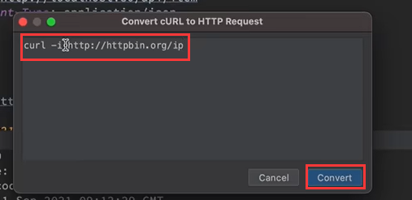

# 4、idea-http接口请求

​	

​			使用idea自带的 http request工具，进行Controller的调试

​	我们可以看到我们写的Controller的每个接口都会有一个图标有点像一个Spring的豆子，但是右下方有个地球的标识

​	我们在点击这个图标的时候，他就会把我们带到一个generator request http这样的一个文件，然后我们点击一下这个文件定位，它就把我们带到这个scratches文件夹中，会生成一个generated-request.http的文件

​	他是一个http 的描述文件

​	在我们点击这个运行的时候---会发起一个请求，然后生成一个json文件

​		下方也会有请求的参数和返回内容

​	如果接口比较多的话，也可以点击run all 那么接口就全部运行发起请求了

​	在点击运行的时候--会提示我们是否要加一些环境信息

​	我们还可以配置一些环境的信息

####  使用环境信息

​	

#### 	选择某个环境运行

####  传入参数发起请求

请求头：比如Context Type

参数-- 直接放我们的json数据就ok

#### 	响应结果比对

​			多次请求后--会有多个json文件，可以进行比较

#### 	请求模板

​		比如我们想创建一个请求--可以点击add request，然后可以选择请求方式，会携带模板生成

​	生成post请求模板

​	比如--post From with a file filed模板 --这个是还可以上传文件的请求-

​		左侧的三角 是我们可以引用一个绝对路径的文件

​	

####  convert--

​		比如我们之前使用的postman导出，生成一个Convert的格式

​	我们可以直接将其他的请求copy进来，转化过来

​	转化后

​	

​	

#### 	log 查看请求的日志

