# 5、idea-单元测试-覆盖率

#### 	1、基本测试

​	首先--我们看一下测试类的注解

​	使用@SpringbootTest，classes = 启动类

​		为什么这么写，因为我们基于Springboot的测试，我们就必须要告诉我们是使用哪个容器启动类启动的项目进行测试

​			而且会加载下面的资源和依赖--比如Autowired注解，如果我们没有这个主程序这些依赖ioc是无法注入的

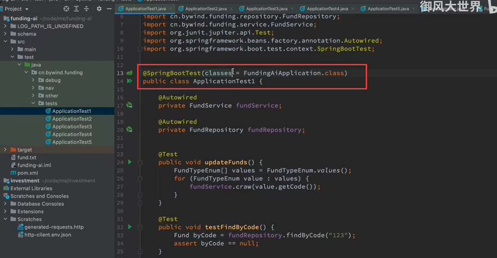

​	点击运行--进行测试

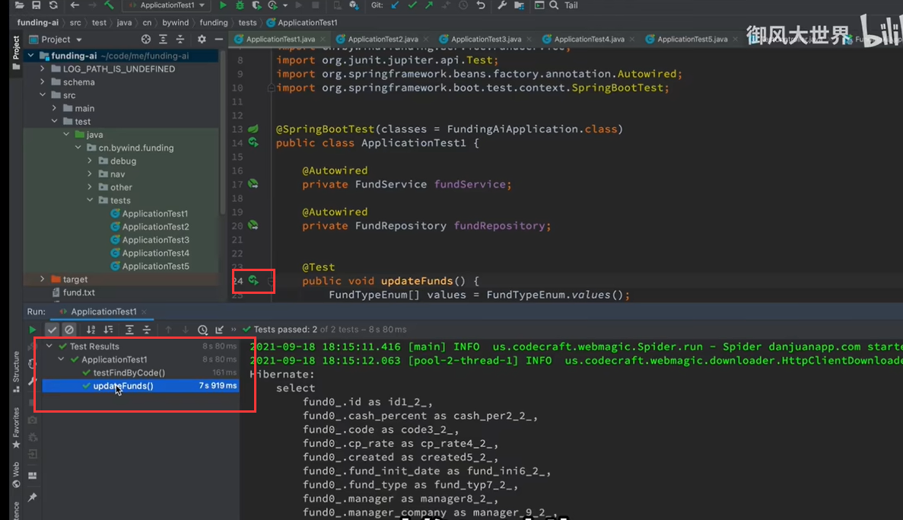

#### 	2、包中的所有测试类-测试

​			全部跑一次--测试包中的所有测试类

​			右键--测试包，点击 run test in 。。。。

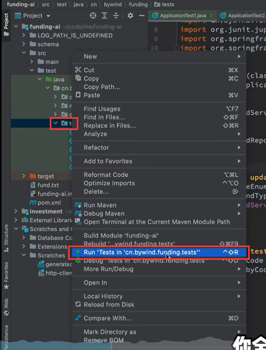

​	比如在运行的过程中某个测试发生异常--我们可以进行单独的测试

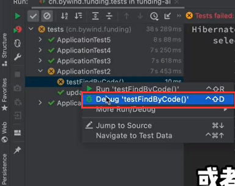

​	我们也可以直接跳到这个测试类的代码处---右键 jump to source 跳到源码处

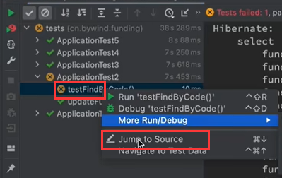

​	显示红色--失败的测试

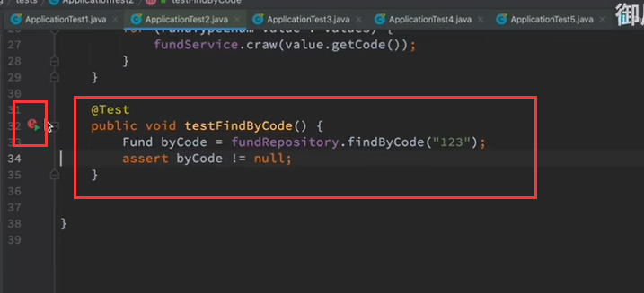

​		我们断点看一下--发现 数据是null，而我们的断言是 不为null所以就报错了

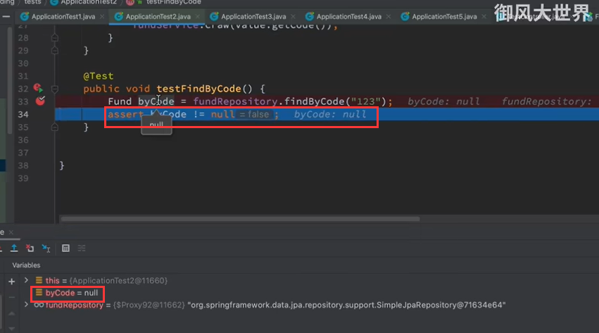

#### 	3、如何在test中测试controller

​		在方法上按 ctrl +shift +T 就是创建测试

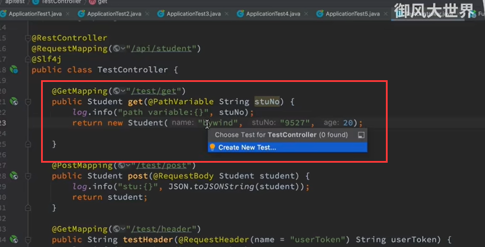

​		我们生成测试的时候--可以选择测试类库，测试类名，是否有父类，选择测试包

​				是否有执行前后的方法，然后选择需要测试的方法

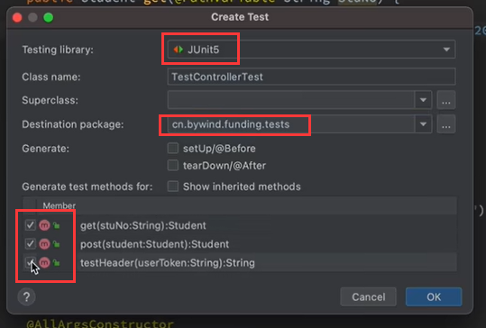

​		然后是把springboot的测试搞进来，还有一些依赖 测试Controller需要webApplicationContext上下文

​			还有mvc，还有请求头

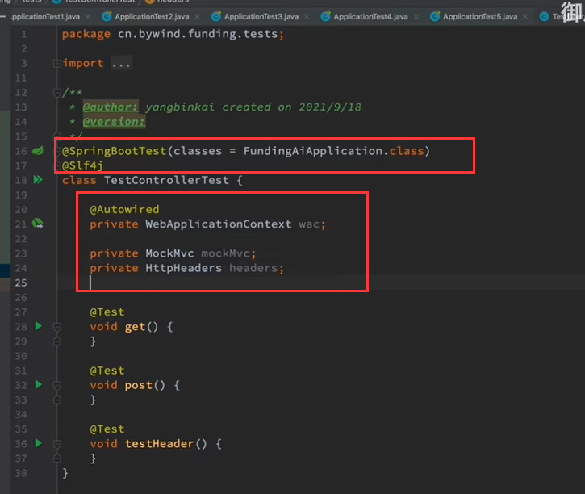

​	然后是前置环境--需要mock模拟构建一个mvc的容器环境，然后设置一些请求头

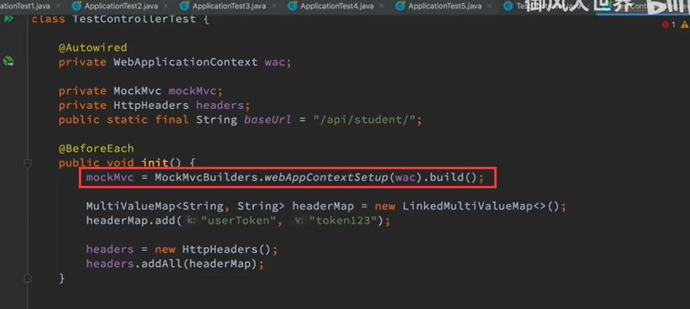

​	然后写测试用例

​		MockMvcRequestBuilders构建请求--如post 然后立马加入路径

​		设置请求头，设置请求内容类型

​		andExpect -- 这个是我们期望他的结果--这个意思是返回200

​		然后获取结果返回--getResponse

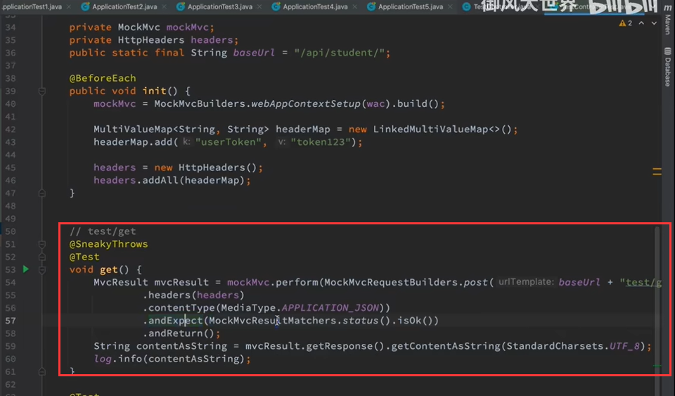

​				注意注解@SyeakyThrows是处理异常的一个语法糖注解

​		

​	测试中提示该接口不支持post，我们修改成get进行测试成功

​	数据也返回

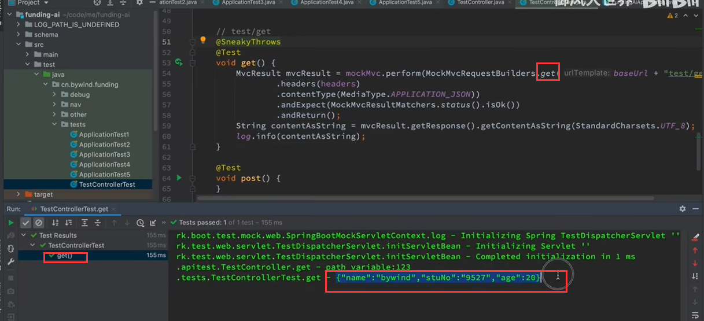

​		使用post请求的话--传参--使用context

​		可以直接是json串，也可以是一个对象，然后使用JSON.toString的方式也是可以的

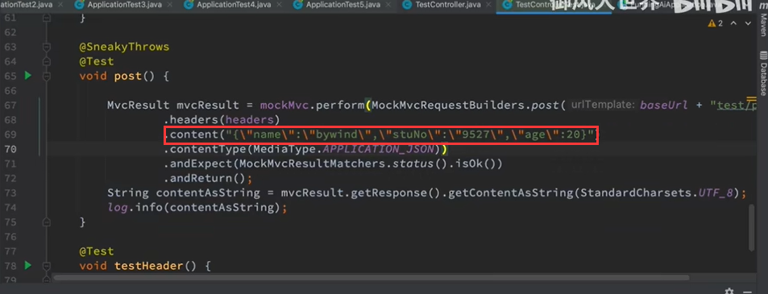

​	这种方式也是可以很大程度上的模拟postman的请求的

#### 	4、coverage--覆盖率 指标

​		我们点击运行一下看看

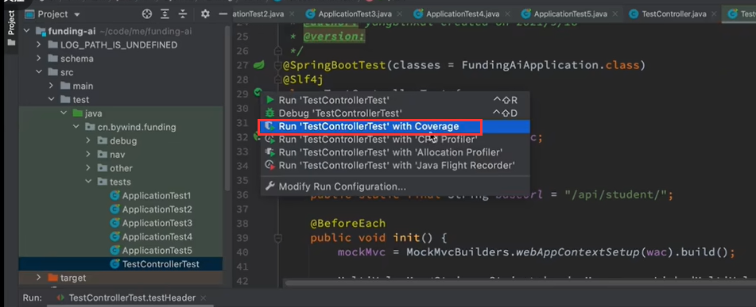

运行完之后--我们发现覆盖率的内容什么都没有

​		其实是需要我们去编辑一下的

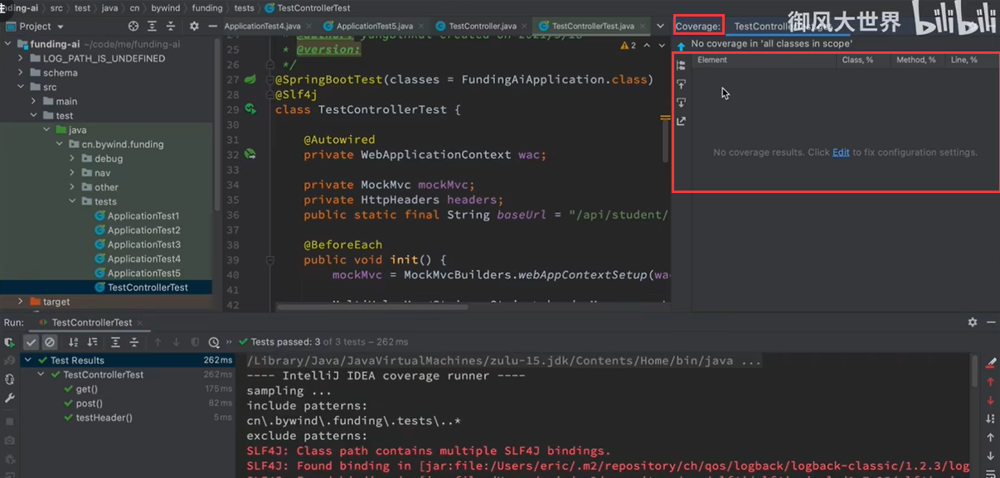

​		这个编辑其实就是我们要对那些内容进行 覆盖率coverage的统计

​			我们现在选中了一下包，那么这个意思就是这些包下的类都会进行覆盖率的统计

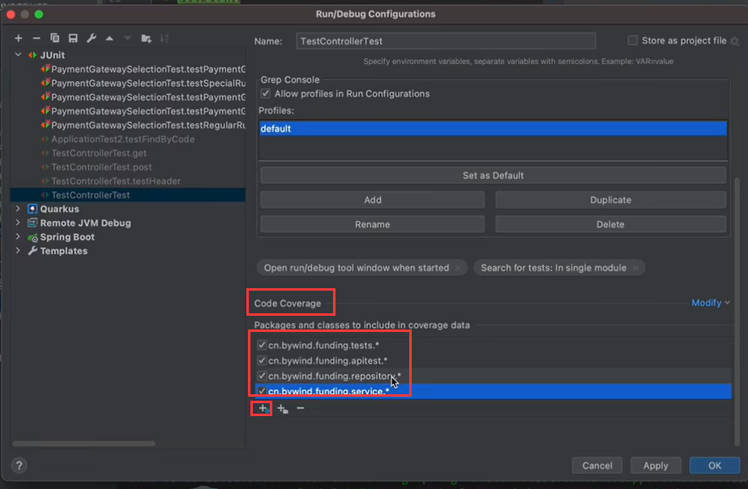

​	然后我们重新运行一下

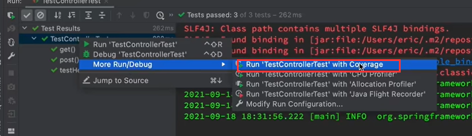

​	运行完之后--我们可以看到覆盖率已经有内容了

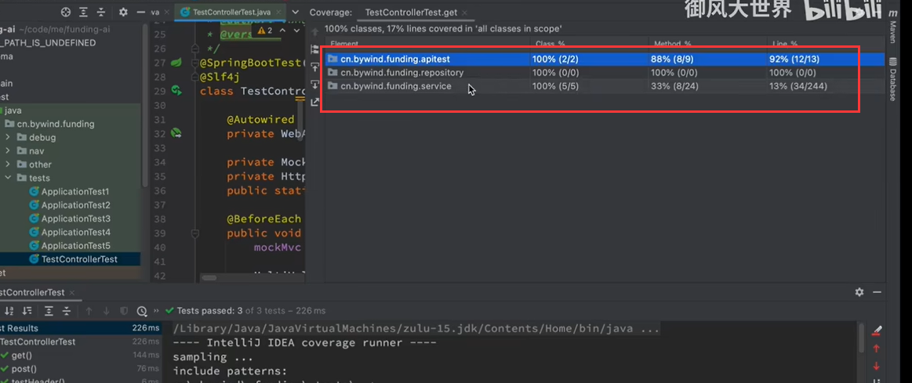

​	我们可以键入apitest这个包下

​		类是都cover覆盖了，方法覆盖了88，代码行是覆盖了92

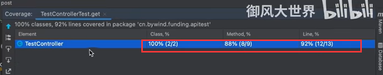

​	然后可以双击看一下这个类

​		我们可以看到--这个类的左侧有一些绿色的

​			这些绿色的就代表cover覆盖住了

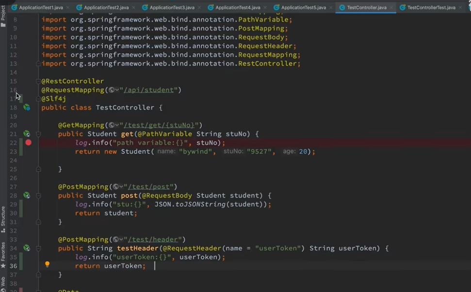

​	点击这个绿色的可以看到，cover覆盖命中了几次

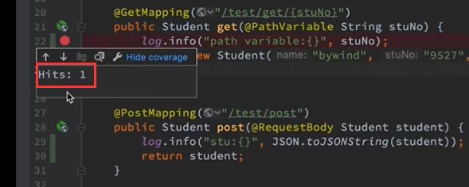

​		这个就是 传言的 覆盖率的测试

https://www.bilibili.com/video/BV1SR4y1H77G/?spm_id_from=pageDriver&vd_source=243ad3a9b323313aa1441e5dd414a4ef