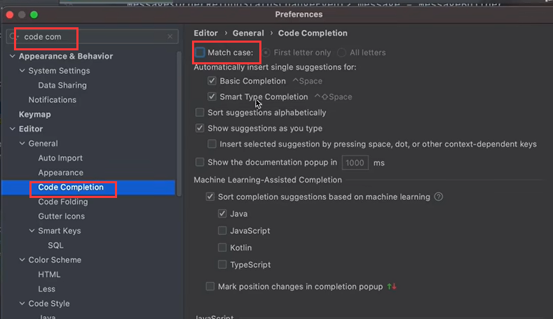
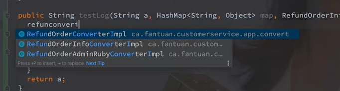
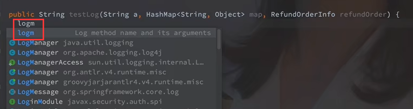
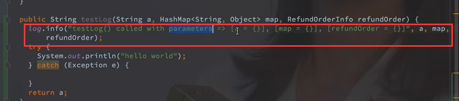
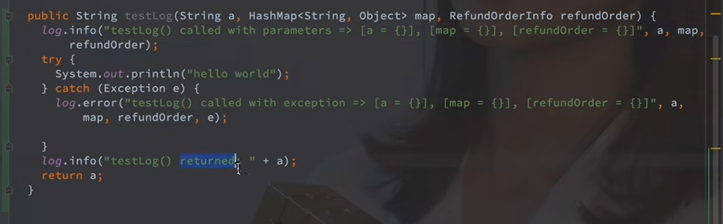
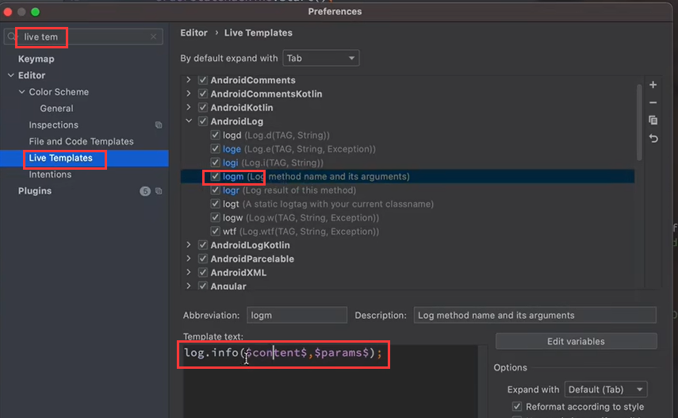
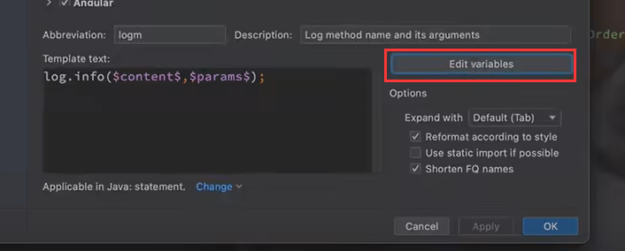
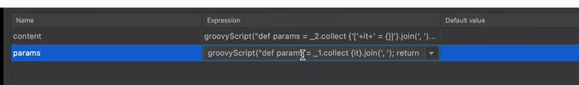

# 6、idea-提示不智能


​	因为默认设置是区分大小写的，我们可以取消大小写




​			这个时候他的联想的内容就比之前多了


比如




​	日志为什么打的特别工整，使用life template




​	模板生成的代码




​	例如




​	如何配置这个打印日志的小技巧呢

​		使用live template 模板代码




​	然后我们需要编辑变量--设置变量模板




​	

​	我们可以搜索一下这个groovy的脚本



​	添加进去就ok了

​	也可以在视频中的评论区找


```
loge
log.error($content$,$params$);
content 参数：
groovyScript("def params = _2.collect {'【'+it+' = {}】'}.join(', '); return '\"' + _1 + '() called with exception => ' + (params.empty  ? '' : params) + '\"'", methodName(), methodParameters())
params参数：
groovyScript("def params = _1.collect {it}.join(', '); return   (params.empty  ? '' : params) + ',e' ",  methodParameters())

logm
log.info($content$,$params$);
content参数：
groovyScript("def params = _2.collect {'【'+it+' = {}】'}.join(', '); return '\"' + _1 + '() called with parameters => ' + (params.empty  ? '' : params) + '\"'", methodName(), methodParameters())
params参数：
groovyScript("def params = _1.collect {it}.join(', '); return   (params.empty  ? '' : params) ",  methodParameters())


logr
log.info("$METHOD_NAME$() returned: " +  $result$);
METHOD_NAME参数: 
methodName()
result参数：
variableOfType(methodReturnType())


```


https://www.bilibili.com/video/BV1uR4y1p7Lh/?spm_id_from=pageDriver&vd_source=243ad3a9b323313aa1441e5dd414a4ef


​	


​	