# 7、idea-高效的使用maven

​		首先--我们知道maven是一个java的包管理工具

#### 1、maven的设置

​		

​	work offine -- 不建议勾选，如果远程有包的更新，是不会去拉远端的依赖的

​	大部分的都默认就可以

​	Thread count -- 用多少个线程来构建我们的maven仓库 一般配置个8

​	maven homepath -- 指定使用的maven

​	use setting file -- 指定使用的maven setting文件

​	local repository -- 本地仓库位置

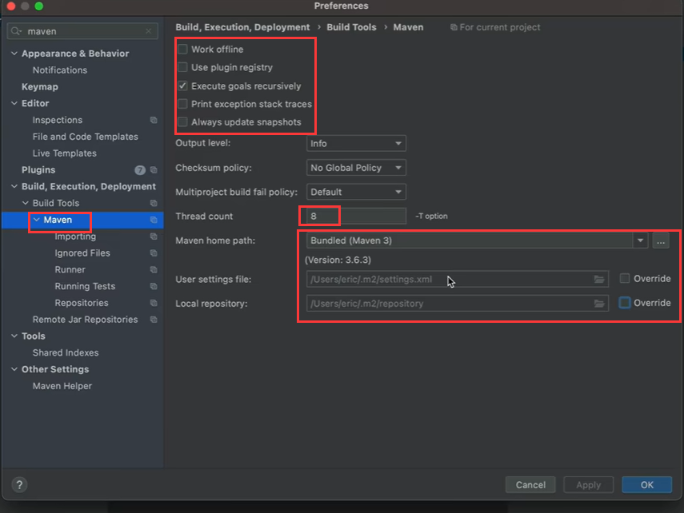

​	比如我们创建一个模块工程

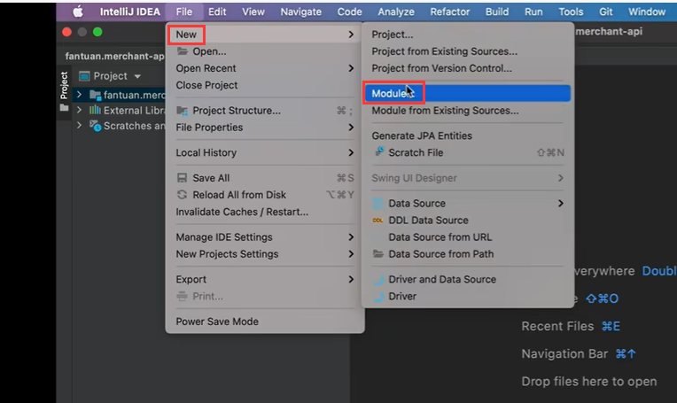

​	然后我们选择maven，我们可以通过archetype来创建maven

​		这个archetype其实就是之前别人写好的一些maven的模板

​		我们可以根据某个 模板创建自己的项目

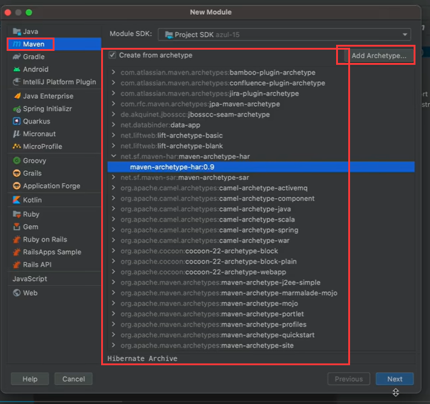

​		如果没有导航窗口

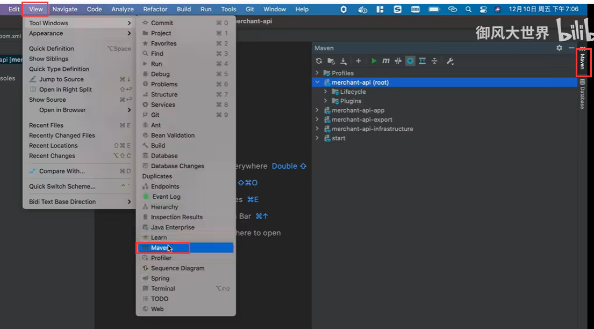

#### 2、导航窗口

​	1、Reload All maven project -- 更新maven仓库，多数idea是会自动去刷新更新的，比如我们新增的包，如果没有更新或者是没有更新成功就点击刷新一下，或者多点几次

​	2、Generate Source --点击文件夹的这个是 生成Source和更新文件，这个是和源码相关的东西，很少使用

​	3、点击+ -- 这个是添加一个maven项目，这个基本也不用，因为我们一般使用new创建项目

​	4、run maven build -- 运行符号，这个是什么意思，比如我们现在有一个项目我们点击它就是对某个选中的maven项目或模块进行构建

​	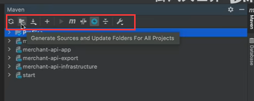

​	

​	比如，我们有一个maven的命令使用的非常多，我们可以右键命令

​		Assign Shortcut

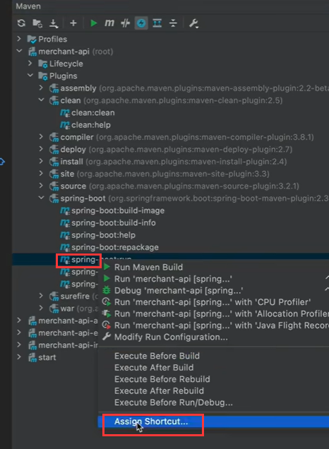

​	

​	这个是什么意思呢，就是可以把我们常用的这个maven命令关联一个快捷键组合

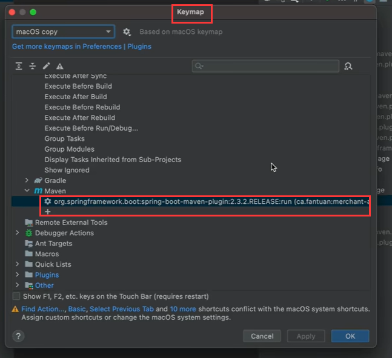

​		Lifecycle下面

​				可以多选--ctrl然后右键点击运行

​	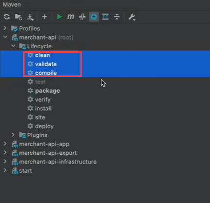

​		Toggle offine mode -- 这个是离线的模式运行maven

​			这个尽量不要去点--保持在线的运行maven

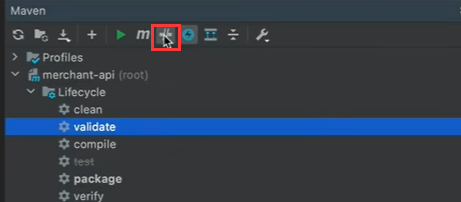

​	toggle Skip test mode

​		如果我们在运行maven的时候不想让人他运行测试用例，就可以勾选上这个

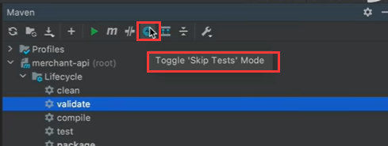

​		点击后这个test就变灰了

​	show dependencies -- 这个是显示依赖

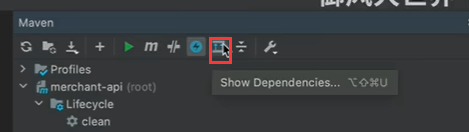

​	

​	点击此轮--maven的设置

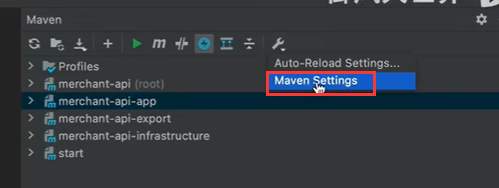

​		其实就是打开的idea中的maven设置

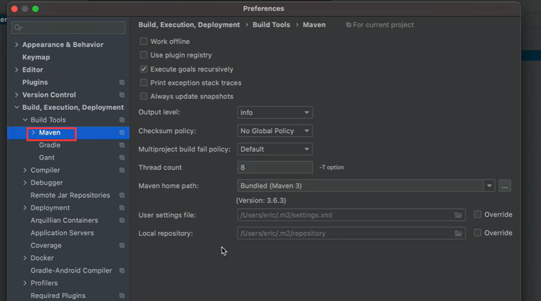

#### 	3、profiles -- 其实就是多套环境

​				我们可以根据自己的需求勾选环境

​					比如我们勾选local 那么当前环境就使用local

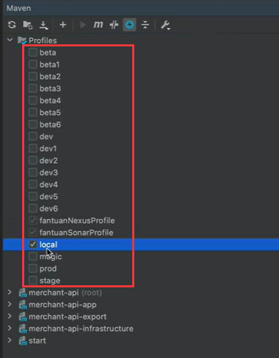

#### 4、maven的插件 -- 			

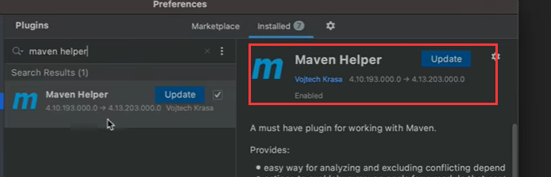

​	在项目上右键--可以使用一些maven的命令

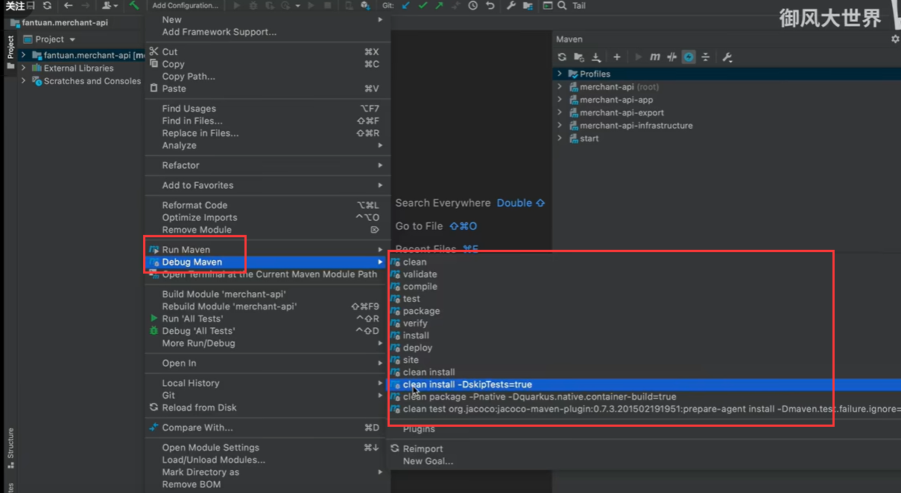

​	

https://www.bilibili.com/video/BV12r4y1S7ok/?spm_id_from=pageDriver&vd_source=243ad3a9b323313aa1441e5dd414a4ef

