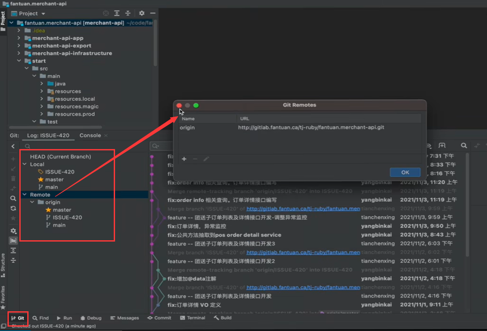
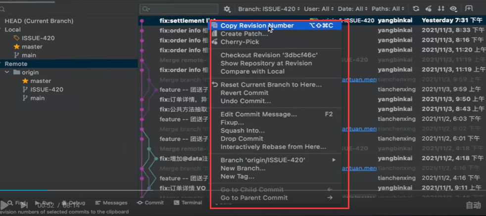
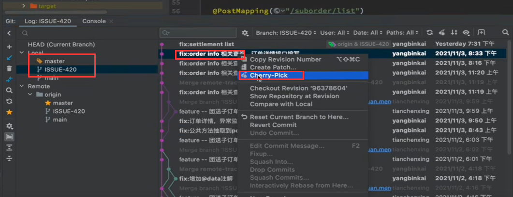
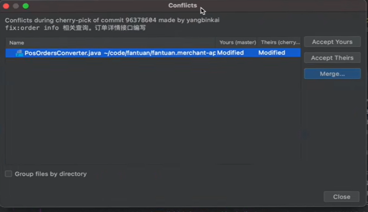
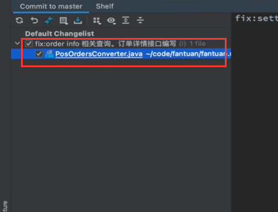
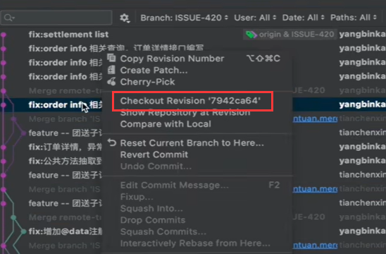
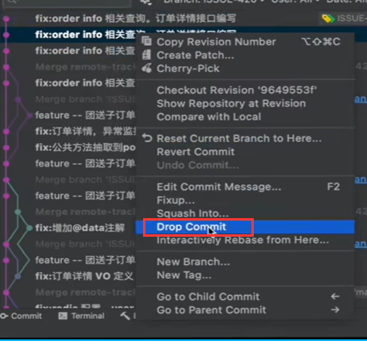

# 8、idea-优雅操作git

​		

​	我们可以在git中查看提交的内容

​		local就是我们本地的内容

​		Remote--是远端的仓库，在idea中我们可以进行对 一些远端仓库的配置和添加

​	对于提交的内容右键---这些操作的含义

​		copy Revision Number -- 拷贝版本号

​		create patch -- 创建补丁 -- 就是当前提交的所影响的文件，我们全部可以用补丁的形式记录起来，然后就存放在我们选择的路径下

​		cherry--pick -- 想把分支的某些提交，某些提交快速的应用到你的分支上来就使用这个

​		比如--我们现在在特性分支上的的内容，其中的一次提交想放入master上，首先切入master分支，然后点击ISSUE特性分支，然后点击想切入的某次提交--右键 选择cherry - pick

​		可能会有冲突的文件内容---需要merge一下

​	然后我们的master就会有一个新的提交变更了

​	checkout Revision --检出当前版本，就是相当于切到这个版本的代码

​	show repository -- 这个提交的历史时刻，他的文件的目录是什么样的形态，可以展示出来

​	compare with local -- 当前的提交和本地目前的文件进行的对比

​	Rest Current batch to here -- 将代码回退到这个点

​	Revert commit -- 比如某次修改我们并不满意，我们可以使用这个功能进行一个 返回

​	Edit commit message -- 修改提交的信息

​	

​	fixup -- 

​	Squash Into -- 这个比如多选了某几次的提交--可以把这几次的提交合并成一个提交

​	Drop commit -- 丢弃当前的提交

​	interact。。。。-- 这次的提交和我们当前的代码 进行一个Rebase操作

​	new branch -- 基于当前的提交--新建一个分支

​	

​	https://www.bilibili.com/video/BV1sh411t7bw/?spm_id_from=pageDriver&vd_source=243ad3a9b323313aa1441e5dd414a4ef

