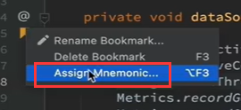

# 9、idea-高效查看源码的方式

#### 	1、代码跳转

​		ctrl + alt +B

​		因为我们在鼠标加ctrl进行的跳转，有时候只能跳转到接口声明，不能直接跳转到实现类

​		所以这种方式的跳转是最好的使用这个快捷键

​		如果这个方法有多个实现，那么idea也会弹出提示，我们选择某个就可以了

#### 	2、代码添加书签

​	

​			在我们感觉重要的代码上 添加Bookmark

​	我们在bookmarks导航中就可以看到我们之前创建的一些书签，可以快速的定位

​	如果你的idea没有书签这个导航--可以在这里展示

​	也可以对书签进行一个编号--在原有的书签上右键

​			然后设置编号

​		这就是书签显示的 编号

​	现在我们想快速跳转的话可以使用 ctrl + 编号 就可以快速的定位到代码了

#### 	3、查看类的关系和时序图

​		比如hashMap--我们想看一下他的 父类 子类 以及上下游的关系

​	在这个类名上右键 -- 然后Dirgames

​	如果想看的更加详细的话可以点击 左上角的颜色图标--代表方法类接口的图标等等

​		图中的类我们可以使用F4可以进行一个源代码的快速跳转

#### 	4、时序图

​			为什么需要时序图，比如我们在看到别人写的代码的时候，有时候别人写的比较高深逻辑比较复杂，这个时候我们就希望 画一个 时序图，把整体的代码的内部思路屡清楚，但是自己去绘制这个图或者说依赖关系是非常的浪费时间，而且还得是先理解了代码的基础之上的才可以。

​		现在我们可以使用一个时序图的插件快速的帮我们实现这个功能

​	比如我们现在的这个first方法--我们右键他	Sequence Diagram

我们可以看到在左下角就生成了时序图

​		比如我们双击UserController就可以定位到这个类中

​	同时这个时序图也是支持保存和导出的

​	

​	还可以设置这个时序图的调用深度--比如默认深度是5

​	时序图的插件

