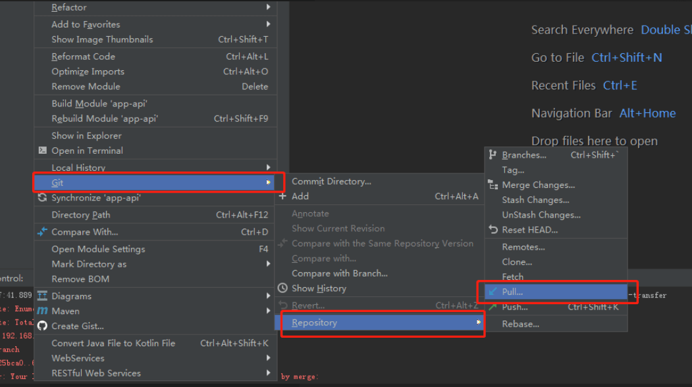

# IntelliJ IDEA Git版本冲突解决方法

在一个大项目开发，经常多个人一起开发会改到同一个文件，这个时候第一个pull的可以正常，但是后面的pull就会有问题了。

- **先在git上修改文件**

分别进行了修改删除新增

- **在idea上修改文件，没有进行更新的情况下**

- **进行拉取，会有报错提示。**

- 这个本地对比结果

- **创建本地版本**

- **版本标识**

- **将代码pull下来，对比**

- **对比代码**

- **对比同一个文件改的地方，合并到同一文件**

