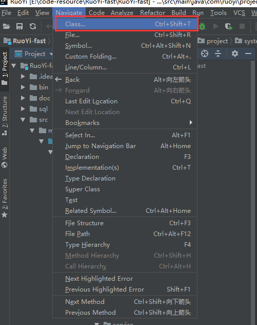

# IntelliJ IDEA使用技巧1


```
场景1：比如我们在idea中写的代码有些多的时候，平时需要我们用空格，来区分代码块或者是用注释//start 和//end  来标注代码的开始和结束。

	那么在idea中其实是可以通过注释来实现代码折叠的，使用//region 为代码的开始 //endRegion为代码的结束
	
	也有快捷方式去做，选中代码块Alt + Shift + Z或者ctrl + alt +t
	
示例：
	//region 描述
    @Override
	public List<PlaysOrder> selectByChannelId(Long channelId) {
		if (channelId == null) {
			throw new BaseException("保存异常，请稍后重试！");
		}
		PlaysOrder order = new PlaysOrder();
		order.setChannelId(channelId);
		return orderMapper.selectOrderList(order);
	}
    //endregion
```


**自动补全返回值**

```
	第一种方式：就是我们在方法的最后加个 .var会自动帮我们生成前面的返回值定义及变量
	
	第二种方式：使用快捷键ctrl + alt + v
	
	第三种方式：
```


**代码提示**

```
shift + L 或者是 ctrl + shift + L
```


**增强for循环**

```
	iter 或者 fore
```


**普通for循环**

​	使用itli


**遍历数组**

​	使用itar


**精准搜索类**

​	使用Navigate -》class  快捷键ctrl + shift +T 或者是按俩下shift




如果勾选Include的话是包含Jar包的内容的


**精准搜索文件**

​	那么就是Navigate --》 File    快捷键ctrl + shift + R


**精准搜索符号**

​	符号在idea中的定义就是 可以是符号，可以是函数，可以是变量


比如我们现在找一个函数的名称：


**字符串搜索**

比如一段字符串搜索一下 ctrl + H


```
搜索框我们讲解一下： 
	Match case：是否匹配大小写
	Words：是否搜索的是一个单词
	Regex：正则表达式搜索
	File mask：非常有用，指定在那类文件里搜索，比如*.java 文件中搜索
	
	
	Project:在项目中搜索
	Module：在当前模块中搜索
	Directory：在当前目录下搜索
	Scope：自定义搜索范围
	
```


